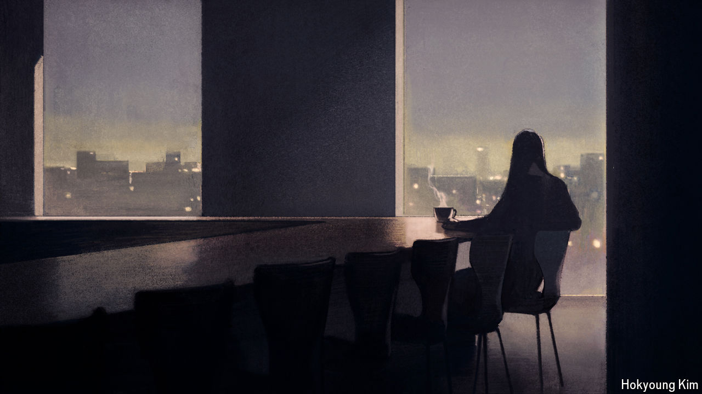

###### All by myself

# The drawbacks—and benefits—of solitude 

##### Three books examine the perils and pleasures of being alone 

 

> Apr 5th 2024 

By Sam Carr. 

 By Netta Weinstein, Heather Hansen and Thuy-vy Nguyen. 

By Pascal Bruckner. Translated by Cory Stockwell. 

, that great coiner, is given credit for the word “lonely”. Coriolanus, one of his heroes, compares going into exile to a “lonely dragon” retreating to his lair. The Roman general was talking about a physical state: someone who was lonely was simply alone. 

Then, thanks to the Romantic poets, the word took on emotional overtones. Loneliness became a condition of the soul. For , who famously “wandered lonely as a cloud”, the natural world offered a reprieve from negative feelings of isolation—a host of daffodils could provide “jocund company”. 

By the early 20th century loneliness was considered one of the defining afflictions of urban life. lamented that a feeling that was “once a borderline experience usually suffered in certain marginal social conditions like old age, has become an everyday experience of the ever-growing masses”. 

Her concerns resonate today, as loneliness is frequently identified as a serious public-health problem, an epidemic even, that besets the elderly and young alike. During the  half of Britons reported often feeling lonely; those aged between 16 and 24 struggled the most. Smartphones, social media, online dating and working from home are all blamed for feelings of alienation. Three recent books have taken on the subject.

In “All the Lonely People” Sam Carr, a psychologist, collects stories of individuals who feel cut off or forsaken. A teenage Afghan refugee struggles to blend in at school in Somerset. An octogenarian languishes in a retirement home. Mr Carr handles this material sensitively, weaving their experiences together with his own, in particular his role as a single parent.

The author evokes the pain of bereavement, heartbreak and childhood trauma and underlines the stigma attached to being withdrawn and friendless. Somehow, the book is not an unbearably bleak read, but you do wonder whether loneliness is just an unavoidable part of the human condition. The range of testimonies also suggests that loneliness is not a single feeling so much as a name for a medley of emotions and unsatisfied appetites.

For “Solitude” Netta Weinstein and Thuy-vy Nguyen, two psychology professors, have teamed up with Heather Hansen, a science journalist, to ponder the rewards of time spent alone. They begin with an account of the mythology of solitude created by figures such as Michel de Montaigne, an essayist, and , a painter. They then draw on laboratory work, interviews and surveys to illuminate how being alone really affects the human psyche.

It is common to treat loneliness and solitude as synonyms, but they are not. The authors suggest that what is negatively portrayed as one state can be positively reframed as the other. To this end they emphasise the restorative possibilities of being alone and include practical guidance. In a noisy and crowded world, they argue, people should make time to be by oneself, away from attention-grabbing stimuli. 

The book’s interviewees mostly regard a lack of company as conducive to autonomy. But this depends on whether solitude is elective or enforced. If it is enforced, as it is for social outcasts and some prisoners, for instance, it is often wretched. Elective solitude, by contrast, above all in natural settings, affords space for reflection. It can open the door to “peak experiences” such as wonder, awe, harmony, even ecstasy. (In a hyper-connected digital age, many readers may not fancy their chances of ever being unplugged long enough to have such experiences.)

Pascal Bruckner sees a world shrinking from sociability in favour of snug seclusion. “The Triumph of the Slippers” is grounded not in research but in the French tradition of witty social criticism. Mr Bruckner, a philosopher and polemicist, dubs the present period “a Great Withdrawal”. As he sees it, the openness of the late 20th century is over, and “the closing of minds and spaces is well under way.” People may like living in “authorised sloppiness”, yet it is hard to imagine heroes and trailblazers wearing dressing gowns: “While it’s nice to be comfortable, you can’t build a civilisation on softness.”

With a mixture of playfulness and grandiosity, he describes a society where most tasks can be completed without leaving the house. His book overflows with soundbites—the public sphere, for example, is dominated by “orgies of pettiness”—and he peppers his short chapters with references to , Plato and Rousseau. 

Though his argument spins off in many directions, Mr Bruckner’s main theme is the need for people to relearn the art of intimacy. “Interactive solitude”, enabled by technology, is no substitute for “the great theatre of the world”. Mr Bruckner supplies a checklist for warding off enduring, corrosive feelings of loneliness: “Have we loved enough, given enough, lavished enough, embraced enough?” If these books are right, many readers will find themselves answering “No.” ■


