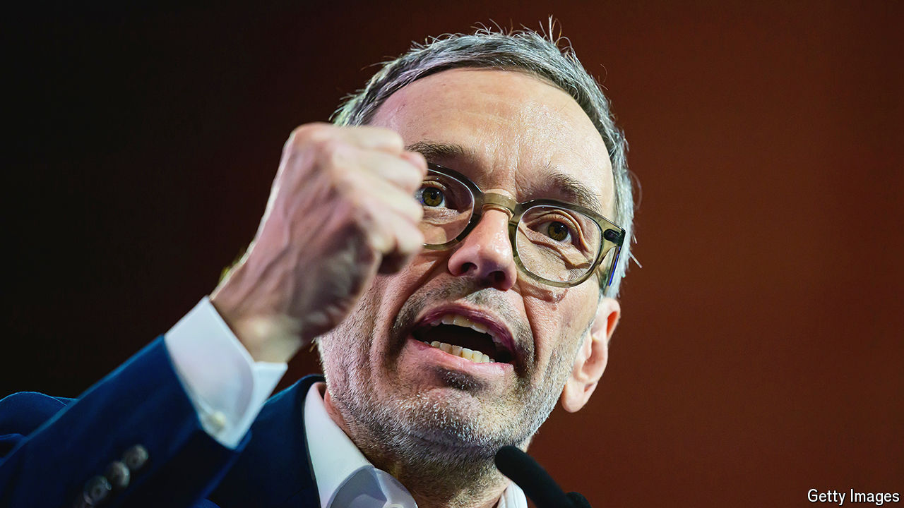

###### Herbert Kickl

# Austria’s accidental hard-right leader 

##### A new biography portrays the rise to the top of an obscure man 

 

> Apr 11th 2024 

“If a party is a boat then I prefer to be in the engine-room rather than at the captain’s dinner.” Thus spoke Herbert Kickl when Heinz-Christian Strache was still boss of Austria’s hard-right Freedom Party (fpö), according to “Kickl and the Destruction of Europe”, a new biography that will be published (in German) on April 15th. Lacking in charm, Mr Kickl was always meant to be the machinist rather than the captain. “I think he is still sometimes surprised to be the leader of the fpö,” says Robert Treichler, one of the two authors (the other is Gernot Bauer, also a journalist at  an Austrian weekly). 

Nothing in his early years and even in his first decades as an apparatchik in the fpö seemed to indicate that Mr Kickl would become a serious contender for Austria’s chancellorship at elections this autumn. Born in 1968, he grew up in a working-class family in Carinthia. He was a good student. He liked the Beatles and the cargo pants he bought at the American army shop in Spittal. His grandfather Florian had been a Nazi, but that was the case for many of his generation in Carinthia. 

In spite of his academic abilities, Mr Kickl never finished his philosophy degree at Vienna University, nor his military service. Instead he joined the fpö and fell under the spell of Jörg Haider, the party’s charismatic leader from 1986 to 2000. Mr Haider spotted Mr Kickl’s talent for marketing and communications—and he was happy to let him do the dirty work of coining some of the fpö’s nastiest yet unfortunately catchy phrases. Mr Kickl is said to have come up with a notoriously unpleasant comment by Mr Haider about Ariel Muzicant, then the head of the Jewish community in Vienna, for which Mr Haider faced the threat of legal action and had to apologise.

When Mr Haider quit the fpö to set up a new party in 2005, everyone expected Mr Kickl to follow him. Messrs Treichler and Brauer don’t provide a satisfying explanation for why he did not, but Mr Kickl probably thought he would do better by staying with the fpö, soon to be led by Mr Strache, another gifted retail politician. But Mr Strache almost destroyed the fpö with a scandal involving a video secretly filmed on the island of Ibiza in which he appeared to promise government contracts in exchange for party donations to a woman who claimed to be the niece of an oligarch close to Vladimir Putin.

With the fpö’s most talented politicians out of the way, the introverted Mr Kickl rose to the top. He moved the party further to the right during the covid pandemic, which he used to whip up protest against governmental restrictions. He praises the “identitarian” movement, Europe’s answer to America’s alt-right; wants to stop immigration and even to deport foreigners. His hero is Viktor Orban, Hungary’s autocratic leader. 

According to the polls the fpö is currently Austria’s strongest party, with around 29% of the votes. The leaders of the second- and third-strongest parties, the centre-right ÖVP and the centre-left SPÖ, vow they would never form a coalition government with the fpö, apparently scuppering Mr Kickl’s hopes of becoming chancellor. But after what looks like a tough election for them, they might lose their jobs and their say in what happens next. ■


