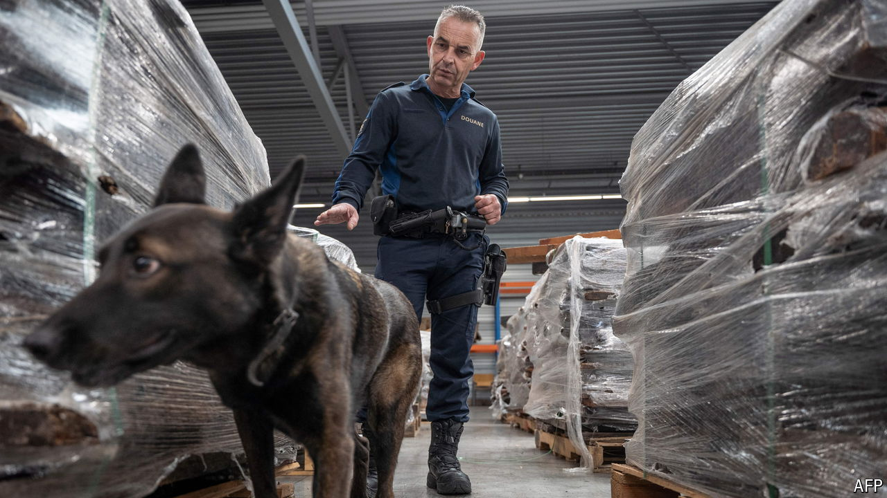
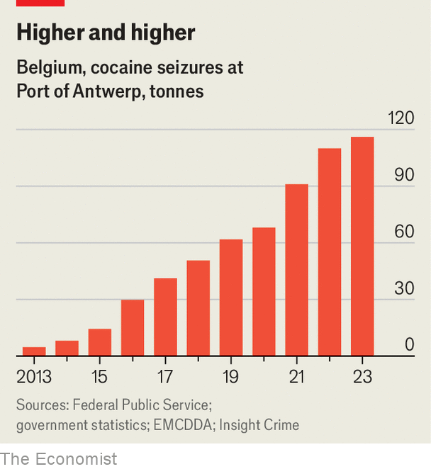

###### The continent’s narco-ports

# Criminal networks are well ahead in the fight over Europe’s ports 

##### Cocaine seizures are sharply up, but much more is getting through 

 

> Apr 8th 2024 

EUROPE’S PORTS are drug hubs. On February 16th the Port of Cork seized €32.8m ($35.6m) worth of crystal meth. Last year Antwerp, one of Europe’s main drug gateways, confiscated record amounts of cocaine. Most drugs, though, elude customs and end up on the streets. More than a quarter of seizures of illegal firearms and half of all homicides in the EU are linked to drug-trafficking. The bloc’s illegal-drug market is now reckoned to be worth at least €31bn a year, according to the EU’s main drugs-monitoring agency.

Ports are relatively safe terrain for narcos. Vast container traffic helps dodgy deliveries slide under the radar. Antwerp, Europe’s second biggest port, after Rotterdam, handles around 290m tonnes of cargo every year. Drugs hidden in crafty spots, like inside frozen tuna or in sea chests, are difficult to spot. Refrigerated containers carrying fresh produce, which require faster processing, are popular places to stash drugs. On February 8th the port authorities in Southampton seized 5.7 tonnes of cocaine in a banana shipment from South America. It was the biggest class-A drug seizure in Britain’s history.

 


As cocaine production in South America rises, and street prices in Europe stagnate, traffickers seem to be favouring bigger shipments. That may explain why the amount of seized cocaine in Europe is increasing as the number of individual seizures has declined since 2019, says Cathy Haenlein from the Royal United Services Institute (RUSI), a think-tank in London. Meanwhile, higher levels of automation and digitisation at big ports are, paradoxically, facilitating new security breaches for gangs to exploit. Increasingly, they steal container-reference codes to nab cargo with cocaine smuggled into it. Corrupt workers can get as much as 15% of the drugs’ value, according to Europol. Others are blackmailed.

As the crooks get more creative, the authorities are trying to catch up. The use of drones is becoming popular; they use thermal cameras to look out for gang members picking up shipments, or to track suspicious movements of consignments. Antwerp became the first major port to use autonomous drones last May and has also vowed to have all high-risk containers scanned by 2028. Shipping companies are scrambling to upgrade their fleets with new tech, such as vapour-screening sensors, smart containers and electronic seals. In January the EU launched a European Ports Alliance to boost co-ordination between ports, governments and private companies. Some €200m will be spent on new scanning equipment. 

But Europe is fighting a losing battle. The sheer number of containers passing through its ports makes scanning ineffective. Just 10% of containers from South America and 1.5% of containers overall are checked in Europe; any more would probably hold up trade. Besides, if you close one door, another one tends to open. Medium-sized ports, such as Helsingborg in Sweden and Málaga in Spain, are already experiencing more traffic in narcotics, no doubt thanks to tighter security at Rotterdam and other established drug hubs.

Corruption is difficult to stamp out. Vetting processes carry little weight compared with threats of violence. Many international crime networks hire locally embedded co-ordinators; the returns available make the investment well worthwhile. “They know the area and they know the people,” says Louis Borer from RiskIntelligence, a consultancy.

What to do? Better information-sharing across Europe will help. But gaps remain. The port of Piraeus in Greece has already been barred from the new port alliance due to suspicions over its Chinese owners. That bodes badly for European ports where foreign firms own majority stakes.

European officials are, rightly, boosting their efforts further up the supply chain. The EU set up a Global Illicit Flows Programme in 2019 and began a new phase of SEACOP, its co-operation project, in January. International efforts are already bearing fruit. Some €48m-worth of cocaine-linked property in Spain and Ecuador was frozen in February following a joint investigation with Europol. (Ecuador had agreed to share more data with Europol in May last year.) But Ecuador remains riddled with drug gangs. So long as demand in Europe soars, the flow won’t stop. The crooks are in for another bumper year. ■


