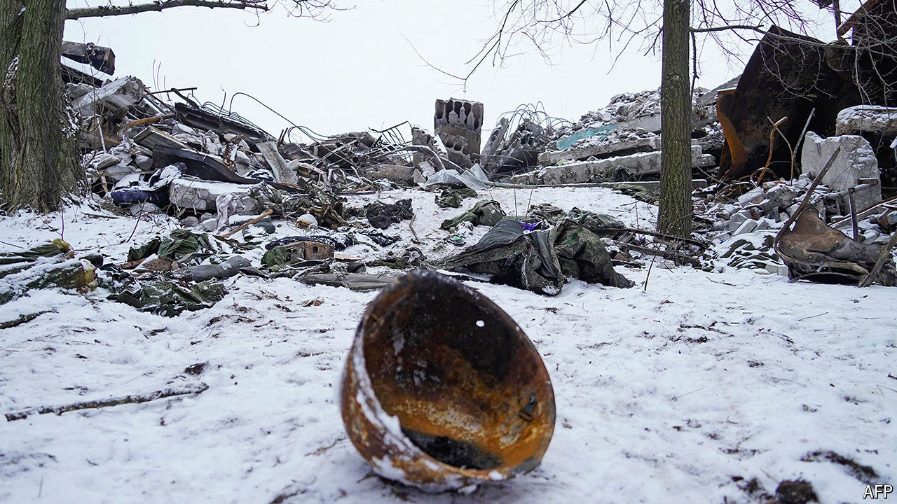

###### Missing in Ukraine

# Russia is struggling to find its missing soldiers 

##### Vladimir Putin’s war has left thousands of searching families in limbo 

 

> Apr 11th 2024 

KAMONIN ALEKSANDROVICH disappeared in the Donetsk region in winter. On February 22nd last year, as Ukraine repelled Russian assaults along the front line across eastern Ukraine, his unit was involved in fierce fighting. According to his family, Kamonin was badly injured. “He went out with his unit on the mission, he had no documents with him,” they wrote on an online message board. Their son did not return from the battle; and like dozens more he simply disappeared. 

“He was wounded and left behind. His colleagues don’t want to say anything, and command hides the truth,” his family say. Mr Aleksandrovich’s case is the tip of an iceberg. On People Search, a group set up on Vkontakte, a Russian social-media platform, new faces of the missing appear daily with pleas for help.


Thousands of Russian combatants are missing in Ukraine. Suddenly thrust into war by President Vladimir Putin, Russia’s commanders were ill-prepared for the losses their forces would suffer. “No funeral teams were created in advance to search for and evacuate the bodies of the dead,” said Sergei Krivenko of Memorial, a now-banned Russian human-rights group. As Russia’s campaign descended into fiasco, many soldiers were hastily buried in unmarked graves or incinerated in grisly pits and mobile crematoriums. Hundreds more bodies were simply abandoned.

The Russian defence ministry has not put out a number on its missing in action (MIA), but some experts say it could be as high as 25,000. Under Russian law, if the body of a missing soldier is not found, official recognition of his death can only take place, in court, two years after the end of hostilities; though, this period has recently been cut to six months. After that, relatives will be entitled to 12.5m roubles ($134,000) as compensation.

Russia’s record of finding missing soldiers, alive or dead, is abysmal. During its two wars in Chechnya, official indifference and systemic army failures forced many families to find and identify their missing relatives themselves. Over 200 Soviet soldiers who fought in the Soviet-Afghan war are still missing, with veterans still trying to trace them. In Ukraine these chronic deficiencies remain entrenched, with secrecy and staff shortages hampering efforts to find soldiers through official channels.

“Relatives learn information about a serviceman through the commander of a unit in which the soldier serves,” explains Mr Krivenko. “It works in peacetime but in war conditions less so.” Russian units have struggled to contact the families of those missing, and have failed to create channels to report soldiers’ statuses accurately. As a result, many combatants who have gone missing, whether presumed dead or alive, are not officially recognised as MIAs and have not appeared on any of the lists of injured, killed and missing. For Russia’s defence ministry they do not exist. In such cases, relatives are not entitled to compensation, or the government’s help in searching for them. 

Secretive and abusive practices long ingrained in Russian military culture feed the crisis. The army often treats its personnel poorly, dead or alive. For some commanders, eager to conceal losses on the battlefield from superiors, it is easier to claim a soldier has “disappeared” and to leave their status unresolved. It also means that compensation can be delayed or avoided entirely. “Families have a right to compensation but the defence ministry might not be willing to pay out immediately. It comes down to a propaganda war,” says Matthew Holliday of the International Commission on Missing Persons. “Announcing large numbers of missing is not a positive message to share when you’re trying to win a war.” 

Abandoned by the authorities, families are turning elsewhere for help. Several communities dedicated to finding Russia’s MIAs have sprung up online, sharing photos, unit details and identifying features. Relatives are even going to battlefields and morgues themselves in the hope of finding their relatives, or turning directly to Ukrainian social media for help.

In the opening days of the war, Ukraine’s interior ministry set up a hotline and a Telegram channel called Look for Yours, which allowed families to find information about missing Russian soldiers. But as the war has intensified, attitudes towards the invaders have hardened. Ukrainians are also struggling to find and identify their own MIAs. “We have so many unclaimed Russian bodies, but there aren’t enough fridges to store the number of dead,” says Olha Reshetylova of Media Initiative for Human Rights, a Ukrainian human-rights group. “They are not the priority. We have our own dead to find.”

Most Russian families will discover the fate of their missing loved ones, at best, only after the end of the war, and even then the process could drag on for many years after a ceasefire, when and if one ever comes. For some, thwarted by the army’s bureaucratic labyrinth and existing in a hellish personal and legal limbo, the answer may never arrive. ■


