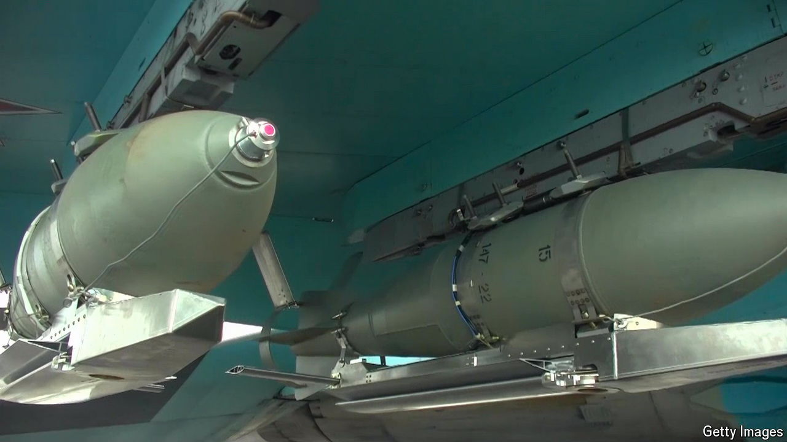

###### Cheap and nasty

# Russia’s ferocious glide-bomb campaign 

##### For now, Ukraine has no answer to it 

 

> Apr 11th 2024 

FOR THE past year, Russia has been stepping up its use of glide bombs. In recent months both the size of the bombs and the rate at which they are launched have increased sharply. So far they have mainly been used against Ukrainian troops on the front line. They demonstrated their effectiveness in February by bringing to an end Ukraine’s stubborn defence of Avdiivka, a coking town in the east. But they are now also being used to add a new dimension to Russia’s strategic air campaign, supplementing its limited supply of air-launched cruise missiles.

The glide bombs start life as mostly Soviet-era general-purpose FAB bombs, of which there are huge quantities in Russia’s inventory. Last year, the Russians started adding simple, cheap conversion kits to them: wings that pop out when the bomb is released, and a satellite guidance system based on Russia’s GPS equivalent, GLONASS. A slightly more sophisticated and accurate version, which has the wings integrated in the body of the weapon, laser guidance and an anti-jamming antenna, appeared last month. Two of these struck Kharkiv on March 27th.


The bombs are carried by SU-34 and SU-35 fighter jets, which lob them when flying at high speed (1,500kph) and high altitude (10km) to give them a range of up to 65km. Once released, they are almost impossible to track. So the only way of stopping them is to destroy the aircraft carrying them before they are dropped, either with long-range ground-based air-defence missiles or else by fighter jets armed with long-range air-to-air missiles.

There is a sequence of events that leads directly to the Russian glide-bomb attacks on civilian targets in Kharkiv, Ukraine’s second city, which lies just 30km from the Russian border. It appears that to counter the growing glide-bomb threat, the Ukrainians took the risk of moving precious Patriot missile launchers near to the front line. In late February, Ukraine announced that in just ten days it had shot down between ten and 12 SU-35 and SU-34s, an intolerable attrition rate for the Russians.

But on March 9th it was confirmed that a Russian Iskander missile had hit a convoy of Patriot launchers. It destroyed at least two of them and killed their crew. Since then, the glide-bomb attacks have escalated. On March 27th the Ukrainian foreign minister, Dmytro Kuleba, said that Russia dropped 700 glide bombs in a six-day period from March 18th. Without more Patriot batteries, or until the long-awaited arrival of F-16s armed with AIM-120 missiles, which is unlikely before July, Russian pilots will continue to inflict the glide-bomb scourge with impunity. ■


