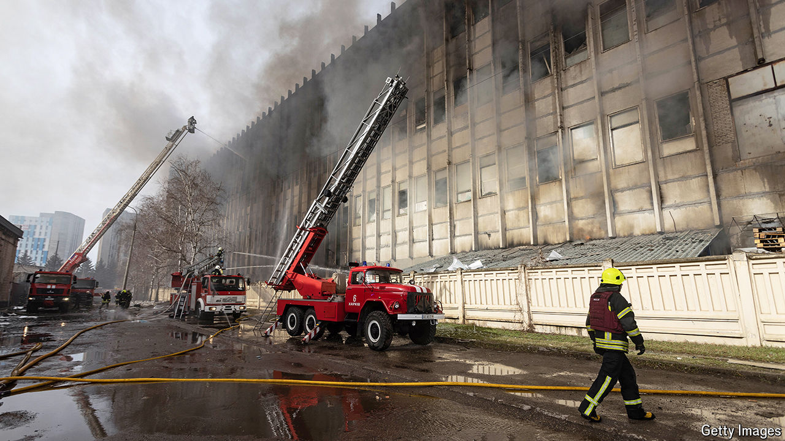
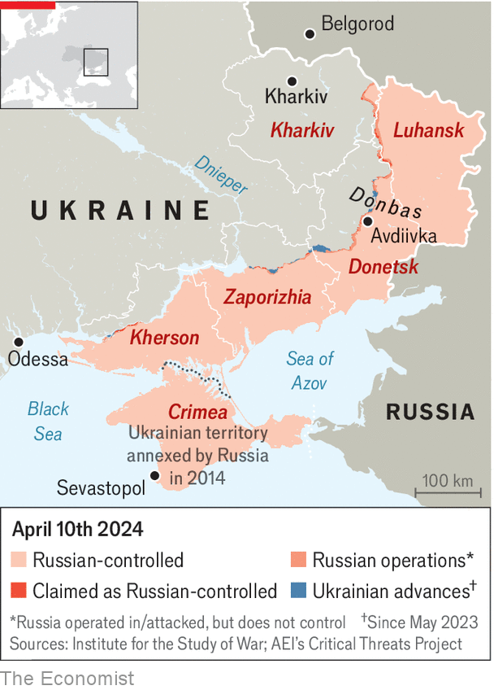

###### 20km from the enemy

# The Kremlin wants to make Ukraine’s second city unliveable 

##### The race to save Kharkiv from Russian bombs 

 

> Apr 7th 2024 

IT HAS BEEN a few days since a 250kg Russian glide bomb landed in Iryna Tymokhyna’s courtyard on 23rd August Street, and it is fair to say she is not happy. Sitting on the park bench that has since become her living room, the 60-year-old curses Vladimir Putin and the minority of Kharkiv residents she believes are still helping him. Her apartment is covered in dust and broken glass, she says; her neighbours were put in hospital, and a passing bicycle courier was killed. “If it was up to me, I would shoot the bastards…and I’d wipe Belgorod [the closest Russian city] off the face of the Earth while I was at it.” 

Ms Tymokhyna’s sharp language is striking for the fact she was born in Russia, and most of her relatives still live there. But her outrage is far from unique in a 1.3m-person city now living through  mostly originating from the region just across the border. 

 


Russia stepped up its bombardment of Kharkiv in December. Since then, the city has been on the receiving end of more ballistic missiles than at any time since the start of the war. Drone assaults have become more frequent: they fly faster and higher, and have a carbon wing-coating that makes shooting them down harder. But the March 27th attack on 23rd August Street was a pivotal moment, the first time a glide bomb, launched from a plane and capable of travelling tens of kilometres to devastating effect, had been used against Ukraine’s second city.


The attack came just five days after a missile barrage destroyed almost all of Kharkiv’s power-generation capacity. It has been followed by more than a week of operations using glide bombs, missiles and drones, killing at least 16 people and injuring another 50 or more. The escalation had military sources in Kyiv suggesting that Russia has resolved to make the city a “grey zone”, uninhabitable for civilians. 

The man responsible for keeping Kharkiv running disagrees. Interviewed at a secret location, the mayor, Ihor Terekhov, says his city has no intention of giving up. Things were worse , he says, when all but 300,000 of the pre-war population of 2m fled. “How can you make a city like this a grey zone? People won’t leave, because they have already left, then returned.” Yes, powering up a city without power stations or working transformers was difficult, but they managed it. “If I told you how we did it, that too would be targeted.” But many of the city’s problems could be solved if the West provided capable air-defence systems or F-16s that could push back the fighter jets carrying the new bombs. 

Russia’s exact intentions are not clear at this stage, though there are signs that it is preparing for a major summer offensive. A Ukrainian source with knowledge of the intelligence picture said Russia is training six divisions (some 120,000 men) in eastern Siberia. On April 3rd President Volodymyr Zelensky said Russia would mobilise a further 300,000 in June. Kharkiv is one of several possible directions for a future assault. It is not the most likely, but it has already been heavily trailed in Russian media. That might indicate a Kremlin information campaign to frighten Kharkiv residents. Or it could be a nod in the direction of a pro-war camp agitating for a fiercer response to Ukraine’s frequent attacks on Belgorod, which are also causing unease in Western circles. In March Mr Putin talked about the creation of a “buffer zone” on Ukraine’s border. 

A military operation to seize Kharkiv would be a tall order for Russia. The last time it tried, in 2022 when the city was much more poorly defended, it failed spectacularly. Taking the city would require breaking through Ukrainian defences and encircling it, which Russia is nowhere near being able to do; establishing air superiority, which is not a given; and winning a bloody urban campaign. “There’s a strong chance they would not succeed with any of that,” says Andriy Zagorodnyuk, a former defence minister. For others, the fear remains that the Russians will turn nastier when they realise they can’t get what they want. “They won’t be able to take Kharkiv, but destroy it—perhaps,” says Denys Yaroslavsky, a local businessman turned special-forces reconnaissance commander. “We’d be talking about something of the order of Aleppo.”

Some have already taken the hint and packed their bags. Iryna Voichuk, a journalist, left for Europe at the end of March, after the glide bombs began to hit. It felt like leaving a friend, she says: “I was happy to live there despite the dangers, but that changed when a missile landed 100 metres away from my flat.” Much of Kharkiv’s commerce vanished in 2022 along with its richest inhabitants. The energy shortage and military escalation are testing the resolve of the enterprises that are left. Among them, there has so far been no exodus or panic besides a few isolated cases, insists Yury Sapronov, one of the few big businessmen left in the city. “I can’t say that Kharkiv is suddenly going to benefit from a massive influx of investment, since we can’t move the Russian border. But we will survive and small businesses can even prosper from internal demand.” 

If others have written Kharkiv off, those inside the city have yet to receive the memo. Urban life continues in spite of the dozen daily air-raid warnings. Families walk in the city’s central park despite the missiles that occasionally land nearby. Children play football next to a military facility. The sense of digging in is summed up by the city’s decision to start building its schools underground. The first of these will open this month. It is entered via a single blast hatch that sticks out incongruously from a sports field. Built with reinforced concrete that goes several metres underground, it should survive anything Russia throws at it. All 900 spots in the first intake have been reserved. 

Ms Tymokhyna, who offers  tea in her park-bench living room, says there is nothing she would not do to defend the country that for 43 years has been her home. “I’m 60 years old, but I’m ready with my spade to go wherever I’m needed,” she says. “Make Molotov cocktails, acid, whatever it takes. Ukraine is everything to me. If the Russians dare to come here, I’ll find them. They won’t have a hope of staying in the realm of the living.” ■


