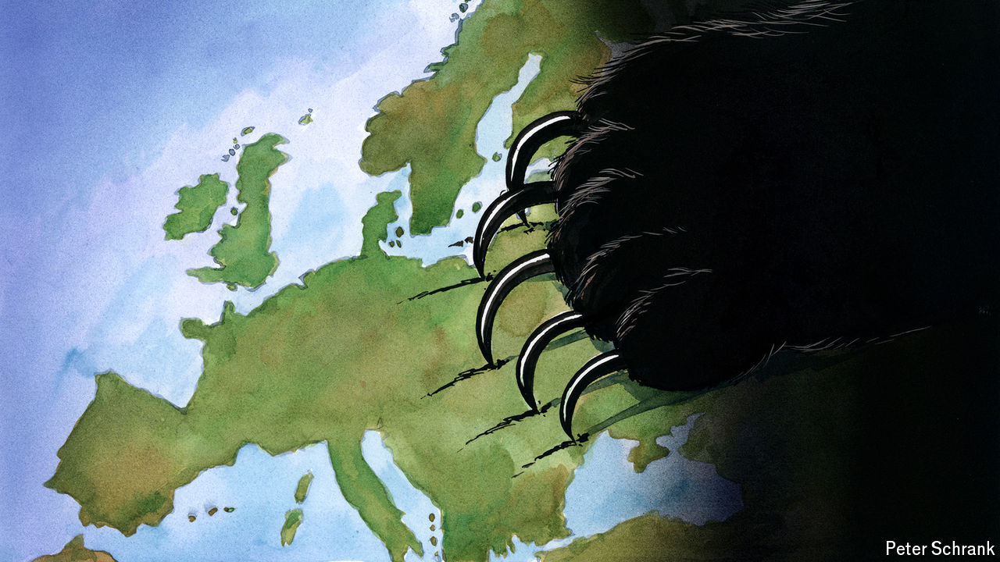

###### Charlemagne

# What happens if Ukraine loses? 

##### Russian victory would be debilitating for the West, and especially for Europe 

 

> Apr 11th 2024 

To ask “what if Ukraine loses?” was once a tactic favoured by those looking to berate its Western allies into sending more money and weapons. Increasingly the question feels less like a thought experiment and more like the first stage of contingency planning. After a gruelling few months on the battlefield, gone are last year’s hopes of a Ukrainian counter-offensive that would push Russia back to its borders and humble Vladimir Putin. These days it is fear that dominates: that an existing stalemate might crumble in favour of the invader, or of Donald Trump coming back to power in America and delivering victory to Russia on a silver platter. Although a vanquished Ukraine has become a less far-fetched prospect, it is no less frightening. Sobering as the return of war on the continent has been, a successful invasion reaping geopolitical rewards for Mr Putin would be much worse. 

A defeat of Ukraine would be a humbling episode for the West, a modern Suez moment. Having provided moral, military and financial succour to its ally for two years now, America and Europe have—perhaps inadvertently—put their own credibility on the line. That they have sometimes dithered in delivering this support would make things worse, not better: further confirmation, among sceptics of liberal polities, that democracies lack what it takes to stand up for their interests. In Russia but also China, India and across the global south, Ukraine’s backers would be dismissed as good at tabling UN resolutions and haggling over wording at EU and NATO summits but not much else. The colouring by atlas-makers of Ukrainian land into Russian territory would cement the idea that might makes right, to the benefit of strongmen far and wide. George Robertson, a former boss of NATO, has warned that “If Ukraine loses, our enemies will decide the world order.” Unfortunately for the Taiwanese, among others, he is probably right.


Nowhere would feel the brunt of this humiliation more than the EU, the pinnacle of liberal international norm-setting. Ukraine’s neighbours moved less fast than America in providing support. But in the European slow-but-steady way they feel they have done as much as could be asked of them. By sending arms (including using EU money to pay for weapons, a first), propping up Ukraine’s finances, taking in millions of refugees, applying a dozen rounds of sanctions against Russia and weaning themselves off its piped gas, the bloc’s politicians have pushed out the boundaries of what initially seemed possible. If it proves not to have been enough, plenty will ask whether the union at its core is fit for purpose. Populists—and Putin fans—in the mould of Hungary’s Viktor Orban or Marine Le Pen in France will crow that theirs is the best way. Currently there are divisions between the hawkish eastern fringe and others in the bloc. If Ukraine loses, those will metastasise into recriminations and bitterness. Emmanuel Macron in France, a newly minted hawk, has set the tone by warning of “cowards” holding Europe back.

The geopolitical fallout of a Ukrainian defeat would depend on the shape of any peace settlement. This in turn would hinge on military dynamics or the mindset of Mr Trump, should he be elected again. If Ukraine’s ammunition-constrained army crumbles and somehow Russia controls not just its eastern territories but the whole country, perhaps under a Belarus-style puppet regime, its aggressor will in effect share over a thousand more kilometres of borders with the EU. Should defeat be more limited—including annexation of territory, but a still-functioning “rump” Ukraine—nerves would still be set jangling. How long would it be before Mr Putin finished the job? Millions more Ukrainians might seize the opportunity to leave. The future shape of the EU would change: the promise of enlargement to Ukraine presupposed a comprehensive victory. The western Balkans, whose own bid to join was revived by the war, would surely be left in limbo too. 

Beyond the feeling of culpability and shame, a sense of fear would pervade Europe. Might there be a further attack? Would it be on a NATO country, forcing allies into action? Further attempts at conquest would at least be a possibility. Mr Putin has alluded to Nazism in the Baltics, echoing the pretext he used to invade Ukraine; the trio also have a large Russian-speaking population. A year ago the joke was that Russia’s claim of having the best army in Europe was ludicrous: it didn’t even have the best army in Ukraine. Fewer think that today, given Russia’s ability to keep supplying its men—not to mention supplying more men—faster than its adversary. A victorious Russian army would leave Mr Putin commanding the only fighting force with the battle-hardening and 21st-century warfare skills to take territory; if he controlled the Ukrainian state he would control two such military machines. Against him stand war-shy Europeans, perhaps with flaky American backing and depleted armouries. Might Poland or Germany find they will need their own nuclear deterrent? 

War hoarse

Even if Ukraine wins, Europe will have to change. The “peace project” at its core will have to adjust to a world in which war is, if not likely, then at least possible. NATO celebrates its 75th birthday this month, but its future as an alliance that Europeans use to ensure that America guarantees their territorial integrity is uncertain. Decades of reaping the post-cold-war peace dividend will have to be followed by higher defence budgets, as has started happening.

But if Russia emerges even semi-victorious, change will be imposed upon Europe in far more unpleasant and unpredictable ways. Seeking an arrangement with Mr Putin that would reward his belligerence with control over bits of Ukraine if he promised not to wage more war will provide illusory security, if that. Europe’s answer to the question “what if Ukraine loses?” remains simple: “It must not.” ■


