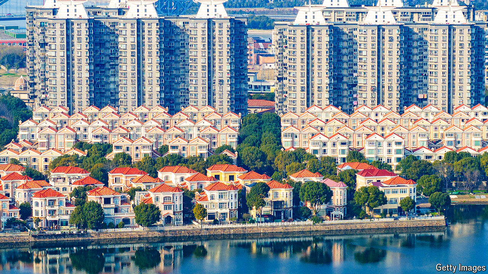
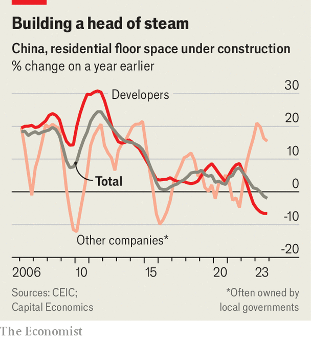

###### Xi’s healthy appetite

# China’s state is eating the private property market 

##### Pity those soon to buy a home 

 

> Apr 11th 2024 

At an upmarket housing development in Wuhan, sales agents want to make clear that their state-owned firm has severed all its ties to the private sector. The firm had at first partnered with Sunac, a private developer, until it defaulted in 2022. A saleswoman explains that the firm’s owner also controls the city’s waterworks and electricity provider. If this type of firm collapses, she says with a grin, “then the whole country has no hope”. 

More than three years into China’s property crisis, the biggest private builders are folding under the strain of enormous debts. New-home sales in 30 large cities fell by 47% in March, year on year. Revenues for the 100 biggest developers were down 46% in the same month. Housing investment dropped to 8.4trn yuan ($1.2trn), a quarter below its peak in 2021. Although millions of families are waiting for developers to finish building their flats, it would take 3.6 years to sell China’s glut of inventory, including homes still under construction, reckon analysts at ANZ, a bank. 

All this presents an opportunity for state-owned firms. Only by securing access to funding can developers survive. Some private companies have found help via a government programme that approves housing projects for state funding, but it has been slow to deploy capital. State firms, on the other hand, have long enjoyed tight links with banks. This means they are buying more land, building more homes and selling more of them than their private counterparts. At a time when most private companies face some form of restructuring, a few state-owned firms are miraculously eking out profits. Moreover, their actions provide hints as to the plans of Xi Jinping, China’s leader, for the next decade of the country’s property industry.

 


As part of those plans, the state is set to become China’s biggest home-builder. The country’s leaders want to construct millions of “social housing” units for low-income households, which cannot be resold like normal commercial units. Such is the scale of the planned construction, social homes will come to dominate overall housing supply by 2030. As much as 4trn yuan will be spent on social housing and other state building this year and next, estimates S&amp;P Global, a credit-rating agency. According to Capital Economics, a research firm, just as construction by developers began to plummet year on year in late 2021, building by other types of companies, mainly local-government firms, soared (see chart). As a result, 30-40% of new housing supply will be social homes by next year, up from just 10% currently. 

Local governments may also become the largest buyers of the country’s housing stock. The city of Zhengzhou recently announced that it would purchase 10,000 homes to make them social units. Many will be rented out. Although there is no estimate of how big a landlord local governments will become, several other cities have announced similar plans.

A few powerful state-owned firms are on the rise. CR Land, owned by the central government, notched a 3% year-on-year increase in its core profits—an astonishing accomplishment when most of its peers have lost money or collapsed. COLI, another centrally controlled giant, saw profits fall by a very respectable 3%. As the crisis has played out, home sales by the largest state firms fell by only 25% between mid-2021 and mid-2023, while those at the largest private ones tumbled 90%.

This reflects official preferences. On April 8th a state bank called for the liquidation of Shimao, a private developer that defaulted in 2022, over a $200m unpaid loan. Needless to say, this would hinder Shimao’s attempts to restructure its debts and continue building unfinished homes. By contrast, in March regulators asked banks and bondholders to help save Vanke, a developer with a powerful state-backed shareholder. Chinese policymakers are much happier to offer bail-outs to institutions over which they have influence.

With the state set to consume China’s property industry, what could go wrong? For a start, state firms face dangerous debts. Local-government firms sit on estimated collective debt of 75trn yuan, or about 60% of GDP. When such firms buy land from local governments they merely shift money from one pocket to another. These transactions have kept money flowing into local coffers, but are building up unsustainable burdens. Some local-government firms have started to issue bonds for the sole purpose of paying off other companies’ debts. Analysts fear that this level of spending cannot continue much longer, especially in poorer provinces.

Additional debts might appear to policymakers to be a price worth paying for control over China’s most important asset. The future of the housing market, the thinking goes, would include fewer boom-and-bust cycles if sober state firms were in charge. Cheaper accommodation should also help Mr Xi fight China’s widening wealth gap. Yet state dominance will also mean a less efficient market. China’s private homebuilders are masters of supply chains. Their ability to organise labour for construction is unparalleled. The state, in contrast, is a lousy builder. As state firms take on a bigger and bigger role, the quality of new homes is likely to fall. 

The intervention will also shake the foundations of the market. Homebuyers will probably become reluctant to buy a home at commercial rates when the same unit may later be available at subsidised ones. Market-watchers suspect officials want to conserve funds to buy up homes on the cheap, taking advantage of the struggles of private firms. As a consequence, the rapid growth of social housing will probably cause an even deeper crisis among private companies. That may not be quite what Mr Xi has in mind. ■


