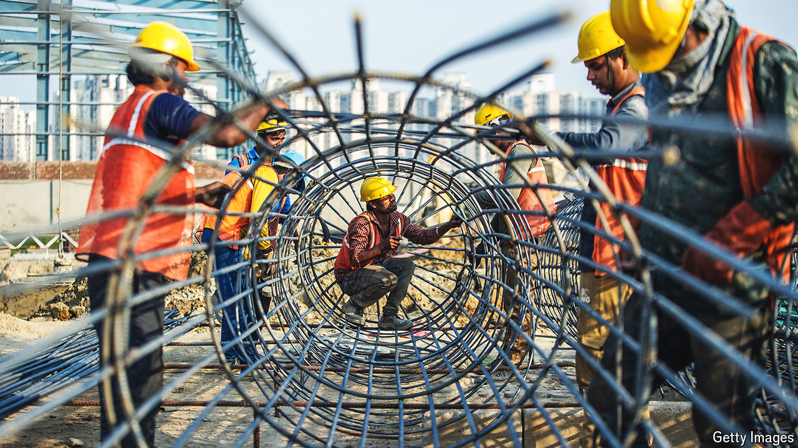
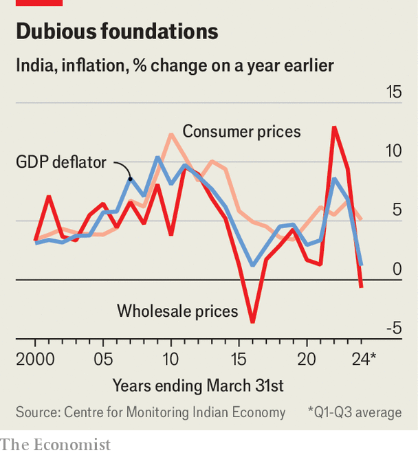

###### Beyond GDP

# How fast is India’s economy really growing? 

##### Statisticians take the country’s figures with a pinch of salt 

 

> Apr 11th 2024 

Optimism about India tends to spike now and again. In 1996, a few years after the country opened to foreign capital, the price of property in Mumbai, India’s financial hub, soared to the highest of any global city, according to one account. In 2007 the country’s economy grew at an annual rate of 9%, leading many to speculate that it might hit double digits. Yet after each of these booms, hopes were dashed. The late-2000s surge made way for financial turbulence in the 2010s.

Today India again appears to be at the start of an upswing. In the year to the fourth quarter of 2023, GDP growth roared at 8.4%. But such figures tend to be treated with a pinch of salt. Economists inside and outside the government are debating just how fast the economy is growing—a question that has particular piquancy ahead of a general election that begins on April 19th. So what is India’s actual growth rate? And is the economy accelerating?

 


To answer these questions, start with the 8.4% figure. Nominal GDP growth in the same period was 10.1%, implying that inflation was only 1.7%. Although that may seem suspect, given that India’s consumer prices rose by 5.4% over the year, it can be explained. Like many other countries, India’s GDP deflator puts a lot of weight on wholesale producer prices. These are volatile and grew by only 0.3% over the year. 

India’s approach does have oddities, however. In 2015 the country changed its GDP calculation, starting with figures from 2011, from one that measured real GDP directly by observing changes in production quantities to one that measured nominal GDP through surveys and financial reports, before then deflating them to obtain real GDP. It is a complex process: some sectors, such as manufacturing and mining, are deflated using a wholesale price index (WPI); services use a mix of the WPI and consumer prices; other sectors, including construction, use a quantity-based method.

In 2017 Arvind Subramanian, then India’s chief economic adviser, observed that the country’s GDP figures were falling out of line with indicators such as credit, electricity use and freight traffic. In 2019 he published a paper suggesting India’s GDP growth in 2011-16 had been overestimated by a few percentage points a year. The numbers have since been mired in controversy, not least because the methodological change came with a revision to historical data that reduced the growth rates achieved by the previous government. 

Few people suspect foul play in India’s GDP calculations. The old approach struggled to capture changes in the quality of goods, rather than quantities, says Pronab Sen, India’s first chief statistician. But the new method has disadvantages of its own. “Earlier, the chances were we were measuring real GDP growth more accurately, and today we are measuring nominal GDP more accurately,” says Mr Sen.

The disadvantages reflect two issues: the choice of deflator, and how the deflation is carried out. More sectors use WPI as their deflator than consumer prices. Indeed, even though WPI does not contain service prices, it is still used for a number of industries, such as hotels, that ought to incorporate them. This is a growing problem. Service sectors already make up more than half India’s GDP and are expanding faster than the rest of the economy. By our calculations, India’s consumer price index, which puts greater weight on services, grew by 20 percentage points more than its GDP deflator from 2011 to 2019—the largest gap in any big economy. From 2003 to 2011, by contrast, it grew by three percentage points less.

Then there is how deflation is done. Most countries use a method called “double deflation”, where input and output prices are deflated separately. Consider a manufacturer importing oil for use in production. If oil prices fall, output prices do not and quantities stay the same, real value added should not change. But if the same deflator is used for inputs and outputs, as in India, it would look as if the manufacturer had become more productive. 

This is what seems to have happened during the 2010s. Oil prices were steady at $90-100 a barrel from 2011 to 2014, before crashing to below $50 over the next two years. India is reliant on oil imports, as the world’s third-biggest consumer of oil, 85% of which is brought in. Although India’s manufacturing sector struggled in this period, GDP data concealed its difficulties.

The good news is that since the covid-19 pandemic, the divergence between WPI and consumer prices no longer appears as significant. From December 2011 to 2019, consumer prices grew at a 5.8% annual rate and WPI grew at a 2.6% annual rate. Yet in the four years to December 2023, both measures have grown at around 5.7%. WPI remains volatile, which is why quarterly GDP figures, such as the recent 8.4% growth rate, should be treated with a degree of caution. The number was also boosted by a one-time reduction in subsidy payments and an increase in indirect tax collections, which is why the trend is more likely to be closer to 6.5%—the growth rate of gross value added.

India’s government is working towards incorporating services into its price indices. The road to a fully fledged producer-price index and double-deflation will be a long one, however. Mr Sen says many Indian companies would rather not share data on their costs with the government. Statisticians are often reluctant to force the private sector to comply. Meanwhile, collecting wholesale prices is much easier because traders are happy to report them.

Do existing data suggest a boom? Since December 2019, real GDP has grown by 4.2% at an average annual rate, meaning that India, like many other countries, has not recovered to its pre-pandemic trend. Corporate and foreign investment remain weak. But looked at since December 2021, India’s overall economy seems robust, having grown at 7.1% annually. Alternative indicators, from electricity use to freight traffic, are strong; surveys of purchasing managers for both manufacturing and services have hit their highest levels in over a decade. Forecasters expect 6.5% annual growth over the next five years. Although real GDP growth from 2011 to 2019 was also officially 6.5% a year, the underlying rate was probably lower, implying genuine acceleration may be under way. The data is noisy, the picture is mixed and yet most government economists would be satisfied with that outcome. ■


