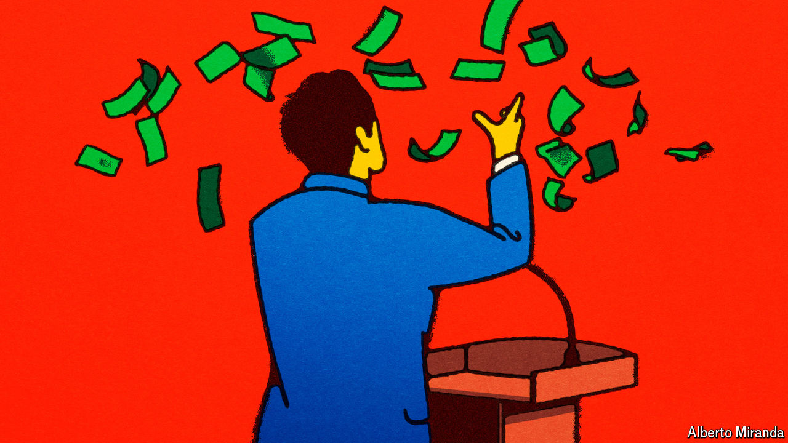
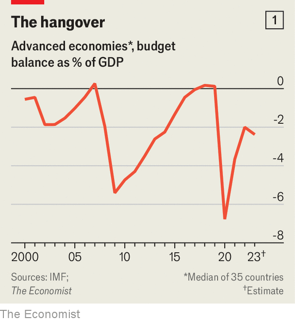
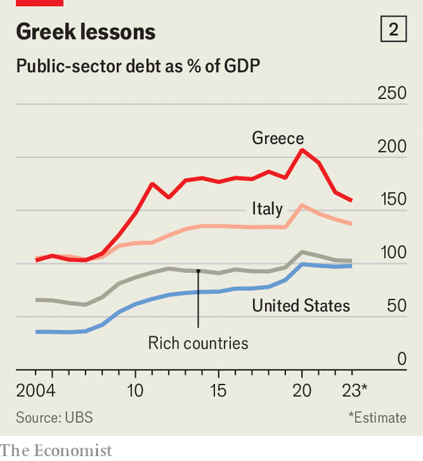

###### Fantasy economics

# The rich world faces a brutal spending crunch 

##### Countries including America, Britain and France are up against remorseless fiscal logic 

 

> Apr 9th 2024 

A decade ago finance ministries were gripped by austerity fever. Governments were doing all they could to cut budget deficits, even with unemployment high and economic growth weak. Today things are very different. Across the West, most economies are in better shape. People have jobs. Corporate-profit growth is strong. And yet governments are spending a lot more than they are taking in. 

No government is more profligate than America’s. This year the world’s largest economy is projected to run a budget deficit (where spending exceeds taxation) of more than 7% of GDP—a level unheard of outside recession and wartime. But it is not the only spendthrift country. Estonia and Finland, two normally parsimonious northern European countries, are running large budget deficits. Last year Italy’s deficit was as wide as in 2010-11, following the global financial crisis of 2007-09, and France’s grew to 5.5% of GDP, well above forecasts. “I am calling for a collective wake-up call to make choices in all of our public spending,” announced Bruno Le Maire, its finance minister, last month.

 


Some countries have been more reserved. Last year Cyprus ran a surplus. Greece and Portugal—close to balancing their budgets—look like the model of fiscal rectitude even if they still have colossal debts. Still, the general direction is clear. has analysed data from 35 rich countries. Whereas in 2017-19 the median country in our sample ran a budget surplus, last year it ran a budget deficit of close to 2.5% of GDP (see chart 1). Measures of “primary” deficits (excluding interest payments) and “structural” deficits (abstracting from the economic cycle) have also widened. 

Two factors explain the splurge. The first relates to taxes. Across the rich world, receipts are surprisingly weak. In America, revenue from income taxes deducted from pay fell slightly last year. Meanwhile, “non-withheld income taxes”, including on capital gains, tumbled by a quarter. Britain’s capital-gains-tax take is running 11% below its recent high. And Japan’s self-assessment tax take for this fiscal year, which includes some levies on capital gains, is on track to come in 4% below last year’s. 

Taxmen are suffering because of market ructions in late 2022 and early 2023. Tech firms, which pay big salaries, let staff go, trimming income-tax hauls. As stock prices fell, it became more difficult for households and investors to sell shares for a profit, reducing the pool of capital gains. Last year few people made profits from flipping houses as property prices dropped. Senior staff at private-equity firms, who often receive income in the form of investment returns rather than a conventional salary, had a bad year. 

The second factor is state spending. Following the whatever-it-takes fiscal policy of the covid-19 pandemic governments have retrenched, but not fully. In Australia elderly people in care homes may still receive financial assistance during a covid outbreak. Only in mid-2023 did Germany completely wind down the job-protection schemes implemented during the pandemic. America is still paying out hefty tax refunds to small businesses that kept people on during lockdowns. In Italy a project concocted in 2020, designed to encourage homeowners to green their homes, has spiralled out of control, with the government so far disbursing support worth more than €200bn (or 10% of GDP). The name of one of the schemes, “Superbonus”, would be amusing were it not so profligate.

Politicians have also become more prepared to intervene—and spend money—in order to right perceived wrongs. After Russia invaded Ukraine and energy prices soared, governments in Europe allocated about 4% of GDP to protect households and companies from the effects. A few, including Poland and the Baltics, are now spending big on guns and soldiers. President Joe Biden wants to forgive as much student debt as he can before America’s presidential election in November. 

How long can the firehose keep blasting? At first glance, it looks like it could keep going for a while. Markets are on a tear, which will boost tax receipts. And a government’s debt sustainability does not change solely owing to what happens to the budget deficit. It is also a product of overall public debt, economic growth, inflation and interest rates. Since the end of the pandemic, inflation has been high and growth has been solid. Although interest rates have risen, they remain fairly low by historical standards.

 


These conditions put politicians in a fiscal sweet spot (see chart 2). We calculate that in 2022-23 the median rich country was able to run a primary deficit of about 2% of GDP and still cut its public-debt-to-GDP ratio. The nominal value of debt would have risen, but, helped by inflation, the size of the economy would have risen by even more. A few countries faced an even more favourable environment. Italy’s debt ratio has fallen by about ten percentage points of GDP since 2021, despite its loose fiscal policy. France’s ratio has edged down, too. Greece—combining favourable economic conditions with tight fiscal policy—has seen its debt-to-gdp ratio fall by a stunning 50 percentage points.

Now conditions are changing, however. Interest rates facing governments are not yet falling, even as economic growth and inflation have come down. In America investors are trimming their bets on  by the Federal Reserve. All told, the fiscal arithmetic is becoming more daunting. For instance, whereas last year the Italian government could have run a primary deficit of up to 2% of gdp and still cut its debt ratio, now it needs to run a surplus of 1% of gdp. America is in a similar position. Further falls in inflation, a slowdown in growth or higher rates would make it more difficult still for governments to stabilise their debt.

Small wonder that talk of fiscal consolidation has become louder. The Italian government believes it will soon be reprimanded by the EU for its stance. In Britain the Labour Party, which hopes to take power before long, promises fiscal rectitude. The French government has discussed cuts to health spending and unemployment benefits. America is the outlier. In the world’s leading economy, the conversation still has not turned. Ahead of the election, Donald Trump and Mr Biden promise tax cuts for millions of voters. But fiscal logic is remorseless. Whether politicians like it or not, the era of free-spending governments will have to come to an end. ■


