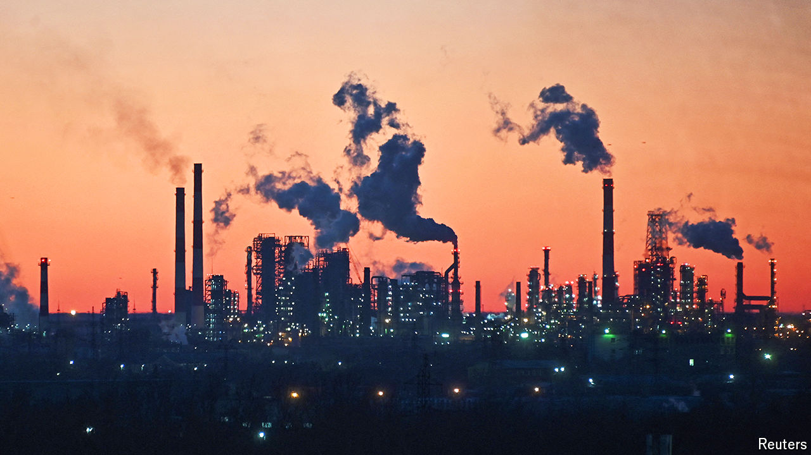

###### Behind enemy lines

# Ukrainian drone strikes are hurting Russia’s oil industry 

##### The world’s third-largest producer is now an importer of petrol 

 

> Apr 11th 2024 

Selling more oil at higher prices ought to be the stuff of dreams for a petrostate. But for Russia it is a sign of a new, punishing phase in its war with Ukraine. Months of Ukrainian drone strikes on refineries have crimped Russia’s ability to produce refined fuels, such as diesel and petrol, and turned the world’s third-largest oil producer into an importer of petrol. Energy firms have tried to pare their losses by selling unrefined oil overseas, pushing exports to a ten-month high in March.

In Ukraine’s most recent attack on April 2nd, its planners extended their reach. They managed to land explosives on a refinery 1,115km from the border. Their attack set fire to a unit responsible for 3% of Russia’s refining capacity. Although it left no lasting damage, others have been more successful. All told, Ukraine’s barrage has knocked out a seventh of Russian refining capacity, according to S&amp;P Global, a data firm. Maintenance work and flooding in the city of Orsk on April 8th has taken more capacity offline. Wholesale prices on the St Petersburg International Mercantile Exchange have spiked. Ukraine, which has itself been the target of strikes on energy infrastructure, hopes the assaults will slow the flow of dollars into its enemy’s war machine and dent support for the war.


Russia’s oil giants are suffering the most. Refineries that normally produce petrol and diesel for overseas clients at a premium have been diverted to domestic production. The volume of diesel due to pass out of Russian ports has hit a five-month low. At the same time, oil barons are seeking new customers for their excess crude, on which they will stomach losses of $15 or so for every barrel that could have been exported as a refined product, says Sergey Vakulenko, a former oil executive.

Although Ukraine’s attacks have slowed since Vladimir Putin’s re-election in March, Ukraine has given no indication that they will stop. It can lob drones faster and more cheaply than Russia can repair its refineries. Some facilities, like the NORSI refinery in the city of Nizhny Novgorod, have been particularly slow and expensive to fix, in part because access to equipment is stymied by Western sanctions. As of this month, Russian oil producers must also reduce the amount they pump from the ground by about 5% as part of a production cap agreed with OPEC+, an oil cartel. 

Motorists have so far been shielded from Ukraine-inflicted “unplanned maintenance” (as Russia’s energy ministry puts it). The government has kept a lid on prices by banning petrol exports for six months from March 1st, and striking a deal with Belarus, its client state. Russia imported 3,000 tonnes of fuel from Belarus in the first half of March, up from zero in January. Fearing that may not be enough, officials have also asked neighbouring Kazakhstan to set aside a third of its reserves, equivalent to 100,000 tonnes, should Russia need them, according to Reuters. If attacks continue, they could start to push up prices.

The consequences for Russia’s public finances should be limited, even though oil revenues represent 34% of its budget. Rosneft, the state oil company, will dispense a smaller dividend if it cannot make up its lost revenues, but many doubt these dividends make it to state coffers at all. The government will even save some cash by paying out fewer per-barrel subsidies to refineries. Russia’s biggest money-earners are resource taxes. And because these are levied as royalties at the well-head, the government is indifferent between oil exported as crude or as refined fuel, says Mr Vakulenko. As long as Russia is able to export crude, it can collect royalties.

Observers outside Russia are watching to see if Ukraine’s attacks will affect the global oil market. They have yet to have much impact, but the price of Brent crude has risen by 19% this year to just under $90 a barrel, owing to OPEC+ supply curbs, better-than-expected global economic conditions and disruptions in the Red Sea. Few observers have more at stake than Joe Biden, who faces an election in November. His administration has urged Ukraine to halt its attacks, fearing they will provoke tough retaliation from Russia and drive petrol prices higher. Ukraine’s leaders are willing to take the risk. ■


