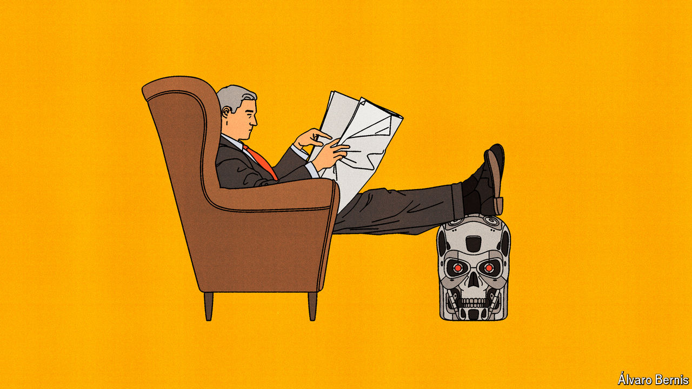

###### Free exchange

# What will humans do if technology solves everything? 

##### Welcome to a high-tech utopia 

 

> Apr 9th 2024 

In “Permutation City”, a novel by Greg Egan, the character Peer, having achieved immortality within a virtual reality over which he has total control, finds himself terribly bored. So he engineers himself to have new passions. One moment he is pushing the boundaries of higher mathematics; the next he is writing operas. “He’d even been interested in the Elysians [the afterlife], once. No longer. He preferred to think about table legs.” Peer’s fickleness relates to a deeper point. When technology has solved humanity’s deepest problems, what is left to do? 

That is one question considered in a new publication by Nick Bostrom, a philosopher at the University of Oxford, whose last book argued that humanity faced a one-in-six chance of being wiped out in the next 100 years, perhaps owing to the development of dangerous forms of artificial intelligence (AI). In Mr Bostrom’s latest book, “Deep Utopia”, he considers a rather different outcome. What happens if AI goes extraordinarily well? Under one scenario Mr Bostrom contemplates, the technology progresses to the point at which it can do all economically valuable work at near-zero cost. Under a yet more radical scenario, even tasks that you might think would be reserved for humans, such as parenting, can be done better by AI. This may sound more dystopian than utopian, but Mr Bostrom argues otherwise.

Start with the first scenario, which Mr Bostrom labels a “post-scarcity” utopia. In such a world, the need for work would be reduced. Almost a century ago John Maynard Keynes wrote an essay entitled “Economic Possibilities for Our Grandchildren”, which predicted that 100 years into the future his wealthy descendants would need to work for only 15 hours a week. This has not quite come to pass, but working time has fallen greatly. In the rich world average weekly working hours have dropped from more than 60 in the late 19th century to fewer than 40 today. The typical American spends a third of their waking hours on leisure activities and sports. In the future, they may wish to spend their time on things beyond humanity’s current conception. As Mr Bostrom writes, when aided by powerful tech, “the space of possible-for-us experiences extends far beyond those that are accessible to us with our present unoptimised brains.” 

Yet Mr Bostrom’s label of a “post-scarcity” utopia might be slightly misleading: the economic explosion caused by superintelligence would still be limited by physical resources, most notably land. Although space exploration may hugely increase the building space available, it will not make it infinite. There are also intermediate worlds where humans develop powerful new forms of intelligence, but do not become space-faring. In such worlds, wealth may be fantastic, but lots of it could be absorbed by housing—much as is the case in rich countries today. 

“Positional goods”, which boost the status of their owners, are also still likely to exist and are, by their nature, scarce. Even if AIs surpass humans in art, intellect, music and sport, humans will probably continue to derive value from surpassing their fellow humans, for example by having tickets to the hottest events. In 1977 Fred Hirsch, an economist, argued in “The Social Limits to Growth” that, as wealth increases, a greater fraction of human desire consists of positional goods. Time spent competing goes up, the price of such goods increases and so their share of GDP rises. This pattern may continue in an AI utopia.

Mr Bostrom notes some types of competition are a failure of co-ordination: if everyone agrees to stop competing, they would have time for other, better things, which could further boost growth. Yet some types of competition, such as sport, have intrinsic value, and are worth preserving. (Humans may also have nothing better to do.) Interest in chess has grown since IBM’s Deep Blue first defeated Garry Kasparov, then world champion, in 1997. An entire industry has emerged around e-sports, where computers can comfortably defeat humans. Their revenues are expected to grow at a 20% annual rate over the next decade, reaching nearly $11bn by 2032. Several groups in society today give us a sense of how future humans might spend their time. Aristocrats and bohemians enjoy the arts. Monastics live within themselves. Athletes spend their lives on sport. The retired dabble in all these pursuits.

Everyone’s early retirement

Won’t tasks such as parenting remain the refuge of humans? Mr Bostrom is not so sure. He argues that beyond the post-scarcity world lies a “post-instrumental” one, in which AIs would become superhuman at child care, too. Keynes himself wrote that “there is no country and no people, I think, who can look forward to the age of leisure and of abundance without a dread. For we have been trained too long to strive and not to enjoy…To judge from the behaviour and the achievements of the wealthy classes today in any quarter of the world, the outlook is very depressing!” The Bible puts it more succinctly: “idle hands are the devil’s workshop.” 

These dynamics suggest a “paradox of progress”. Although most humans want a better world, if tech becomes too advanced, they may lose purpose. Mr Bostrom argues that most people would still enjoy activities that have intrinsic value, such as eating tasty food. Utopians, believing life had become too easy, might decide to challenge themselves, perhaps by colonising a new planet to try to re-engineer civilisation from scratch. At some point, however, even such adventures might cease to feel worthwhile. It is an open question how long humans would be happy hopping between passions, as Peer does in “Permutation City”. Economists have long believed that humans have “unlimited wants and desires”, suggesting there are endless variations on things people would like to consume. With the arrival of an AI utopia, this would be put to the test. Quite a lot would ride on the result. ■


