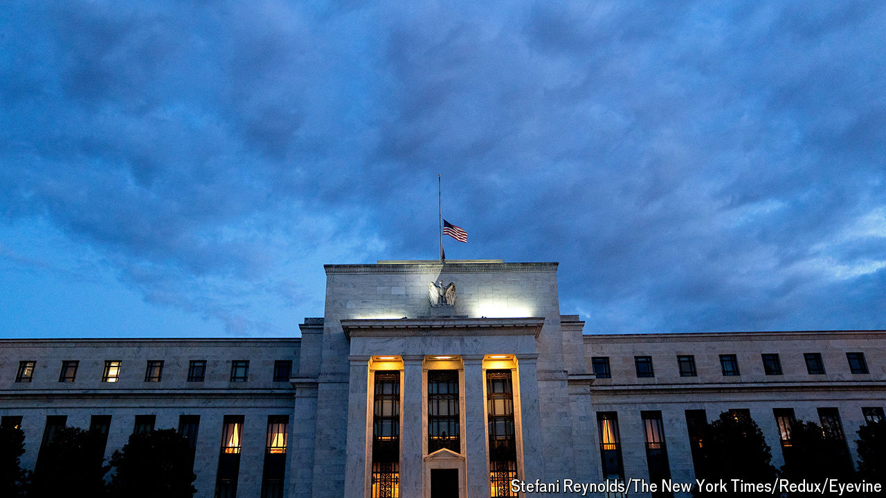
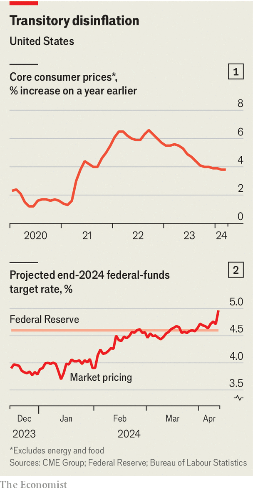

###### Put the axe away

# When will Americans see those interest-rate cuts? 

##### Following a nasty surprise, some now think they may come only after the presidential election 

 

> Apr 10th 2024 

Perhaps it was always too good to be true. The big economic story of 2023 was the seemingly painless disinflation in America, with consumer-price pressures receding even as growth remained resilient, which underpinned surging stock prices. Alas, the story thus far in 2024 is not quite so cheerful. Growth has remained robust but, partly as a result, inflation is looking stickier. The Federal Reserve faces a dilemma about whether to start cutting interest rates; investors must grapple with the reality that monetary policy will almost certainly remain tighter for longer than they had anticipated a few months ago.

 


The latest troublesome data came from higher-than-expected inflation for March, which was released on April 10th. Analysts had thought that the core consumer-price index (CPI), which strips out food and energy costs, would rise by 0.3% month on month. Instead, it rose by 0.4%. Although that may not sound like much of an overshoot, it was the third straight month of CPI readings exceeding forecasts. If continued, the current pace would entrench inflation at over 4% year on year, double the Fed’s target—based on a slightly different inflation gauge—of 2% (see chart 1).

Back in December, at the peak of optimism, most investors had priced in six or seven rate cuts this year. They have since dialled back those expectations. Within minutes of the latest inflation figures, market pricing shifted to implying just one or two cuts this year—a dramatic change (see chart 2). It is now possible that the Fed will not cut rates before the presidential election in November, which would be a blow to the incumbent, Joe Biden.

Jerome Powell, the Fed’s chairman, has remained consistent. He has always insisted that the central bank will take a data-dependent approach to setting monetary policy. But rather than bouncing up and down in reaction to fresh figures, he has also counselled patience. At the start of this year, even after six straight months of largely benign price movements, he said the Fed wanted more confidence that inflation was going lower before starting to cut rates. Such caution risked seeming excessive. Today it looks appropriate.

The volatility of market pricing has also changed the Fed’s positioning relative to the market. At the end of last year, when investors foresaw as many as seven rate cuts this year, officials had pencilled in just three, appearing hawkish. In their more recent projections, published less than a month ago, officials still pencilled in three cuts, which now appears doveish. The Fed will next update its projections in June.

In the meantime the Fed will be watching more than the CPI. Its preferred measure for inflation, the core personal consumption expenditures price index (PCE), will be released in a few weeks, and is expected to come closer to 0.3% month on month in March. Several of the items that drove up CPI, particularly motor-vehicle insurance and medical services, are defined differently in PCE calculations. The Fed may also be comforted by data showing wage growth has continued to moderate.

Nevertheless, trying to explain away uncomfortable numbers by pointing to this or that data quirk is redolent of 2021, when inflation denialists thought that fast-rising prices were merely a transitory phenomenon. The general conclusion today is that although growth has remained impressively strong, it now appears to be bumping up against the economy’s supply limits, and is therefore translating into persistent inflationary pressure. That calls for tight, not loose, monetary policy. The Fed, already cautious about cutting rates when inflation figures were more co-operative, is likely to be even more wary now. ■


