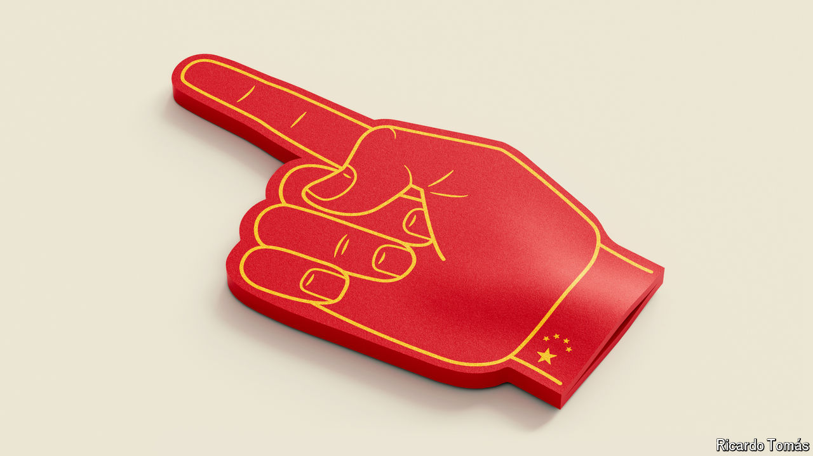
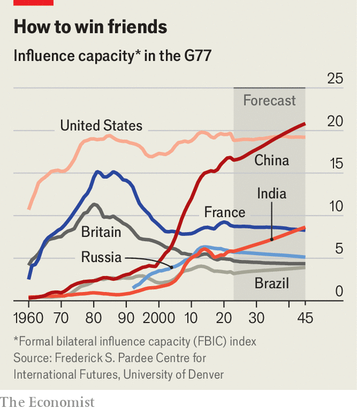

###### On the rise

# Who’s the big boss of the global south? 

##### In a dog-eat-dog world, competition is fierce 

 

> Apr 8th 2024 

SNIFFY TYPES disdain the notion of “the global south”, which has become something of a meme in recent years. Its inadequacies are obvious: three words could never capture the complexities of a group of more than 100 countries spread from Morocco to Malaysia and beyond. But the phrase has been adopted by Joe Biden, Emmanuel Macron and Xi Jinping. 

The simplest working definition is that it refers to most, but not quite all, non-Western countries. Its use also denotes how emerging economies want more power over global affairs and often have a critical view of Western policy. Thus the global south is said to be outraged by the war in Gaza, and unhappy about Western decisions on Ukraine, covid-19 and climate policy. Sarang Shidore of the Quincy Institute for Responsible Statecraft, an American think-tank, says “the global south exists not as a coherent, organised grouping so much as a geopolitical fact.”

If the global south exists, sort of, then who leads it? Narendra Modi has suggested India could be its “voice”. Luiz Inácio Lula da Silva (known as Lula), the president of Brazil, reckons his country could be, too. To examine this question we have worked with a group of scholars to crunch data on trade, financial and diplomatic links. Our conclusion is, counterintuitively, that America still has more influence than any other country over the global south, but that within the grouping itself China has become the most powerful member—giving Mr Xi the strongest claim to leadership. The sting is that China’s influence has glaring limits, and could even backfire. And other powers are on the rise.

We worked with the Pardee Centre for International Futures (PCIF) at the University of Denver. It has built an index of states’ power from 1960 to 2022. The main metric is catchily known as “formal bilateral influence capacity”, a measure of how much power country A may have over country B, based on two dimensions. First, “bandwidth”, or the extent of connections back and forth: the volume of trade, diplomatic representation and so on. Second, “dependence”: how much country B needs country A’s arms, loans, investments etc. More connections mean more chances for country A to exert influence—and asymmetry in power makes it easier to do so. Think of China’s power over Pakistan, for instance: ample connections and China enjoys asymmetric influence. The exercise examines power relations among the 130-odd members of the global south found in the G77, a UN grouping.

 


America has been the country with the most influence over the G77 since the 1970s (see chart). Its “influence capacity” has been more or less constant even as the allure of Britain and France has waned. But it is increasingly rivalled by China, which after 40 years of relative insignificance saw its influence grow from around 2000. According to the index, China’s “influence capacity” over the G77 is roughly double that of France, the third-most influential country, and around three times that of Britain, India or the UAE. 

Seeing red

China wields the most influence in 31 countries. Its clout is greatest in Pakistan, Bangladesh, Russia and several states in South-East Asia. By contrast the next-most powerful member of the global south, India, is top dog with only six G77 members. According to an earlier analysis by PCIF, from 1992 to 2020 the number of countries over which China had more influence than America almost doubled, from 33 to 61. 

Recently, China has become a lot keener on the whole idea of the grouping. Last year Mr Xi and senior Chinese officials began referring to their country as part of the “global south”, a description they had hitherto resisted (the term is credited to an American left-wing academic in the 1960s), in favour of phrases like “family of developing countries”. In September, China published proposals on changing international institutions, rules and laws. It claimed this was a vision of “true multilateralism” where “universal security” replaced “universal values”—in other words, a system not run by an interfering West.

China is intensely strategic about winning influence and targets swing states with infrastructure support, financing and more. From 2000 to 2021 it funded more than 20,000 infrastructure projects, many of which were under the Belt and Road Initiative (BRI), across 165 countries with aid or credit worth $1.3trn. Some analysts have noted data showing that credit from large state-backed lenders such as the Export-Import Bank of China is drying up. But a paper published in November by AidData, a group from William &amp; Mary University, argues otherwise. “Contrary to conventional wisdom, Beijing is not in retreat,” says Bradley Parks, one of the authors. The paper finds that there are many more entities extending credit to the developing world today: in 2021 it counted lending of $80bn a year. “[China] remains the single largest source of international development finance in the world.”

China is targeting geopolitical fence-sitters. AidData reckons that around two-thirds of Chinese financing goes to “toss-up” countries, where neither China nor America clearly holds sway. The group has identified a quid pro quo: if a government increases its share of votes at the UN General Assembly (UNGA) that align with China’s by ten percentage points, it can expect a 276% increase, on average, in financing from Beijing. China has also used its weight to curry favour on subjects such as its repression in Xinjiang. From 2000 to 2021 “low- and middle-income countries” voted on foreign-policy decisions with China 75% of the time at the UNGA. 

China uses other tools, too. It is the main trading partner of more than 120 countries. It has provided $240bn, mostly since 2016, in emergency financing of the sort the IMF specialises in. China also builds infrastructure projects quickly in developing countries, pleasing their elites, and subsidises the roll-out of digital tech such as that of Huawei. Over the past five years it has overtaken Russia as the main source of weapons for sub-Saharan Africa. 

Though China’s leadership position among the G77 is formidable, it faces problems. First, its influence is limited in reach and intensity. Recent polls in Africa and South-East Asia, for example, show split support for America and China in developing countries. 

China’s conduct and political values may stunt its influence. Its actions in business and politics have attracted calls for accountability: countries sometimes lay the blame for their debt crises at its door. And the country’s disdain for values-based interactions (it preaches non-interference instead) is apparent. Most of the one-party state’s closest pals are also autocratic. Places in the global south where democratic values are considered strong, such as Brazil, are unlikely to have a close cultural connection with China. What is more, as China draws nearer to the likes of Iran and Russia it risks allying with countries that want to destroy, rather than to reform, the international order. 

Meanwhile China’s economic reputation could deteriorate. The public support it won through its lending binge happened before the money needed repaying. Some 75% of its BRI loans will require the principal to be paid back by 2030. It is probably no coincidence that the share of people in Africa who see China as having a positive impact on its development dipped from 59% to 49% from 2019 to 2022, according to Afrobarometer, a pollster. Mr Xi’s latest response to economic woes in China is to launch massive industrial subsidies, which could lead to manufactured goods flooding markets of other emerging economies. Although some consumers may benefit, another “China shock” may stunt the industrial ambitions of governments in the global south. 

Even as China faces headwinds, new rivals are emerging whose influence in the global south is rising. India is the front-runner. The number of Indian embassies in Africa increased from 25 to 43 between 2012 and 2022. It is the continent’s fourth-largest trade partner and fifth-largest source of foreign direct investment, according to Mr Modi. Meanwhile India is also offering its “stack” of digital platforms—including biometric identity technology—to countries such as Ethiopia, Sierra Leone and Sri Lanka.

Some of India’s power is unquantifiable. As a flawed democracy with an ultra-pragmatic foreign policy (it has forged closer bonds with America at the same time as refusing to condemn Russia’s invasion of Ukraine) it is closer to the median worldview among the G77 than is China. India’s pitch to lead is also substantively different. Because it worries more about a China-led Asia than an American-led world, it is also pragmatic about its approach to reforming international rules. The country wants to be a bridge to the West, not a battering ram.

Buyer’s remorse

Other countries have specialist claims to power. If China is a supermarket of influence, then its rivals in the global south are like boutiques, offering other members a smaller range of bespoke goods. Gulf states are investing some of their hydrocarbon windfalls in renewable-energy projects and mines in the developing world. Brazil, the world’s second-largest agricultural exporter, is using its chairmanship of the G20 this year to promote food security in the global south. South Africa sees itself, improbably, as the moral leader of the global south, taking Israel to the International Court of Justice for alleged genocide in Gaza, and leading a “peace mission” of African countries to Ukraine and Russia.

Lastly, America and its allies are not out of the game. Rich countries in the OECD group spend more than $200bn annually in overseas aid (loans make up most of China’s financing). Trade between sub-Saharan Africa and, in total, America and the euro area is greater than that between the region and China, according to IMF data. And in addition to alliances such as NATO, America has defence partnerships with 76 countries. 

China hopes to see off this competition. Yet even if it does, it will be the leading power in a group that will never be cohesive. China is not going to welcome India permanently onto the UN Security Council; Brazil and South Africa regularly disagree at the WTO over agriculture; debtor countries and creditors like China want different things from World Bank and IMF reform. China will find that countries in the global south will pursue their national interests, and often come into conflict with the West, China—and each other. The global south, in other words, does not want a leader. It is a zone of contest. Just not one that can be located on a map. ■

