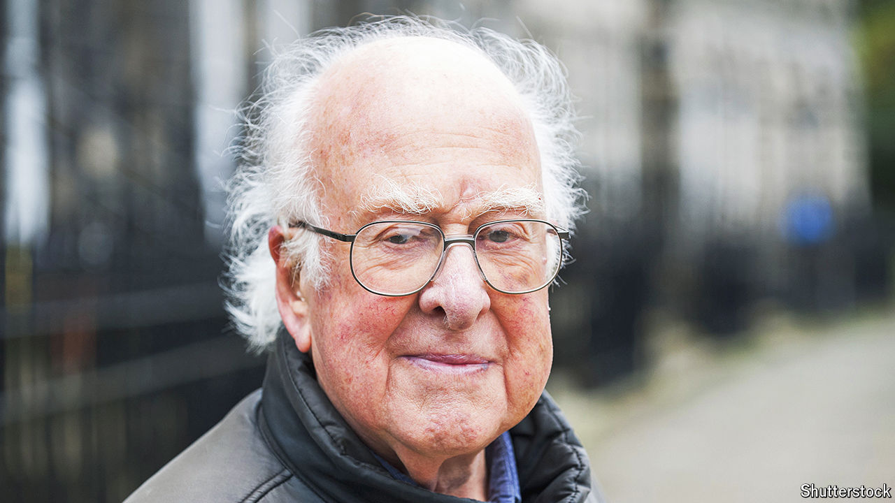

###### What’s in a name

# In praise of Peter Higgs 

##### The particle named after him became a selling point. For the man, it was a bit of a pain 

 

> Apr 11th 2024 

If it had been up to , the world would have taken no heed of his death on April 8th—nor, for that matter, of the 94 years of life which preceded it. He valued the respect of his colleagues and treasured his occasional “bright ideas” about the way the universe worked. The fact that one of those bright ideas ended up boiled down into an object bearing his name, which became the subject of a world-encompassing multi-billion-dollar “quest”, was a source of some exasperation. The, he said, “ruined my life”. 

Dr Higgs’s best-known bright idea was arcane but crucial. There are two types of fundamental particles, fermions and bosons. The symmetrical nature of the equations which describe bosons implies that they should be massless. By the 1950s, though, it seemed that some bosons did have mass; some fundamental symmetries were in practice “broken”. Untangling the maths of broken symmetries became a preoccupation of particle physicists. Dr Higgs’s contribution, made over a few weeks in the summer of 1964, was a mathematical description of a new boson that could give mass to bosons in need of it. 

In 1983 a daring modification of a particle accelerator at CERN, the , produced direct evidence of three massive bosons—two Ws and a Z—predicted by the theory which unified electromagnetism and the weak nuclear force. This boson bonanza left some American physicists miffed. They told the government which funded them that America was losing an important race. The proposed comeback was the Superconducting Super Collider (SSC), a particle accelerator of extraordinary power that would be 87km in circumference. 

The Higgs boson was a key part of the pitch. The particle’s existence was predicted by theory but, as had been the case with the Ws and Z, its discovery was impossible without a powerful enough machine. The SSC would be that machine. Journalists grasped that if there was a Higgs particle there must also be a Higgs; 24 years after writing his original paper, Dr Higgs found himself doing his first interview. Leon Lederman, a champion of the SSC to whom press availability was a joy, not a chore, dubbed the Higgs “The God particle”, thereby increasing the hype and the sales of his thus-titled book. 

In 1993 Congress cancelled the SSC. Its European rival, CERN’s LHC, carried on. Physicists there thought that the Higgs was a “known unknown” which their machine, though smaller, still stood a good chance of producing, and it was central to the way it was sold to politicians and the public. 

The LHC delivered the goods in 2012, and the Nobel prize committee followed suit the next year. Dr Higgs grinned (sometimes) and bore the attention. It was not just that the particle carried his name. Their story was so beguiling: the humble theorist in his garret (actually a third-floor flat in Edinburgh’s New Town) who goes unheralded for decades but whose ideas eventually change the world—how’s that for the untrammelled power of the singular mind? But it was never really true. Dr Higgs, as he always made clear, was one of many scientists coming up with similar ideas at a time when using soundbite-friendly baubles to win funding for city-sized accelerators was still unthinkable. 

It might have been best had it stayed so. What scientists actually want from big science rarely boils down to a single thing; they want the means with which to explore widely. The public wants to know that new discoveries are being made. Casting scientific projects as quests for some pre-ordained grail (dread word), be it a single boson or a single human genome, may make the story simple, but it underplays the true ambition and delight of creating tools that make new types of science possible. And it makes the chance of disappointment greater. More than a decade after its discovery, it is hard to argue that finding the Higgs particle has changed the world, or for that matter physics, all that much. It is worth remembering, as Dr Higgs always knew, that what really matters is the process, not the prize. ■

