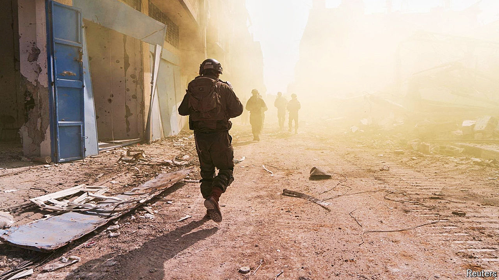

###### War in Gaza

# The short-sighted Israeli army 

##### Force alone cannot bring security 

 

> Apr 11th 2024 

THE STORY of the Israel Defence Forces is the story of Israel itself. From the creation of the state in 1948, the IDF has  with Arab countries that were bent on destroying it. Israelis see their army as the best of themselves—tough, shrewd and innovative. Despite the IDF’s terrible failure to predict or prevent the incursion from Gaza on , many Israelis think their army has gone on to have a good war. A former Israeli general and national security adviser this week said that Operation Swords of Iron would come to be viewed as an exemplar of how to conduct urban combat.

As our reporting makes clear, the reality in Gaza is different. The campaign against Hamas is justified, but it has been marred by the IDF’s over-reliance on technology and a lack of strategic thinking. Most of all, the army has suffered from the self-serving rivalries and cramped vision of Israel’s political leaders. As so often, Palestinians have paid the price. In this, too, the story of the IDF is the story of Israel.


Two areas where  are its responsibilities as an occupying power and its duty to minimise civilian deaths. Some 1.7m people have been displaced; many lack adequate food, water or medicine. For months, a few hundred lorry-loads of food have been getting into Gaza, far below the 500 or so a day that is the minimum needed. Outraged, some countries have resorted to dangerous, costly air drops.

Israel insists that it has done all that humanitarian law demands, but persistent and seemingly arbitrary blockages of aid contradict that. So do Israel’s own belated efforts in recent days, under great pressure from America, its main ally, to prevent a looming famine. IDF officers have blamed politicians for shortages, but at the very least they should have foreseen how these would come to define their operations.

The civilian death toll is also of grave concern. To many people, tens of thousands of deaths and injuries and the destruction of so much of Gaza could never be justified. Israeli officials retort that war is harsh and the ratio of civilian deaths to combatants is about 2:1, a figure that roughly matches independent studies and is similar to Iraq when an American-led coalition struck Islamic State in Mosul in 2016-17.

Comparisons are hard and figures are inexact, but even if that is true, many armies would find Israel’s rules of engagement disproportionate and hence illegal. The IDF is reported to have set the threshold of civilian deaths in justifying decisions to strike a junior Hamas fighter at 20:1 and a senior leader at 100:1. For Saddam Hussein, Iraq’s dictator, America set a threshold of 30:1. The IDF may also have been indiscriminate, which would be illegal too. A report from inside Israel claims that early in the war, when the army was determined to take vengeance for October 7th, it assembled target lists using  and that the pressure to move ahead was so great that humans gave the system only cursory oversight. Israeli officials vehemently deny this, but it would not be the first time in war that, without a clear sense of what counts as victory, kill rates became the measure of progress.

Amid these excesses, the IDF risks falling short in its chief aim of destroying Hamas. After six months, the terrorist group’s most senior leaders remain alive and over 100 hostages are still in captivity. The IDF talks of attacking four remaining Hamas battalions in Rafah, in the south of Gaza, but that is a formula for disaster. About 1.5m people are sheltering near Rafah and Israel has yet to produce a plan for protecting them. Israel appears to have no strategy for preventing Hamas or something like it from rising from the rubble. Without one, it will be subject to the devastating mathematics of insurgency, in which operations designed to reduce the number of terrorists attract more than enough recruits to replace them.

It is not too late to change course. Yet Israel’s politicians—former IDF officers among them—want bombs and bullets to substitute for a political vision of the war’s end. Without a plan for peace, Israel will end up as an occupier or repeatedly striking Gaza. Either way, it will pay a high price militarily, economically and diplomatically. The IDF depends on outside countries, especially America and Germany, to supply vital weapons. If Western voters rejected the idea of supporting an unending conflict, their politicians would eventually follow. 

Our proposal for peace is built on a temporary ceasefire in exchange for a hostage release. That would lead to a regional deal involving Arab money and, possibly, security. Just now, neither Israel nor Hamas is interested. That makes sense for Hamas, which thrives on conflict and Palestinian suffering. For Israel and its citizen army it makes no sense at all. ■

