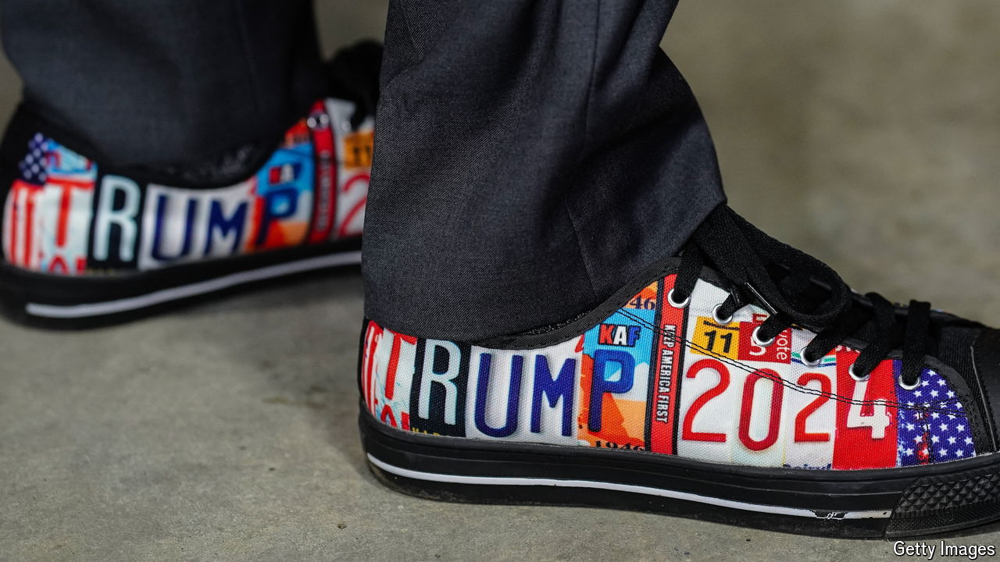
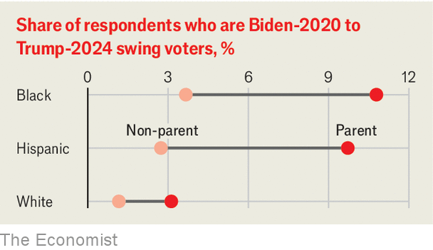

###### Four-leafed voters

# True swing voters are extraordinarily rare in America 

##### We have found some 

 

> Apr 11th 2024 

The biggest question in American politics today is why Joe Biden’s support is so soft. Although there are plenty of theories—ranging from Mr Biden’s age to petrol prices to the withdrawal from Afghanistan—it is hard to be confident about an answer. A standard poll of the type quoted in news reports may be based on a sample of 1,000 people. A poll that asks questions of voters in a swing state might have half that number. These yield useful information, no doubt, but if you want to look within those polls at what, say, , the numbers are too small to draw conclusions. . Over the past year, YouGov has posed questions to a total of 49,000 Americans of voting age. If you pool their answers, as we have this week, you can discover what is really going on.

Because most American voters are partisan and opinions about the two candidates are so calcified, very few people who voted for Joe Biden in 2020 will  in November, or vice versa. In a , swing voters have double value because they subtract from one side and add to the other. Finding them, though, is like hunting for four-leafed clovers.


Mr Biden and Mr Trump are close to tied in national polls (Mr Trump is doing better than that in the swing states). Overall, compared with 2020, there has been a shift of two percentage points in Mr Trump’s favour. This change has two sources.

 


The first is made up of people who voted for Mr Biden in 2020 and now say they are either undecided, supporting a third party or planning not to vote. This is a reminder that if Robert F. Kennedy junior makes it onto the ballot in swing states he could tip the election. Mr Kennedy, whom , refuses to be drawn on whether Mr Biden or Mr Trump would be worse for America and says his internal polling shows him mainly attracting independent voters, rather than from one particular candidate. Other polls, however, suggest that higher third-party support has done more harm to Mr Biden.

The second source of weakness for Mr Biden is genuine swing voters, who have deserted him for Mr Trump. Among our 49,000, just 465 voted for Mr Trump last time and say they will now back Mr Biden. There are 632 Biden-to-Trump voters. Many people who recall the chaos of Mr Trump’s presidency and its riotous conclusion, and have seen recent jobs data, will be wondering what on Earth these folk are thinking. Our mega-sample has some answers on that, too.

Swing voters do not view this year’s election as Republicans would like them to: immigration is not the most important issue for them. Neither do they view it as Democrats wish. Their most important issue is not the defence of democracy, climate policy, or abortion. It is inflation, which  , followed by the economy. Politics is less central to the lives of swing voters than it is to news hounds and committed partisans. They may not know much about Mr Biden’s position on natural gas or North Korea, but they do know that eggs are expensive and driving to work costs too much.

The other, perhaps more surprising, finding is who these swing voters are. Those most likely to have swung from Mr Biden to Mr Trump are non-white parents of school-age children. That may reflect abiding fury at over-long school lockdowns during the pandemic. It also reflects a notable trend: that race and voting are becoming unstuck. In the short term this is troubling, because it makes Mr Trump’s return to the White House more likely. Looking further in the future, however, it promises to be a blessing. A multiracial democracy in which everyone votes according to their race is a nightmarish prospect. Politics should be a competition between ideas rather than identities. America is swinging in that direction. ■

