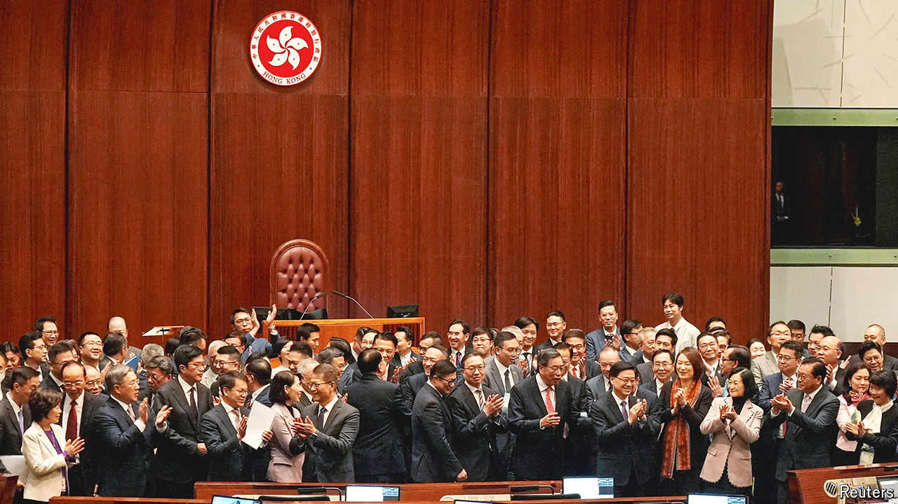
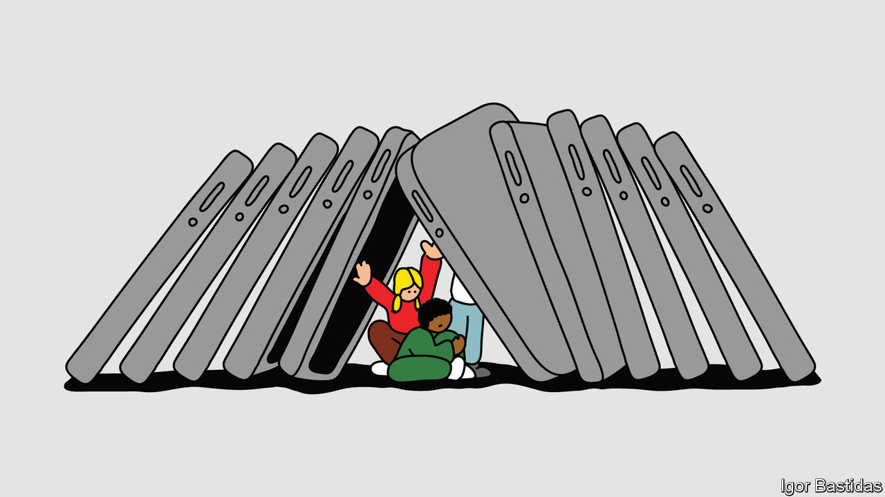

###### On management consultants, Hong Kong, Jonathan Haidt, underpants, describing X, three-letter acronyms

# Letters to the editor 

##### A selection of correspondence 

 

> Apr 11th 2024 

Management consultants

Over the past two years  has asked “” (October 8th 2022) and have they got too big (, March 30th)? On the first point, ask the 10,000-plus clients in Britain we serve across the private and public sector and for the second take a look at our data. 

Our industry in Britain, the second-biggest in the world, experienced double-digit growth last year and is forecast to achieve 9% this year and 11% next. Growth has not been “soggy” in this market in recent years and artificial intelligence is not leading consultants to irrelevance. Far from it: 94% of consultants we surveyed across Britain believe client services related to AI and emerging technology will provide the biggest opportunity for expansion in consulting. 

This constant evolution of the industry is nothing new. Our responsibility, as ever, will be focused on helping our clients, with the appropriate use of technology, seizing maximum advantage and efficiencies while managing data and confidentiality.

Tamzen Isacsson

Chief executive

Management Consultancies Association


 


Bill Fold, your Chief Growth Hacker, is working for the right firm if it delivers PDQ results (“”, March 30th). A bit of chatter with the Chief Client Crusader might reveal that the clients are part of the problem. They employ you looking for the minor miracle they have not stumbled upon. Consultants on the ground get little direction from either their clients or their senior partners. And if they chance upon the miracle, clients get precious little tough-love to follow through. After all, future revenue depends on the Groundhog Day phenomenon of continued billing.

As for “lack of strategic focus”, Peter Drucker would have said there is only one focus: your customer. That is why you exist. What do they need? Certainly not consultants .

But instead of doom, the traditional self-serving business models have opened the door for relative newcomers: firms that use newer business models, do not burn out their staff and leave after solving problems for their clients.

Bill Fold, there is cash to grab with these newcomers. And satisfaction from helping your customers.

Steve Tarr

Fellow

Drucker School of Management


 


Hong Kong’s new law

It is ironic that you slam Hong Kong for passing a new national-security law in fulfilment of its constitutional, legal and moral obligation to protect its country and city, when the British Parliament enacted a sweeping and far more stringent National Security Act last July to counter “hostile state threats” (“”, March 23rd). 

There is no overlap between our new law and the national-security law enacted by Beijing. Offences like treason, sedition, the theft of state secrets and espionage are not covered in Beijing’s law. They have actually been on our statute books for decades in localised versions of British laws. The British government under its National Security Act rejected a “public-interest defence” for people (especially in the media) vulnerable to prosecution for disclosing vaguely defined “protected information”. Yet our new law provides a defence for persons who are compelled to disclose “state secrets” without authority where there is a serious threat to public order, public safety or public health, among other circumstances.

Britain’s National Security Act introduced the new offences of “sabotage” and “foreign interference”. Similar new offences in our national-security law are closely modelled on the United Kingdom’s. 

You also completely disregard that we have a robust rule of law in Hong Kong, and our courts have ruled against the government in many cases. No court observers have been able to find fault with our transparent court proceedings or the learned judgments handed down by our courts. 

Regina Ip

Member of the Legislative Council


 


The kids are not alright

It is mostly correct to say that today’s youth are much less tolerant of prejudice than earlier generations (“”, March 23rd). And it is true that “fighting, juvenile crime, drug use and teenage pregnancy are all retreating in America.” But your book review missed the mark in important ways. 

In “The Anxious Generation”, Jonathan Haidt says that “the environment in which kids grow up today is hostile to human development.” His main point is that the use of smartphones among teenagers is rewiring and harming them. Their social skills, literacy, mental health and ability to focus are all being eroded. He submits that since most of the instant entertainment that teens consume is generated by other teens, they are often cut off from the sum of human wisdom, the influence of their elders and ideas about how to live a good life of meaning and purpose. 

After more than 20 years of working with teenagers, I fully agree with Mr Haidt that something fundamental has shifted on adolescence. We underestimate the consequences of this social experiment at our peril. You concluded that “the generation that is now young will eventually grow up, get jobs, form relationships and have children.” Mr Haidt’s data suggest that an unprecedented number of young people are looking for ways to prolong adolescence and opt out of independence and responsibility. Today’s adults owe them a better preparation for the future. This is not a case of the old “fretting” about the young. 

Colin McLean


I enjoyed your review. I am reminded of this quote: “Children today are tyrants…they contradict their parents, gobble their food and tyrannise their teachers.” Socrates.

Michael Crick


 


The wrong underpants

Your piece on the history of Marks &amp; Spencer gave us the fact that a corpse was able to be identified in 1994 because it was wearing the retailer’s underwear (“”, March 30th). This brought to mind the story of Operation Mincemeat in 1943, when the British created a fictitious identity for a cadaver that was set afloat off the coast of Spain in order to mislead the Germans about the allied invasion of Sicily. 

The difficulty of finding clothing for the corpse during war rationing meant it had to be kitted out with underwear owned by H.A.L. Fisher, an Oxford academic and author of a remarkable history of Europe, who had died in 1940. 

David Cunningham Green


Xcellent suggestions

Regarding ’s description of X (, April 6th), perhaps the best way to move forward on this problem is to have “X, soon to be known as Insolvent”.

Rupert Higgins


Noting that The Artist Formerly Known As Prince eventually reverted to being called Prince, might we hope that the same happens to Twitter?

Tom Hayhoe


 


Three-letter acronyms

LOL. Really enjoyed your online leader about the explosive growth of TLAs. THX. (“”, March 30th). 

Jem Eskenazi


