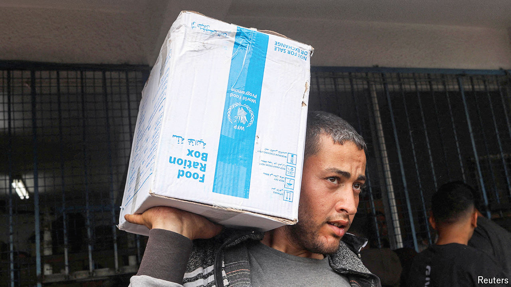

###### Israel v Hamas

# America, Israel and Hamas are trapped in a dangerous impasse 

##### The fighting has ebbed. But ceasefire talks are going nowhere 

 

> Apr 10th 2024 

EID AL-FITR, which marks the end of Ramadan, is normally a joyous time in Gaza, as families exchange gifts and buy new clothes for children. But the holiday, which began on April 9th, is no cause for celebration this year. Fighting has ebbed enough for a few thousand Palestinians to return to Khan Younis, the southern city that has been the focal point of combat since January, and scavenge through the remains of their ruined homes. The war is not over, though, and efforts to negotiate a temporary ceasefire are still at an impasse.

On April 7th Israel withdrew its ground troops from Khan Younis, leaving just one brigade deployed in Gaza. Those who remain are stationed along a corridor that cuts across the middle of the 41km (25-mile) enclave. They are meant to prevent Palestinians from leaving the south, now home to almost 90% of Gaza’s 2.2m people, and returning to the north, which was depopulated in the early weeks of the war.


With such a sparse ground presence, the army can do little to advance the war’s twin goals: the defeat of Hamas and the return of 129 hostages still held in Gaza (dozens of whom are thought to be dead). To do the former, Israel would have to press into Rafah, the last remaining city it has yet to assault; the latter would require a deal with Hamas. Neither seems likely.

Western and Arab negotiators had hoped to broker a ceasefire before the start of Ramadan, and then before Eid al-Fitr. Those deadlines came and went. Talks are still slogging along in Egypt and Qatar. Earlier this month Bill Burns, the CIA director, flew to Cairo to present America’s latest proposal. It called for Hamas to release 40 Israeli hostages—mostly women, the sick and the old—in exchange for 900 Palestinians held in Israeli jails.

Negotiators put an optimistic spin on the effort. Majed al-Ansari, a spokesman for Qatar’s foreign ministry, said he was “more optimistic”. A few diplomats suggested the withdrawal from Khan Younis could serve as a confidence-building measure to nudge Hamas into lowering its demands. Others call this wishful thinking.

There are still big gaps between what Israel and Hamas are willing to accept—the same ones that have bedevilled negotiations for months. Yahya Sinwar, the leader of Hamas in Gaza, still wants a permanent ceasefire; Israel will only agree to a temporary lull. Envoys from Hamas have also claimed they cannot find 40 living hostages from the groups set to be released. That would require them to release soldiers or young men, whom it had hoped to hold as leverage, and for whom it wants a higher number of freed prisoners.

Mr Sinwar also wants Israel to dismantle the checkpoints along its military corridor and allow displaced Gazans to travel north during a truce. That could allow Hamas to redeploy its own forces, and reassert some control over the north. Israel, unsurprisingly, insists the checkpoints will stay. It would allow women and children to cross, but men would face strict limits. And far from serving as an inducement, the pullout from Khan Younis could have the opposite effect: with little fighting, Mr Sinwar may feel little pressure to deal.

Binyamin Netanyahu, the Israeli prime minister, also seems content to let the talks meander: a ceasefire, even a temporary one, would be unpopular with his far-right allies. In a statement on April 8th he warned that the Rafah offensive was imminent. “This will happen; there is a date,” he said (while declining to provide said date).

Mr Netanyahu has been promising to conquer Rafah for months. On February 8th he said that Israeli troops would “soon go into Rafah”. On March 17th he told the cabinet he had approved “operational plans” for the offensive. After months of threats, it is doubtful that either Israelis or Hamas leaders believe him. In reality, the offensive remains far off. A move on Rafah requires calling up more reservists and preparing a plan to evacuate 1.5m Palestinian civilians living in the city. Israel has done neither. Yoav Gallant, the defence minister, is said to have contradicted Mr Netanyahu and told American officials that there is no scheduled date for the offensive.

That leaves the war effort deadlocked. Some Israeli officials argue that this was the plan all along. In October, before the ground offensive began, generals predicted it would take place in phases. There would be a stage of heavy fighting, with a large Israeli presence inside the strip, and then a longer period of targeted raids carried out by troops on Gaza’s periphery. After four months of fighting in Khan Younis, they now say, their troops no longer have big objectives left to pursue; it is sensible to let them rest, and to focus on defending against other threats from Iran-backed militias across the region.

Mr Netanyahu does not mind the stalemate either: the longer the war drags on, the longer he thinks he can avoid early elections. But a quagmire means that more hostages will probably die in captivity and gives Hamas more time to regroup.

The withdrawal coincided with a big increase in deliveries of humanitarian aid to Gaza. The Israeli army said that 322 lorries entered the territory on April 7th, then a record high during this war; even more came through in the following days. A group of nine countries took part in a joint air-drop of food, clothing and toys ahead of Eid al-Fitr, the largest such operation to date. Many Gazans say they have not seen much difference in the availability of food, though. That is partly because the UN and other aid agencies have been unable to unload and distribute all the goods that crossed the border.

The influx of aid has less to do with the Israeli pullout than with American anger over an Israeli drone strike on April 1st that killed seven aid workers. On April 9th Univision, a Spanish news giant in America, broadcast an interview with Joe Biden in which he called Mr Netanyahu’s approach to Gaza “a mistake”. Yet while the most intense phase of fighting appears to be over, and aid is picking up, America, Israel and Hamas remain trapped in an impasse—with none willing to change course. ■

