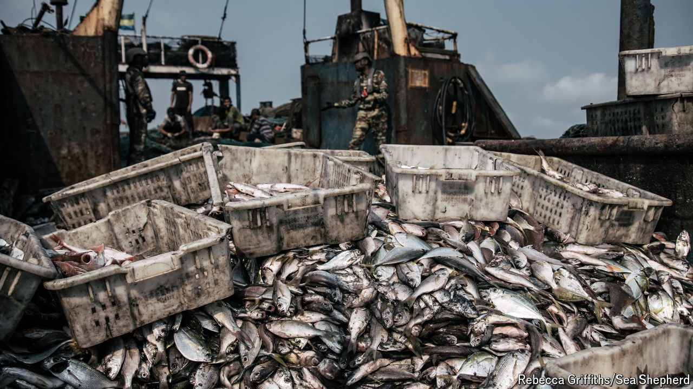

###### Slavery at sea

# China’s fishing fleet is causing havoc off Africa’s coasts 

##### The victims are non-Chinese crew members, local fishermen and marine life 

 

> Apr 11th 2024 

“The foreman woke us up by hitting us,” said the sailor. For the next 20 hours, on a typical day, the bleary-eyed crew would be hauling up fishing nets. If sharks got entangled they would hack off their fins, tossing the mutilated creatures back into the water to die. When dolphins were ensnared, the captain shot them, cut out their teeth and bartered them with passing ships in return for whisky. 

These incidents all took place between 2017 and 2023 on Chinese fishing boats in the south-west Indian ocean, according to the Environmental Justice Foundation (EJF), a London-based NGO. China’s distant-water fishing fleet is the world’s largest and most controversial. It has long been accused of environmental and human-rights abuses in Latin America and west Africa. An investigation by the EJF suggests it is terrorising fishermen and plundering the seas off east Africa, too.

The EJF has identified some 138 Chinese vessels fishing in waters off Mozambique, Tanzania, Kenya and Madagascar. Interviews with crew members suggest that illegal fishing is rampant. Most of the interviewees said they regularly and deliberately killed protected species, such as turtles, dolphins and false killer whales. Fully 80% said they systematically engaged in shark finning, an illegal practice, targeting several endangered or critically endangered species.

Illegal fishing is also harming local fishermen. Chinese vessels routinely fish in waters close to the shoreline reserved by law for small-scale local fishers. According to the EJF, Chinese trawlers in Mozambique often line their nets with a fine mesh, allowing them to catch smaller fish usually targeted only by locals. They have also been known to intimidate the local fishermen, ripping their nets and hounding them out of their usual fishing grounds. The volume of fish caught by small-scale fishers in Mozambique has slumped by 30% over the past 25 years.

Things are even bleaker for the non-Chinese crew members who staff China’s distant-water fleet. On one vessel eight Mozambican workers had to sleep in just two beds. On another there was no working toilet for the Filipino and Indonesian crew, who had to defecate off the side of the boat for an entire months-long voyage. Anyone who complained would be kicked, beaten or threatened with salary deductions. Crew members interviewed by the EJF said four of their comrades had died at sea, one of them by suicide.

Three-quarters of those interviewed said Chinese captains or recruitment agencies had confiscated their passports or birth certificates to prevent them from leaving the ship. Some were trapped at sea for months or even years. The EJF says such treatment amounts to “conditions of modern slavery”. 

The Chinese government insists it has a “zero tolerance attitude” towards illegal fishing. Yet it appears to be using its geopolitical heft to facilitate the depredations of its fleet. Chinese vessels reportedly receive some $7bn a year in government subsidies. According to the EJF, in the south-west Indian ocean they sometimes travel under escort from the Chinese navy. 

 With more than 90% of the world’s fish stocks either fully fished or overfished, Chinese boats must sail ever further to fill their nets. They are racing each other, literally and morally, to the bottom of the global fish barrel. ■

