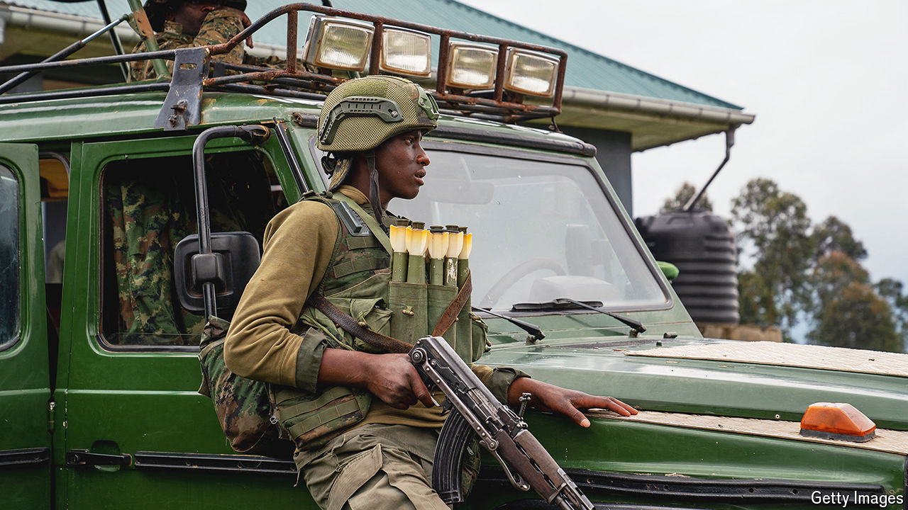

###### Death threats

# Congo brings back the death penalty 

##### And it is cracking down on government critics 

 

> Apr 11th 2024 

Critics of Congo’s government are on edge—and for good reason. Last month the justice ministry said it was bringing back the death penalty, ending a moratorium that had been in place since 2003, in order to “rid our country’s army of traitors” and to “stem the resurgence of acts of terrorism and urban banditry”.

Restoring capital punishment is, in part, a reaction to the desperate situation in eastern Congo, where the M23 rebel group has surrounded the city of Goma. The conflict with M23, which is backed by Rwanda, has forced more than a million people from their homes, most of whom now live in squalid conditions crammed around Goma. Congo’s army is on the back foot. “We don’t have a choice,” says Patrick Muyaya, a government spokesman, referring to the death penalty.

Human-rights activists and the Catholic church have protested, pointing out that the justice system is dysfunctional. Even Congo’s president, Félix Tshisekedi, describes the court system as “ill”. Moreover, the government seems to use a rather expansive definition of treason and has recently been arresting critics of even the mildest sort. “The immediate effect [of the death penalty] is fear,” says Fred Bauma, the director of Ebuteli, a Congolese think-tank. In February, secret-service agents arrested Mr Bauma and, he says, assaulted him in detention.

Other incidents have also had a chilling effect. Last year the bloodied body of Chérubin Okende, a politician who was close to the opposition leader Moïse Katumbi, was found in his car in Kinshasa. Opposition parties said he had last been seen alive outside the Constitutional Court, when he had sent in his bodyguard to drop off some papers. When the guard returned both Okende and his car were gone. After a lengthy investigation, officials provoked derision by ruling that the death was a suicide. “Chérubin didn’t get justice because the justice system is rotten,” said Georges Oyema, a relative.

But Congo’s judiciary does not take criticism well and it is willing to pursue those who question the official ruling. One of Congo’s best-known journalists, Stanis Bujakera, was sentenced to six months in prison on charges of spreading fake news about Okende’s death. His employer, , had published an article without a byline that suggested that Congolese military-intelligence agents had killed Okende, based on a leaked intelligence memo. The government denied the memo’s authenticity, saying it had been forged by Mr Bujakera. 

Pressure on government opponents had been on the rise before the general and presidential elections in December. But it has intensified since Mr Tshisekedi was proclaimed the winner. According to Mr Bauma, the think-tank director, the president is getting jittery about a loss of public support. The military successes in the east that he promised in his campaign have not materialised. A diplomatic solution to the conflict seems far off. “There’s a desire to silence critics,” says Mr Bauma. ■

