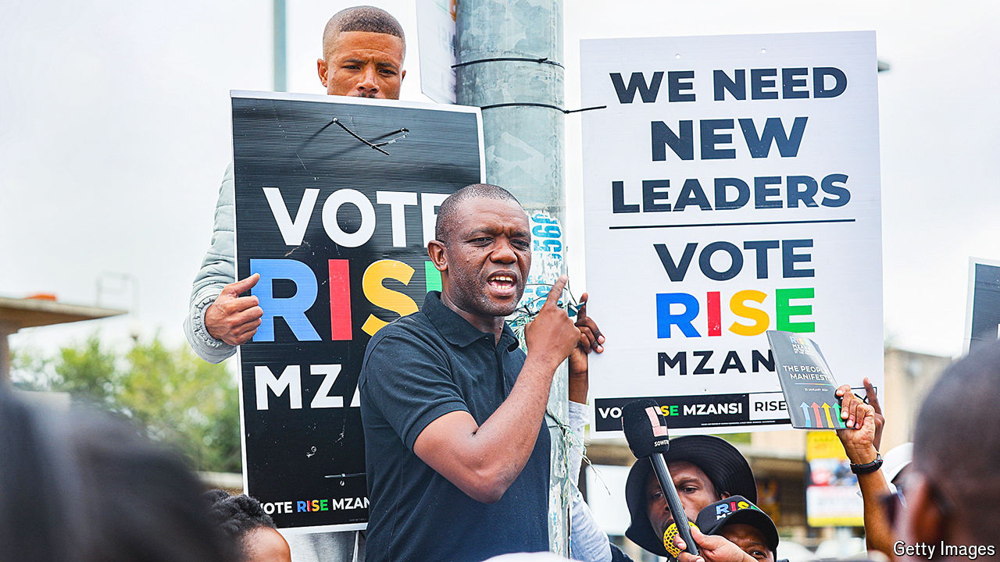

###### Opposition rising

# Is South Africa ready for a change in government? 

##### The ANC is unpopular, but the opposition is fractured 

 

> Apr 11th 2024 

Songezo Zibi, the leader of a new political party in South Africa, thinks the country is ripe for an Emmanuel Macron moment in the national election on May 29th—one in which a political insurgent can disrupt the 30-year-long reign of the African National Congress (ANC). The former newspaper editor has a slick campaign that emphasises competence over hollow campaign promises. Yet he lacks Mr Macron’s sweeping ambition. Instead of aiming for the presidency, Mr Zibi simply hopes that Rise Mzansi, his party, will win perhaps 5% of the national vote. (Polls currently have it at only about 0.5%.)

These modest goals are not a deterrent to donors. Rise Mzansi (named after the Xhosa word for “south”, a colloquial term for South Africa), raised 16.7m rand ($900,000) in the fourth quarter of 2023, which was more than any other party, including the official opposition, the Democratic Alliance (DA). This makes it one of the leading examples of how politics is fragmenting in South Africa as the country prepares for the first election since the end of apartheid in which the ANC is expected to lose its parliamentary majority.

Of the five parties that raised the most money in the last quarter of 2023, the most recent period for disclosures, four are polling at less than 2% each of the national vote. In all, more than 115 parties will compete in the national election. 

Most will sink without a trace, but some are upending the country’s electoral calculus. uMkhonto we Sizwe, a new party backed by Jacob Zuma, a disgraced former president, has come out of nowhere to take more than 13% of the national vote, according to a recent poll. As a result, the ANC’s share of the vote may fall to around 40%. 

That would be new and unpredictable territory. The ANC has never previously fallen below 57% of the national vote and it will have to seek coalition partners if it hopes to keep ruling. That could allow small parties to wield an outsize influence on the shape of the next government. Which parties the ANC chooses to form a government with, and how those parties use their influence, may determine whether South Africa is able to find political renewal or sinks deeper into economic stagnation and corruption.

In this regard, Mr Zibi’s party is also instructive. Rise Mzansi’s manifesto does not contain any groundbreaking policy proposals. It wants to slim down the cabinet, fix public procurement and ban “blue light brigades”, the intimidating police convoys that escort senior government officials at speed. The party’s big focus is instead on professionalising the government by ensuring that people are appointed on merit rather than “deployed” by political parties, as is currently the case. It also wants to reform how the government awards contracts to reduce corruption. “We want to be the grown-ups in the room,” says Mr Zibi.

The 48-year-old comes from a political family: two uncles fought in the armed struggle against the apartheid government, and his mother helped look after political prisoners. Initially, he took a different route. He made his name first as the editor of , a respected newspaper, and then as the spokesman for Absa, a major bank. But politics was always in his soul. “When I was at , it became clear that you couldn’t just write about this stuff,” he says, referring to the many government corruption scandals that the paper covered during his tenure. 

Mr Zibi struggled to find a home in any of the large established parties, which have veered from what he believes are the country’s core values of social democracy. When meeting other politicians, he would give them copies of “The Third Man”, a political memoir by Lord Peter Mandelson, a close ally of Tony Blair. He hoped this would persuade them to follow in New Labour’s footsteps and shift to a more centrist sort of politics. No one read the book. Eventually, he and a few like-minded colleagues realised they would have to do it themselves, and Rise Mzansi was born. Mr Zibi describes it as “a typical centrist European party”; in American terms, “a little to the right of Bernie Sanders”.

The key question facing South Africa is whether the ANC would choose to form a coalition with more or less liberal parties such as Rise Mzansi and the DA, which is polling at about 27%, or instead swing to the hard left. That would mean teaming up with the Economic Freedom Fighters, a populist and socialist party that is expected to win about 10% of the vote, or Mr Zuma’s new outfit. 

Man in the middle

One issue that may be a stumbling block for the ANC forming a coalition of the sensible could be agreeing on fundamental economic policies and the appointment of people to key positions. “We would need an agreement on who the finance minister is going to be. And on the independence of the Reserve Bank,” Mr Zibi says. These alone would be a big ask, but previous coalition negotiations in South Africa have thrown up even stranger outcomes. Take the current mayor of Johannesburg, Kabelo Gwamanda, who belongs to a fringe religious party that holds just three of the city council’s 270 seats. 

His example has emboldened parties like Rise Mzansi to believe that, in this most unpredictable of elections, they too can punch well above their weight. That said, South African politics is littered with the discarded election posters of smaller parties that have tried, and failed, to disrupt the status quo. Mr Zibi will be hoping that his face is not on one of those. ■

