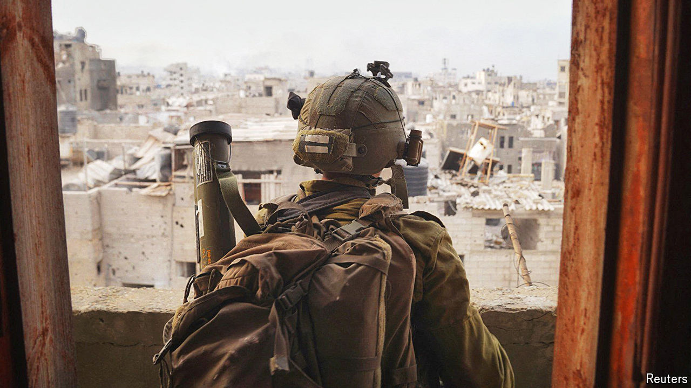

###### An assessment of the IDF in Gaza

# The IDF is accused of military and moral failures in Gaza 

##### Its generals botched the strategy, and discipline among troops has broken down 

 

> Apr 11th 2024 

In the early hours of April 7th the Israel Defence Forces’ (idf) 98th Division withdrew from Khan Younis, the second-largest city in Gaza, exactly six months after Hamas’s attack of October 7th. Israel had the sympathy and broad support of much of the West when it sent its army to war with Hamas. Half a year later, much of Gaza lies in ruins. Over 33,000 Palestinians have been killed, according to the Gazan health ministry. The uprooted civilian population faces famine. Israel has lost the battle for global public opinion. Even its closest allies, including America, are considering whether to limit arms shipments. 

Much of the criticism centres on Israel’s armed forces. Even after its devastating failure to prevent the massacres of October 7th, the idf has remained the most cherished institution in Israeli society. Holding fast to the vision of the idf as both effective and moral is essential to Israelis’ image of themselves. But it is now accused of two catastrophic failures. First, that it has not achieved its military objectives in Gaza. Second, that it has acted immorally and broken the laws of war. The implications for both the idf and Israel are profound.


Israel’s army is unusual. It is widely regarded as one of the world’s most advanced in its use of technology. But the idf is also a people’s army, relying on both conscripts and reservists who represent a wide cross-section of society. Many of the 300,000 reservists Israel called up live in settlements in the occupied West Bank. Regular army units have spent much of their time there policing the occupation. This has had an adverse influence on their attitude to Palestinians, say many officers.

Any assessment of the idf’s operational successes and failures in the war in Gaza must consider the uniqueness of the war zone. Gaza is a densely populated, largely urban enclave. Hamas has spent the past 17 years of its rule embedding its military infrastructure into the civilian landscape and building a vast network of tunnels.

But Israel’s army has, at best, only half-achieved the war objectives of its politicians: destroying Hamas’s military capabilities; removing it from power in Gaza; and rescuing the hostages. The idf claims to have killed about 12,000 militants. With the thousands it has wounded or captured, that represents around half of the pre-war estimate of 40,000. Hamas’s military capabilities have been dramatically curbed. 

But the group is far from destroyed. Of the three men believed to have planned the attacks of October 7th, just one, Marwan Issa, Hamas’s military chief of staff, is thought to have been killed. Many other field commanders have been killed, but Hamas’s fighters are still ambushing Israeli forces throughout Gaza and the group is reasserting itself in areas the idf has left.

Military pressure on Hamas helped yield a short truce in November in which 105 hostages were released. That aside, Israel has rescued only three live hostages.

The idf’s first failure has been one of strategy. On that, blame lies primarily with Israel’s politicians, and the prime minister, Binyamin Netanyahu, in particular, who have refused to countenance any alternative Palestinian force taking control of Gaza. But responsibility also rests with the generals and their understanding of how success there should be measured.

Hard and fast

Criticism of the decision to start the war with a massive assault on Gaza City is growing. After October 7th, the idf’s senior commanders were “motivated by deep feelings of guilt and humiliation”, says Reuven Gal, a fellow at the Samuel Neaman Institute, a policy research centre in Israel, and retired colonel. He was a young infantry officer in the Six Day War and went on to become the army’s chief psychologist. “Instead of stopping this time to think and plan, [the army] went in fast and hard, to restore lost pride.” 

 


Major-General Noam Tibon is a retired corps commander who on October 7th rushed to his son’s kibbutz near Gaza, single-handedly extricating his young family while Hamas was on the rampage. In hindsight, he says, the idf should have gone into Rafah first. He believes his former colleagues were “under the illusion that going first into Gaza City would break Hamas psychologically, by taking their symbols of government”. But, he argues, “all the talk of dismantling their brigades and battalions is rubbish. They remain a fundamentalist movement which doesn’t need commanders to fight until death.” 

Many serving officers decry the emphasis the idf has placed both internally and publicly on how many Hamas fighters have been killed, instead of adopting a more strategic approach. “I don’t want to be Westmoreland!” announced one senior general involved in directing operations, early on in the war, referring to the commander of American troops in Vietnam who boasted of his men’s body-counts.

The idf’s second failure is the way in which the army has prosecuted this war, specifically the high levels of destruction and civilian deaths. (The idf disputes the Hamas-run health ministry’s death toll, saying that many of the dead are militants, but the number of civilians killed is undoubtedly extremely high.) This is down to two main factors: first, operational directives that allow strikes even when the likelihood of killing civilians is significant; and second, a lack of discipline within the idf in adhering even to those rules. 

Start with the laxer rules regarding targets. The idf has a dedicated war-room that tracks population levels in every area of Gaza and issues warnings, via leaflet drops, social media, phone calls and text messages to civilians, to move out of harm’s way. But no part of Gaza has ever been totally cleared of civilians. An area on the population map constantly updated by the operations room is considered “green” once less than 25% of the original population remains. Even then, officers monitoring this admit that ultimately their assessments are merely “recommendations” to commanders in the field. 

“The orders to carry out strikes were given in accordance to international humanitarian law,” insists an officer in the idf legal corps who helped advise those commanders. “But the policy on the level of firepower has changed. The strikes are more devastating in this war because the aim here is to destroy Hamas. And there are many more strikes.” 

The idf has used drone strikes, or “targeted killings”, to assassinate militants for two decades. But in the past these were authorised by senior officers high up the command chain. By contrast, at some points during this war there were over 20 different headquarters with officers of varying experience calling in attacks. “We never had an opportunity to call in such a range of air-power, anything from drones to f-35 fighters-jets,” said one reserve officer in charge of a brigade-attack cell. 

While there have been reports that many of the air strikes are determined by , the idf insists the decisions to attack are taken by humans. But there is ample evidence this is where the problems happen. 

The lack of enforcement of even these looser rules of engagement has been such that accusations that Israel has broken the laws of war are plausible. “The standing orders don’t matter in the field,” says one veteran reserve officer who has mostly been in Gaza since October. “Just about any battalion commander can decide that whoever moves in his sector is a terrorist or that buildings should be destroyed because they could have been used by Hamas.” “The only limit to the number of buildings we blew up was the time we had inside Gaza,” says one sapper in a combat-engineering battalion. “If you find a Kalashnikov or even Hamas literature in an apartment, it’s enough to incriminate the building.”

Other officers reported a breakdown of discipline in their units, with multiple cases of looting. “I think everyone in our platoon took a coffee set,” said one sergeant. Soldiers have filmed themselves vandalising Palestinian property and, in some cases, put those videos online. On February 20th the idf’s chief of staff published a public letter to all soldiers warning them to use force only where necessary, “to distinguish between a terrorist and who is not, not to take anything which isn’t ours—a souvenir or weaponry—and not to film vengeance videos.” Four months into the war, this was too little, too late. “He should have acted much sooner to root this out,” says one battalion commander. 

Political failures

The idf’s third failure is its role in Israel’s obstruction—until an angry phone call between President Joe Biden and Mr Netanyahu on April 4th—of aid efforts to Gazans. Officers have mainly blamed the politicians for this. But some acknowledge that even without a political directive, the army, which is arguably an occupying force in Gaza now, should have assumed this responsibility from the planning stage. Instead it acted only when the humanitarian situation became critical. 

Major-General Tibon’s fiercest criticism is reserved for Mr Netanyahu: “[He] has been running this war to serve his political interests—keeping his nationalist base happy and preventing his far-right extremist parties from leaving his government.” Serving generals share this view.

That does not bode well for the future. The war in Gaza is not over. Israel’s next step is unclear. Mr Netanyahu says that a date has been set for an incursion into Rafah, Hamas’s last major stronghold (in private, Israeli generals deny this). 

Another scenario is that Israel and Hamas agree to a temporary truce or a more lasting ceasefire. That would allow the idf to prepare for future conflicts, perhaps including with Iran, which is threatening to retaliate for an Israeli air strike in Syria that killed several high-ranking Iranian officers. The IDF plans to form new armoured divisions—at great cost to the country’s finances and to the soldiers who will have to serve for longer. Yet more troops and tanks will not prevent the idf from repeating the mistakes it has made in Gaza. With the war at a hiatus, now is a moment for Israel and its allies to ask hard questions about how it has been conducted. ■


