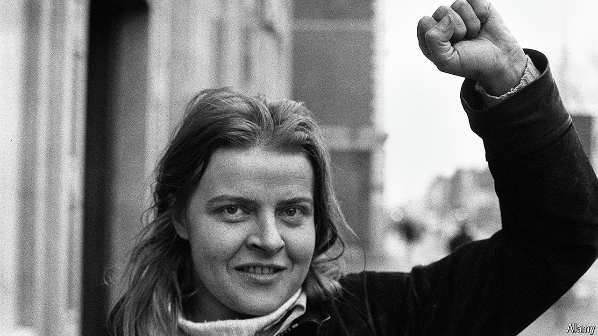

###### The militant debutante

# Rose Dugdale went from debutante to IRA bombmaker 

##### The heiress and IRA militant died on March 18th, aged 82 

 

> Apr 10th 2024 

Her hair was curled. Her skin was powdered. Her white organdie gown had been tailor-made by the House of Worth. Her gloves, as all debutantes’ must, reached to the elbow. Her posture was from Miss Ironside’s School for Girls in Kensington (“Shoulders back! Stand up straight! Speak clearly!”). Rose Dugdale—heiress, debutante, beauty—was very well put together.

Her bombs would be well put together too. Take the ones she dropped from the helicopter she helped hijack in Northern Ireland. They had a milk churn for the main casing. A core of gelignite. Fertiliser around that. Wire round the top to keep it all in. She worked with ingenuity and care—and food would be a feature of her DIY destruction: she would later use packets of digestive biscuits to dampen the recoil on grenade launchers. That, the police thought, was clever. You had to understand physics to do that.

But then Rose was clever. And for a time—after the ball gowns but before the bombs—she had excelled. She’d only agreed to that gown so that her parents would let her apply to Oxford. Soon, she was studying philosophy, politics and economics there. Later, she would specialise in philosophy and in Wittgensteinian “simples”: categories of objects that were one single, simple thing. Though little was simple about Rose: debutante-terrorist; heiress-thief; oxymoron incarnate. Her father would blame that education. “Never”, he warned, “send your daughter to Oxford.”

He certainly had not meant to. Rose had been born into that English class for whom ignorance was less an accidental state than an ideal. At Miss Ironside’s School for Girls, mistresses instructed the girls less in science than in sitting up straight: getting the right answer mattered far less than getting “Mr Right”. At home, Rose was expected to dress for dinner, curtsy to guests and hunt both deer and a husband. And above all she had to do “the season”, that “upper-class version of a puberty rite” as the writer Jessica Mitford called it, when four hundred girls in pearls curtsied before the queen. Or, as Princess Margaret put it, when “every tart in London” did. Rose was repelled: it was no more than a pornographic marriage market.

Oxford, by contrast, had felt so modern. Her female tutor, Peter Ady, particularly so. Peter had breeches, Burmese ancestry, dark eyes, a boy’s name (her mother had hoped for a son) and a habit of passionately kissing other women on the mouth. Students had watched, fascinated, as Peter stalked up to the philosopher Iris Murdoch and kissed her on the lips. A little later, as Sean O’Driscoll records in his biography, Rose had kissed Peter too. Peter had responded and soon they were in bed. After, Rose lay on Peter and Peter stroked her hair. They weren’t lesbians, Rose thought, or trying to be feminist fundamentalists or anything. They were just trying to be in love.

And for a time she was. With Peter, and with social change. Later, after Rose had been arrested—first for burgling her father’s house, then for stealing art from another one, and for that hijacking—people would wonder why an Oxford-educated deb had turned to terrorism. It was the wrong question: she was not a rebel despite her advantages but because of them. Oxford had liberated her from her sex and class. There, she had stopped curtsying and started to wear men’s shirts. She and a friend had even disguised themselves as men (wigs, glasses, grunting) to crash the all-male Oxford Union. Though her liberation was not total: when the BBC came to interview her about it, Rose meekly made them tea.

Still, the revolution was coming. And when Bloody Sunday happened in 1972, and 13 civilians were killed by British soldiers, Rose decided to hasten it along. She turned against Britain—the “filthy enemy”—and became a militant. Whereupon her upper-class education suddenly came into its own. All that hunting and shooting was ideal rifle practice for a terrorist. Years of crawling on her belly stalking deer made her the perfect guerrilla fighter. Hadn’t Mao said that political power grew from the barrel of a gun? Well, Rose knew how to wield one. And a stint in a French finishing school turned out to be splendidly handy for an art heist.

On April 26th, 1974, a little after 9.15pm, a car drove up to Russborough House in Ireland. Inside the house were Sir Alfred and Lady Beit and an expensive art collection. Inside the car were three masked men, two AK-47 rifles and Rose, pretending to be a French tourist whose “voiture” had broken down. Within minutes Sir Alfred and Lady Beit had been tied up at gunpoint. Rose walked round the house, telling her men which paintings to steal (still speaking, as Mr O’Driscoll’s book notes, in that accent).

She wanted “Zis one” (a Goya) “and zis one” (a Velázquez) and definitely “zis one” (a Vermeer). The spell at finishing school and youthful trips to the Louvre had given her a discerning eye: “ Not zat one!” She didn’t regret the heist: the pictures could be used to ransom IRA prisoners and the Beits were capitalist pigs; they deserved it. Besides, the Vermeer was just beautiful. History, she knew, would absolve her. 

The legal system was less lenient: after she was caught, she was sentenced to nine years in prison. History would be less forgiving than expected too: Rose would be remembered largely for violence and for failure. That heist merely ended in arrest, while those carefully made milk-churn bombs failed to detonate properly: one bounced off a roof; another splashed harmlessly into a river. A British major said the army had begun assessing an interesting new weapon, the AGMIC: the “Air-to-Ground Milk-Churn”.

The AGMIC didn’t catch on. The IRA eventually handed over its weapons. But Rose, who was let out of prison in 1980, was unrepentant. Towards the end of her long life she was asked what its best day had been. She thought for a moment and then answered: the day when she had dropped those bombs. That had been the happiest day of her life. ■

