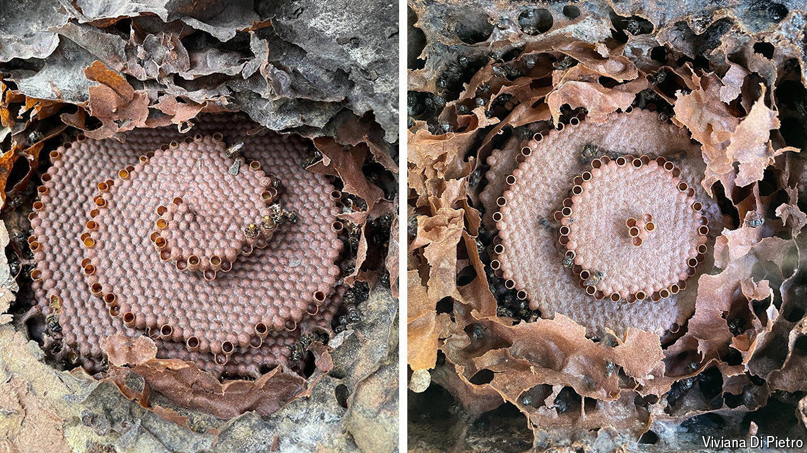

###### Hive minds

# Bees, like humans, can preserve cultural traditions 

##### Different colonies build in competing architectural styles 

 

> Apr 10th 2024 

WHEN IT comes to architectural accomplishments, humans like to think they stand at the top of the pyramid. That is to underestimate the astonishing achievements of social insects: termites raise skyscraping nests and honeybees fashion mesmerisingly geometric combs. The true master builders of the insect world, however, are the hundreds of species of stingless bee, native to the tropics and subtropics, which weave combs of unparalleled variety and intricacy inside hollow tree trunks or other cavities. 

Now a group of evolutionary biologists led by Viviana Di Pietro at KU Leuven, in Belgium, reports that, like humans, these tiny-brained creatures are capable of building according to different architectural traditions which are then handed down over generations.

The finding, published in , is the clearest demonstration yet of cultural differences spontaneously appearing in insects. Insect culture would once have been thought impossible, says behavioural biologist Andrew Whiten of the University of St Andrews, who was not involved in the research. “Less than a century ago, culture was thought to be uniquely human.”

To collect their data, Ms Di Pietro and her colleagues observed more than 400 colonies of the stingless bee species  in a large apiary in Brazil over two extended periods in 2022 and 2023. Around 95% of the colonies exhibited combs built up in horizontal layers, like tiered wedding cakes, while the remainder adopted a spiral structure. In each case the tradition was maintained over many generations of worker bees. 

Since  shows a strong preference for a horizontal-layer comb structure, it is surprising that spiral combs occur at all. Capturing the insects’ behaviour on video, the team established that there was no difference in average cell-building rate between the two styles, and hence no efficiency advantage to either. 

In order to rule out a genetic explanation for the different styles, the researchers transplanted workers from colonies that built in one tradition to colonies that built in the other, having first emptied the host structures of their indigenous adults. The imported workers soon switched to the local style, which was then perpetuated by the colony’s own larvae as they eventually matured into workers.

Tom Wenseleers, who runs the lab in which Ms Di Pietro is a doctoral student, hypothesised that the bees may switch styles as a way of coping with the build-up of minuscule construction errors made by their predecessors. Such a process, in which multiple organisms indirectly affect each other’s behaviour through the traces they leave on their environment, is known as stigmergy. To test whether stigmergy was in fact responsible for the stylistic schism between bee colonies, the researchers introduced a hint of helicity to otherwise perfect horizontal-layer combs, and found that it did indeed prompt the bees to switch to building spirals. That is strong evidence in favour of Dr Wenseleers’s hypothesis.

These results have left observers of animal culture abuzz, as they suggest that stingless bees can transmit different building traditions across generations without individuals needing to be instructed by their peers. This is a more expansive way of thinking about culture, which is often rigidly defined as behaviour directly transmitted from individual to individual until it becomes characteristic of a group.

For Dr Whiten, the new finding indicates that more complex animal behaviours—the building of dams by beavers or nests by chimpanzees, for instance—may also have arisen through such indirect transmission. Though it is too early to know for certain, say scientists, it is possible that some human traditions could have stigmergic roots too.

Bees may not be done confounding expectations. In recent laboratory experiments with bumblebees, Lars Chittka, a behavioural ecologist at Queen Mary University of London, found that they were capable of learning cumulatively—that is, adopting and expanding upon the innovations of previous generations. The team trained “demonstrator bees” to open a complicated two-step puzzle box (in which blue and red tabs had to be pushed out of the way to reveal a solution of sucrose), and then observed other insects learning the right technique from the demonstrators. Such cumulative culture, which does require social learning, was previously thought to be unique to humans. It may be long past time to make room at the top of that pyramid. ■


