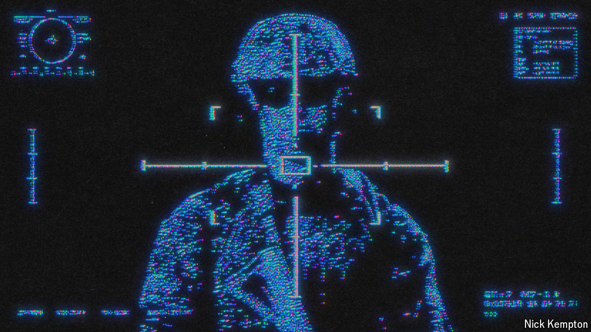

###### AI at war

# How Ukraine is using AI to fight Russia 

##### From target hunting to catching sanctions-busters, its war is increasingly high-tech 

 

> Apr 8th 2024 

IN THE run-up to Ukraine’s rocket attacks on the Antonovsky Bridge, a vital road crossing from the occupied city of Kherson to the eastern bank of the Dnipro river, security officials carefully studied a series of special reports. It was the summer of 2022 and Russia needed the bridge to resupply its troops west of the Dnipro. The reports contained research into two things: would destroying the bridge lead the Russian soldiers, or their families back home, to panic? And, more important, how could Ukraine’s government maximise the blow to morale by creating “a particular information environment”?

This is how Sviatoslav Hnizdovsky, the founder of the Open Minds Institute (OMI) in Kyiv, describes the work his research outfit did by generating these assessments with artificial intelligence (AI). Algorithms sifted through oceans of Russian social-media content and socioeconomic data on things ranging from alcohol consumption and population movements to online searches and consumer behaviour. The AI correlated any changes with the evolving sentiments of Russian “loyalists” and liberals over the potential plight of their country’s soldiers.

The highly sensitive work is still shaping important Ukrainian decisions about the course of the war, says Mr Hnizdovsky. This includes potential future strikes on Russia’s , the only direct land link between Russia and Crimea.

Ukraine, outgunned by Russia, is increasingly seeking an edge . A Ukrainian colonel involved in arms development says drone designers commonly query ChatGPT as a “start point” for engineering ideas, like novel techniques for reducing vulnerability to Russian jamming. Another military use for AI, says the colonel, who requested anonymity, is to identify targets.

As soldiers and military bloggers have wisely become more careful with their posts, simple searches for any clues about the location of forces have become less fruitful. By ingesting reams of images and text, however, AI models can find potential clues, stitch them together and then surmise the likely location of a weapons system or a troop formation. Using this “puzzle-pieces” approach with AI allows Molfar, an intelligence firm with offices in Dnipro and Kyiv, to typically find two to five valuable targets every day, says Maksym Zrazhevsky, an analyst with the firm. Once discovered, this intelligence is quickly passed along to Ukraine’s army, resulting in some of the targets being destroyed.

Targeting is being assisted by AI in other ways. SemanticForce, a firm with offices in Kyiv and Ternopil, a city in the west of Ukraine, develops models that scrutinise online or uploaded text and images in response to prompts. Many of SemanticForce’s clients use the system commercially to monitor public sentiments about their brands. Molfar, however, uses the model to map areas where Russian forces are likely to be low on morale and supplies, which could make them a softer target. The AI finds clues in pictures, including those from drone footage, and from soldiers bellyaching on social media. 

It also cobbles together clues about Russian military weaknesses using a sneaky proxy. For this, Molfar employs SemanticForce’s AI to generate reports on the activities of Russian volunteer groups that fundraise and prepare care packages for the sections of the front most in need. The algorithms, Molfar says, do a good job of discarding potentially misleading bot posts. (Accounts with jarring political flip-flops are one tip-off.) The firm’s analysts sometimes augment this intelligence by using software that disguises the origin of a phone call, so that Russian volunteer groups can be rung by staff pretending to be a Russian eager to contribute. Ten of the company’s 45-odd analysts work on targeting, and do so free of charge for Ukrainian forces.

Spy versus AI

Then there is counter-intelligence. The use of AI helps Ukraine’s spycatchers identify people whom Oleksiy Danilov, until recently secretary of the National Security and Defence Council (NSDC), describes as “prone to betrayal”. Offers to earn money by taking geolocated pictures of infrastructure and military assets are often sent to Ukrainian phones, says Dmytro Zolotukhin, a former Ukrainian deputy minister for information policy. He recently received one such text himself. People who give this “market for intelligence services” a shot, he adds, are regularly nabbed by Ukraine’s SBU intelligence agency.

Using AI from Palantir, an American firm, Ukrainian counter-intelligence fishes for illuminating linkages in disparate pools of data. Imagine, for instance, an indebted divorcee at risk of losing custody of his children whose phone has been detected near a site later struck by missiles. If, say, the hypothetical divorcee has strong personal ties to Russia and has begun to take calls from someone whose phone use suggests a higher social status, then AI may use such “social-network analysis” to increase his risk score.

Such AI assessments of interactions among a network’s nodes have impressed experts for over a decade. Kristian Gustafson, a former British intelligence officer who advised Afghanistan’s interior ministry in 2013, recounts the capture of a courier transporting wads of cash for Taliban bigwigs. Their ensuing phone calls, he says, “lit up the whole diagram”. Subsequent algorithmic advances for calculating things like “betweenness centrality”, a measure of influence, make those days look, as another former intelligence officer puts it, “pretty primitive”.

In addition, network analysis helps Ukrainian investigators identify violators of sanctions on Russia. By connecting data in ship registries with financial records held elsewhere, the software can “pierce the corporate veil”, a source says. Mr Zolotukhin says hackers are providing “absolutely enormous” caches of stolen business data to Ukrainian agencies. This is a boon for combating sanctions-busting.

The use of AI has been developing for some time. Volodymyr Zelensky, Ukraine’s president, called for a massive boost in the use of the technology for national security in November 2019. The result is a strategically minded model built and run by the NSDC that ingests text, statistics, photos and video. Called the Centre of Operations for Threats Assessment (COTA), it is fed a wide range of information, some obtained by hackers, says Andriy Ziuz, NSDC’s head of staff. The model tracks prices, phone usage, migration, trade, energy, politics, diplomacy and military developments down to the number of weapons in repair shops.

Operators at COTA call this model a “constructor”. This is because it also ingests output from smaller models such as Palantir’s software and Delta, battlefield software that supports the Ukrainian army’s manoeuvre decisions. COTA’s “bigger picture” output provides senior officials with guidance on sensitive matters, including mobilisation policy, says Mykola Dobysh, NSDC’s chief technologist. Mr Danilov notes that Mr Zelensky has been briefed on COTA’s assessments more than 130 times, once at 10am on the day of Russia’s full invasion. Access to portions (or “circuits”) of COTA is provided to some others, including insurers, foreign ministries and America’s Department of Energy.

Ukraine’s AI effort benefits from its society’s broad willingness to contribute data for the war effort. Citizens upload geotagged photos potentially relevant for the country’s defence into a government app called Diia (Ukrainian for “action”). Many businesses supply Mantis Analytics, a firm in Lviv, with data on everything from late deliveries to call-centre activity and the setting off of burglar alarms. Recipients of the platform’s assessments of societal functioning include the defence ministry and companies seeking to deploy their own security resources in better ways.

How much difference all this will ultimately make is still unclear. Evan Platt of Zero Line, an NGO in Kyiv that provides kit to troops and who spends time at the front studying fighting effectiveness, describes Ukraine’s use of AI as a “bright spot”. But there are concerns. One is that enthusiasm for certain AI security applications may divert resources that would provide more bang for the buck elsewhere. Excessive faith in hyped models is another risk. 

More dramatically, might AI prove to be a net negative for Ukraine’s battlefield performance? A few think so. One is John Arquilla, a professor emeritus at the Naval Postgraduate School in California who has written influential books on warfare and advised Pentagon leaders. Ukraine’s biggest successes came early in the war when decentralised networks of small units were encouraged to improvise. Today, Ukraine’s AI “constructor process”, he argues, is centralising decision-making, snuffing out creative sparks “at the edges”. His assessment is open to debate. But it underscores the importance of human judgment in how any technology is used. ■


