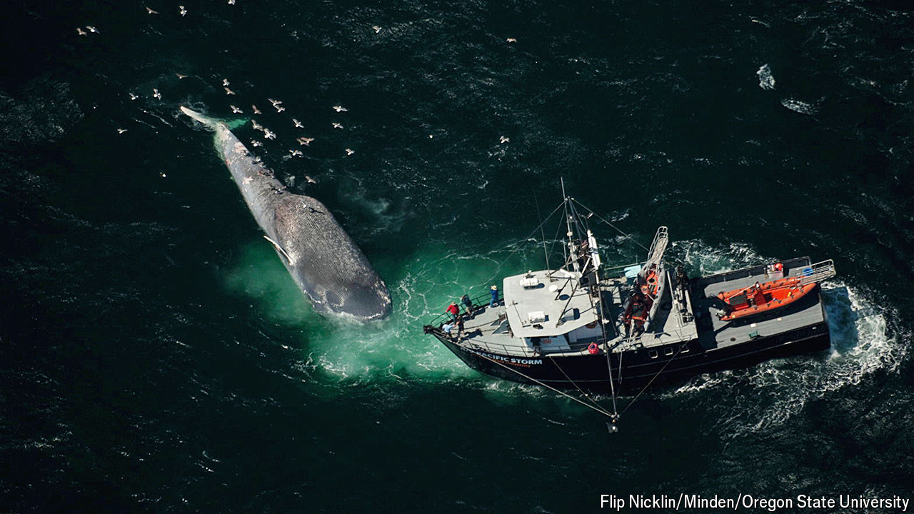

###### Conservation

# New technology can keep whales safe from speeding ships 

##### Collisions kill 20,000 every year 

 

> Apr 11th 2024 

ON MARCH 3rd a whale calf washed ashore in Georgia, on America’s east coast, bearing slash marks characteristic of a ship’s propeller. Less than a month later another whale, a recent mother, was found floating off the coast of Virginia. Her back was broken from the blunt-force trauma of a ship collision; her calf, missing and still meant to be nursing, is not expected to live. Three deaths within weeks is not good news for the North Atlantic right whales, of which only about 360 remain.

They are dying mainly because of human activity, and they are not alone. Ship collisions threaten whale populations worldwide, killing up to 20,000 individuals annually. With global ocean traffic forecast to rise by at least 240% by 2050, the problem will balloon. But a new movement is using technology to fight back. On April 11th a Californian strike-prevention programme expanded operations across North American waters. Other countries are following suit.

Whale Safe launched in 2020, two years after the number of whales killed by collisions in California reached a record high of 14. Callie Leiphardt, the scientist leading the project at the Benioff Ocean Science Laboratory, says that for every killed whale found, ten more are thought to die unrecorded. That so many were dying despite voluntary speed limits suggested more robust interventions were needed. The team reasoned that by alerting ships to whales, and publicising which shipping companies ignored the speed limit, they might increase compliance and bring down deaths.

Their approach rests on listening for whales underwater using microphone-equipped buoys capable of separating low-frequency whale calls from the ocean’s background noise. Vetted detections are then fed into Whale Safe’s alert tool, alongside sightings and model-based predictions, to tell nearby skippers to slow down. The team then monitors ships’ speeds within established slow zones via a widespread GPS-tracking system and awards parent companies marks from A to F, visible online. With this week’s expansion to the east coast, Whale Safe will now assess companies across all slow-speed zones in North America.

How many whales have been saved is hard to say. But since Whale Safe first launched, Californian collisions seem to be decreasing: only four were reported in 2022, compared with 11 the year before. In the Santa Barbara channel, a collision hotspot, the proportion of ships that slow down has also been rising—from 46% in 2019 to 63.5% in 2023. 

The idea is also catching on elsewhere. In 2022 Chile moored its first acoustic buoy to alert ships to blue, sei, humpback and southern-right whales. That same year Greek researchers published the results of a trial using buoys to detect sperm whales in the Mediterranean and to pinpoint their location in three dimensions, informed by work on the black boxes of lost planes. Another European project, led by a consortium of NGOs and naval companies, is developing detection boxes that use thermal and infrared cameras, alongside other sensors, to help ships spot whales early.

For Mark Baumgartner at Woods Hole Oceanographic Institution in Massachusetts, who pioneered the use of acoustic buoys, the real solution lies in changing ships’ behaviour. After all, spotting a whale is useful only if the ship is moving slowly enough to react. This is why Canada has expanded mandatory speed restrictions to ever more areas where right whales live; America is considering doing the same. The International Maritime Organisation, a UN agency, created a “Particularly Sensitive Sea Area” in the north-western Mediterranean last summer, the first such area explicitly created to mitigate ship strikes. Several companies are now rerouting ships away from sperm-whale habitats there. Similar efforts are under way in Sri Lanka and New Zealand. 

It will not all be plain sailing. Some overlap between ships and whales is inevitable in busy ports. What’s more, slow container ships can still kill whales, as can smaller boats. Many coastal communities, whose economies rely on their ports and harbours, often resist stricter measures, such as mandatory speed limits or no-go areas. With all that in mind, it is easy to feel pessimistic on behalf of a species like the North Atlantic right whale. But like all whales that used to be hunted for meat and blubber, it has bounced back from the brink of extinction before. According to Dr Baumgartner, “Everyone that works on right whales has hope.” ■


