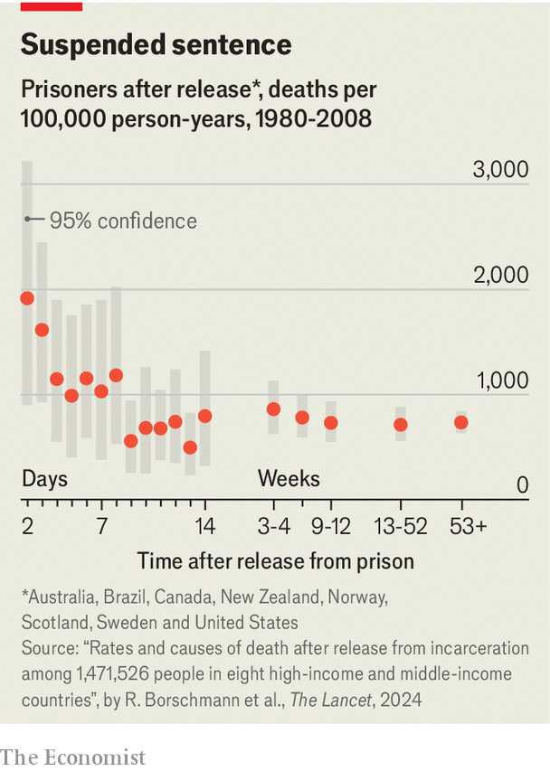

###### Prisoners’ health

# The first week after prison is the deadliest for ex-inmates 

##### Alcohol and drugs kill many in the early days of freedom 

 

> Apr 11th 2024 

EVERY year more than 30m people are released from behind bars. Many leave much as they enter—in very poor health. People who end up in prison have higher rates of infections such as HIV and hepatitis; cognitive disabilities; mental illness and addictions. Prisoners tend to have several of these problems, often rooted in abuse or other trauma. Unsurprisingly, ex-prisoners die earlier than those who have never been incarcerated. What is striking is how many deaths occur within days of release. 

 


A paper in the  on April 10th by an international research consortium led by Rohan Borschmann from the University of Melbourne and Stuart Kinner from Curtin University, in Perth, sums up an analysis of the records of nearly 1.5m prisoners released between 1980 and 2018 in America, Australia, Brazil, Canada, New Zealand, Norway, Scotland and Sweden. These ex-prisoners were followed up by consortium members for an average of seven years. The researchers found that mortality was highest in the first week following release and fell dramatically after that (see chart). In the first week it was more than twice as high as it was a month later. (The researchers excluded the spike in deaths on day one, which they discovered was partly due to recording errors for inmates who had died in custody.) 

In the first few weeks on the outside alcohol and drug poisoning represented the leading cause of death in every country except for Brazil (where deaths from violence predominated). One possible explanation is that enforced abstinence when in prison makes an addict’s body less able to handle their usual dose, increasing the risk of fatal intoxication thereafter. Deaths from alcohol and drugs remained high beyond the first week of freedom but were eventually overtaken by the combined deaths from suicides, accidents and disease. 

These results, if put to use, could save lives. Upon their release, prisoners with opioid addiction could be provided with naloxone, a drug that treats opioid overdose. This has been tried in parts of Canada since 2016, with naloxone kits given to prisoners upon release, on the assumption that either they or a close contact would be likely to need it. (The consequences of this intervention were outside the scope of this week’s paper.) Ensuring better access to mental-health services in the first weeks after release could also be beneficial.

A study from the Netherlands published in 2021 found that prison has no net effect on inmates’ pre-existing health. Someone who goes in unwell, in other words, comes out unwell. Appropriate care behind bars could change that, helping prisoners better face what awaits them outside. ■


