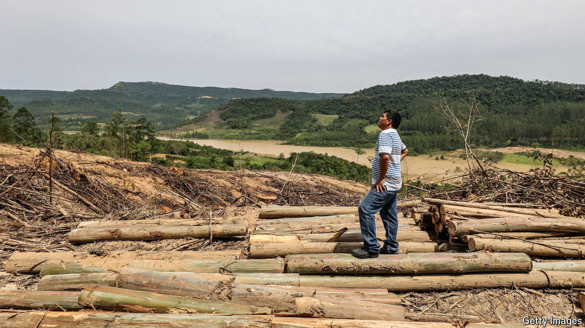
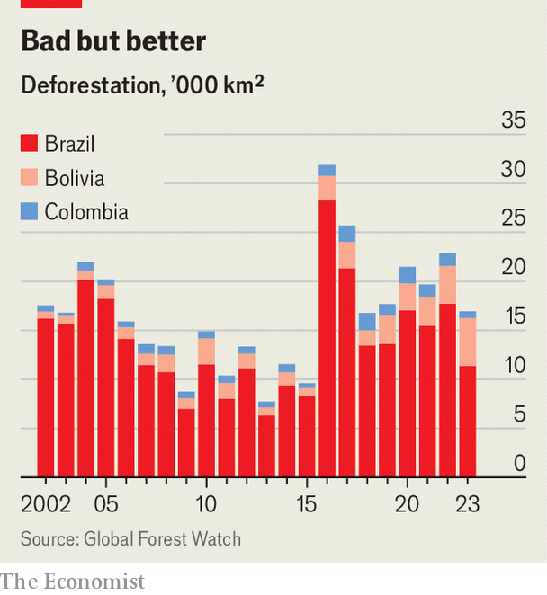

###### Falling felling

# Brazil and Colombia are curbing destruction of Amazon rainforest 

##### Tree loss in South America fell by almost a quarter in 2023, compared with the year before 

 

> Apr 7th 2024 

Last year, South America lost around 2,000 square kilometres of mature tropical forest—equivalent to an area roughly the size of Wales, or three times the size of the state of Delaware. These swathes of forest host some of the planet’s highest levels of biodiversity. They capture and store carbon more efficiently than any other environment. In one sense, 2023 was merely another step along a grim, familiar path—South America has lost 30% of its primary forest cover since 2001.

 


