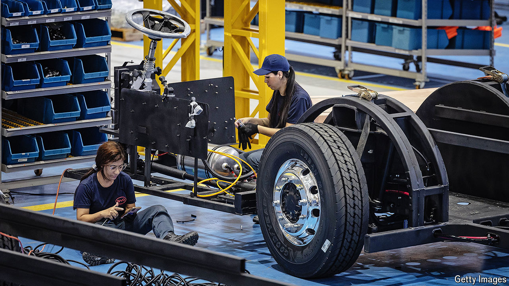

###### The great green rivalry

# Chinese green technologies are pouring into Latin America 

##### That is prompting anxiety in the United States about security, coercion and competition 

 

> Apr 10th 2024 

From the snazzy seats of the E14 bus in Montevideo, Uruguay’s capital, it is hard to tell that the smooth electric machine is Chinese. Only an eagle-eyed commuter would spot the tiny window sticker bearing the name of BYD, a Chinese manufacturer. Enquiries as to passengers’ concerns about the bus’s Chinese origins elicit bafflement. They are a vast improvement on the deafening gas-guzzlers they replaced. The operator has just ordered 200 more. Thousands of similar buses glide through other Latin cities. But politicians in the United States fret that Latin America’s growing reliance on Chinese green technology, from electric buses to solar panels, is a problem and even a threat. 

Tensions are rising because the stakes are high. The fast adoption of green technologies such as electric vehicles (EVs), solar panels and batteries is a vital pillar of efforts to halt climate change. These technologies are also an economic smash hit. In 2022 announced foreign direct investment in renewable energy globally totalled over $350bn, dramatically more than annual investments in any other sector not only that year but in decades. That has made green technology the latest front in the United States’ rivalry with China. 

