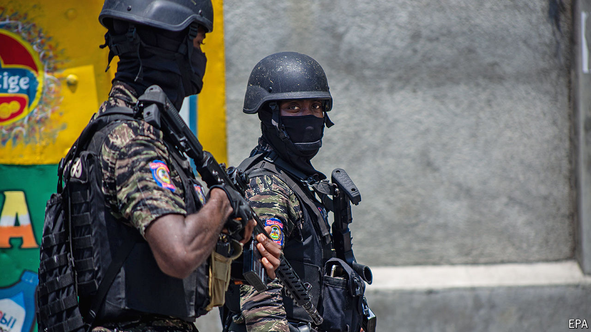

###### The first small steps

# Haiti’s transitional government must take office amid gang warfare 

##### Only after it is installed can an international security force be deployed to the country 

 

> Apr 11th 2024 

One month ago Haiti’s prime minister, Ariel Henry, despised at home and stranded abroad, agreed to hand over power to a “transitional presidential council”. It was to be formed according to a plan drawn up by Caricom, the 15-member Caribbean community, and other powers including the United States. On April 7th the nine-member council finally submitted a political agreement to Mr Henry for approval. His vestigial government’s assent will let the violence-racked country move forward. As went to press, that had not yet happened. Only once it does, and a decree is published in Haiti’s official gazette, , can the council finally start work.

Haiti desperately needs some form of authority beyond the anarchic rule of the gangs. The country of 11.6m people has been chaotic since July 2021 when Jovenel Moïse, the then-president, was murdered in his residence. The situation reached a new low in early March, when gangs went on the rampage while Mr Henry was out of the country, blocking his return. The airport in Port-au-Prince has been too dangerous to use since then. No cargo moves through the main port, a terrible problem in a country which is a net importer of food. More than 40% of Haitians do not have enough to eat. Thousands are displaced. Getting in and out of Port-au-Prince, to Cap-Haïtien in the north, where Haiti’s other international airport is still operating, requires a helicopter.

