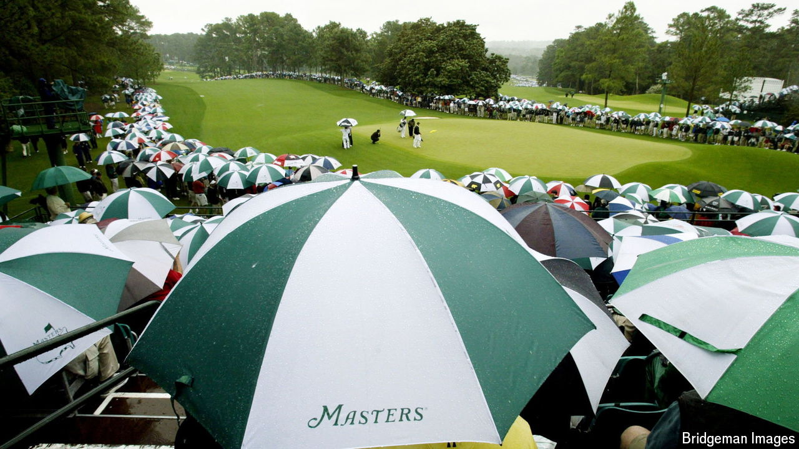

###### The Economist reads

# What to read about golf 

##### Five books on a sport that inspires enthusiasm—and provokes frustration 

 

> Apr 11th 2024 

THE PINK and purple azaleas are in majestic bloom. Augusta National golf course is immaculate, thanks to a small army of groundsmen, gardeners and volunteers, for the start of the Masters on April 11th. It is the eagerly awaited first of the four “major” men’s golf tournaments of the season.

Like baseball and cricket, golf has inspired writing of the highest quality. P.G. Wodehouse wrote whimsically about his favourite game. John Betjeman, who was buried near the tenth green of a rugged Cornish golf course, wrote a delightful poem, “Seaside Golf”, about scoring a birdie on one of its toughest par fours. Perhaps John Updike best described the novelist’s attraction to this most frustrating of sports. “It is of all games the most mysterious, the least earthbound, the one wherein the wall between us and the supernatural is rubbed thinnest.” Its detractors may say that a round of golf is a “good walk spoiled” (the title of a fine book by John Feinstein). But they are wrong. Here are five of the best golf books, chosen from a long and worthy list, that demonstrate why. 

By Bobby Jones. 

No one has played the game with more grace than Robert Tyre (“Bobby”) Jones junior. In 1930 he won the British and American Opens and the British and American amateur titles, an achievement that has never been repeated. The basis of Jones’s brilliance was his “picture swing”, which no one had taught him. His putting, with a rusty, goosenecked club he called Calamity Jane, was fearless.

Jones retired in 1931, aged just 28, and went on to co-design and co-found the Masters at Augusta. He published this autobiography three decades later. It is part instruction manual, part analysis of famous golf courses and part memories of his greatest rounds. He practised infrequently because, as he writes, “You learn very soon, in tournament golf, that your most formidable adversary is yourself. You win or lose according to your own ability to withstand pressure.” Jones soaked up that pressure better than any other golfer in history.

. By Bernard Darwin.

If Bobby Jones was the most stylish golfer, the grandson of evolution’s greatest theorist was its most elegant chronicler. Bernard Darwin’s foreword to Jones’s book is one of countless pieces that he wrote about golf (he covered the sport for the  from 1907 to 1953). As with many of the finest sportswriters, Darwin had expertise that extended beyond the game; he was an authority on Charles Dickens. Darwin was no mean golfer himself. He was a Cambridge Blue and played in the Walker Cup, a tournament that pits amateur golfers from the British Isles against Americans. It all helped to inform his erudite writing on the game. This book is imbued with Darwin’s charm and humour. It has vivid descriptions of courses like St Andrews (“the home of golf”), Sunningdale, Rye and Hoylake, accompanied by excellent illustrations of famous holes.

By Jeff Benedict and Armen Keteyian. 

Tiger Woods has been the subject of umpteen volumes, some of them self-serving autobiographies or hagiographies. None has probed as deeply as this one. There is something almost Shakespearean about the rise and fall of Mr Woods, perhaps the most famous athlete on the planet for two decades, whose psychological flaws ultimately brought him crashing down. Driven by ambitious parents, Tiger was hitting golf balls on national television with a perfect swing at the age of two. Jeff Benedict and Armen Keteyian recount in gripping fashion Mr Woods’s increasingly reckless behaviour off the course—the philandering and car crashes—at the height of his fame. Yet the most thrilling passages are those that transport readers to the scene of Mr Woods’s many triumphs on the course, describing his supreme mental toughness and his technical brilliance.

By John Updike. 

The master novelist was a golf addict, “curiously, disproportionately, undeservedly happy on the course”. Updike was a reasonable golfer (handicap 18). In 30 lyrical and often humorous essays he portrays the highs and lows associated with this standard of play. The duck hook, the banana slice, the topped dribble, the ricochet off the tree, the fat hit, the stubbed putt—never have the failings of the average golfer been so vividly described. But the moments of utter satisfaction, when result matches intention, are vividly recorded, too. Who but Updike would weave Herodotus, Artemis, Florence Nightingale, George Eliot, Dante and his own fictional creation Rabbit Angstrom into a book about golf? Battles with his swing, tussles with his instructor, musings about the etiquette of the game and his pleasure in the camaraderie of a fourball are interspersed with fictional excerpts and philosophical ramblings.

By Mark Frost. 

New York-born Mark Frost is a man with many strings to his bow: novelist, screenwriter, film and television producer and director. He was the co-creator of the quirky television series “Twin Peaks” But he is also a fine golf writer. All three of his non-fiction golf books are outstanding. “The Match” is an enthralling story about a bet by two American millionaires in 1956, which led to a match that pitted two young amateur stars, Harvie Ward and Ken Venturi, against the greatest pros of the time, Ben Hogan and Bryon Nelson. “The Grand Slam” recounts Bobby Jones’s capture of the “impregnable quadrilateral”. But “The Greatest Game edges out those two. It tells the story of the US Open at Brookline Country Club in 1913, an epic battle between Harry Vardon, a 43-year-old Briton who by then had won six majors, and 20-year-old Bostonian Francis Ouimet, an amateur who lived across the street from the course. Both men had dragged themselves out of poverty and broken social barriers to play the game. Mr Frost employs the techniques of a novelist to build tension as Vardon and Ouimet, along with Briton Ted Ray, are forced into a playoff to decide the title. Their battle is one of the most rousing sports events in history, and Mr Frost narrates it magnificently.

Also try

Read about  on . A couple of scholars made the surprising discovery that reducing par on a hole  on that hole. Our sports column explained why the best golfers  as those of the best tennis players. Here we discuss how  are revolutionising golf. This Christmas special from 2014 reports on golf’s  in America and Europe and how the sport is trying to reinvent itself.■

