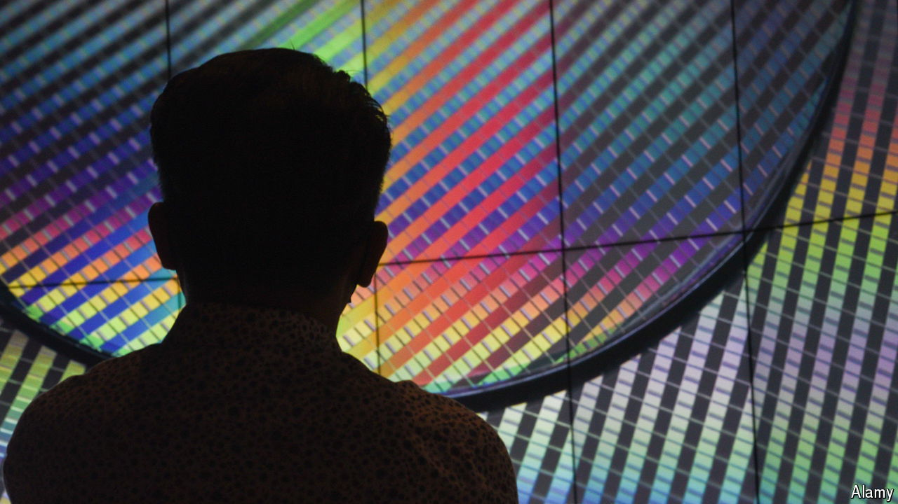
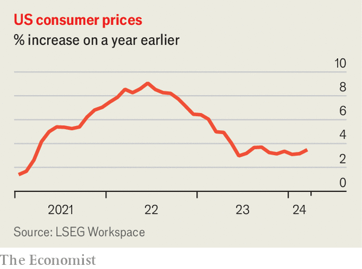

###### The world this week

# Business 

#####  

 

> Apr 11th 2024 

The Biden administration said it would provide $6.6bn in direct funding to to support its facilities in Arizona for manufacturing the world’s most advanced semiconductors. TSMC, based in Taiwan and the world’s largest contract chipmaker, will have three sites in Phoenix when it completes a new factory there. It is increasing its investment to $65bn, the largest-ever foreign direct investment in a “greenfield” project, meaning built from scratch, in America. TSMC supplies chips to Apple and Nvidia for use in smartphones and artificial intelligence. 

 unveiled its Gaudi 3 chip for AI, which it claims is faster and more power-efficient than Nvidia’s H100. It tested the chip on two open-source large language models: Llama, which is run by Meta, and Falcon, a project backed by Abu Dhabi. Intel also announced a plan to create, with other tech companies, an open platform for enterprise AI that will “accelerate deployment” of secure generative AI systems. 

 is to crack down on users who share passwords to its streaming services. Bob Iger, Disney’s chief executive, said the crackdown would be gradually rolled out to different countries starting in June. Netflix implemented a similar policy last year, and it has since reported a surge in subscribers. 

 safety record was in the spotlight again. An engineer at Boeing alleged that the company took shortcuts on quality and safety when it manufactured 787 and 777 jets, leaving them with potential structural flaws. Boeing described the claims as “inaccurate”. And the Federal Aviation Administration investigated yet another incident involving a Boeing plane, this time an engine panel that fell off a 737-800 during take-off from Denver. Meanwhile, Alaska Air received $160m in compensation from Boeing for the panel that fell off one of its aircraft in January, leaving a gaping hole in the plane. The airline said it expects further payments. 

, Britain’s biggest supermarket chain, reported a big rise in pre-tax profit to £2.3bn ($2.9bn) for the 12 months ending February 24th. It expects higher profits this year, as inflationary pressures have “lessened substantially”. Meanwhile, , a troubled department-store and supermarket chain, appointed Jason Tarry, a former senior executive at Tesco, as its new chair. Dame Sharon White held the position for five years, the shortest-ever tenure in the job. 

A victory, of sorts

The EU’s General Court ruled that  imposed on Mikhail Fridman, a Russian investor, and Petr Aven, his business partner, between February 2022 and March 2023 must be annulled. The court found that the EU had not “sufficiently substantiated” its reasons for linking Messrs Fridman and Aven to Vladimir Putin’s regime after Russia invaded Ukraine. Mr Fridman is one of Russia’s most prominent businessmen. Both men are still subject to sanctions not covered by the judgment.

 


Two bits of economic data changed market calculations about the Federal Reserve’s path towards interest-rate cuts. America’s annual  rate rose again, to 3.5% in March from 3.2% in February. And American employers created 303,000  in March, the highest number since last May, suggesting that the economy remains red-hot. Stockmarkets sagged and the yield on government bonds jumped in response to both sets of data. Investors have narrowed their bets on when and how the Fed will cut this year, though some of those bets, of up to seven cuts, were wildly optimistic. 

The  left interest rates on hold, keeping the deposit facility at 4%, but indicated that it would raise rates at its next meeting in June. Many investors now think the ECB could cut rates before the Fed does. 

Fitch reduced its outlook for  sovereign credit-rating from stable to negative, but retained the country’s A+ rating (Moody’s took similar action in December). Fitch forecasts that China’s central- and local-government debt will rise to 61.3% of GDP this year. In 2019 it was 38.5% of GDP.

 decided to sell its business in , and will book a $1bn pre-tax charge in its first-quarter earnings related to the sale. The bank said it would also have to acknowledge $4.9bn in losses on its books linked to the falling value of the peso when the deal closes, though this would neither affect its financial strength nor its tangible net asset value. HSBC has been gradually pulling back from markets outside Asia in order to focus on its business there. 

Serenity and strife

“We’ll have AI that is smarter than any one human probably around the end of next year,” predicted  in an interview. Mr Musk’s prophesy is conditioned on the continuing supply of chips and electricity. Meanwhile, Mr Musk had more earthly matters to consider when he caused a huge political row in Brazil by calling for the resignation of a Supreme Court judge whom he suspects of ordering a block on certain right-wing accounts on his messaging service, X. 

