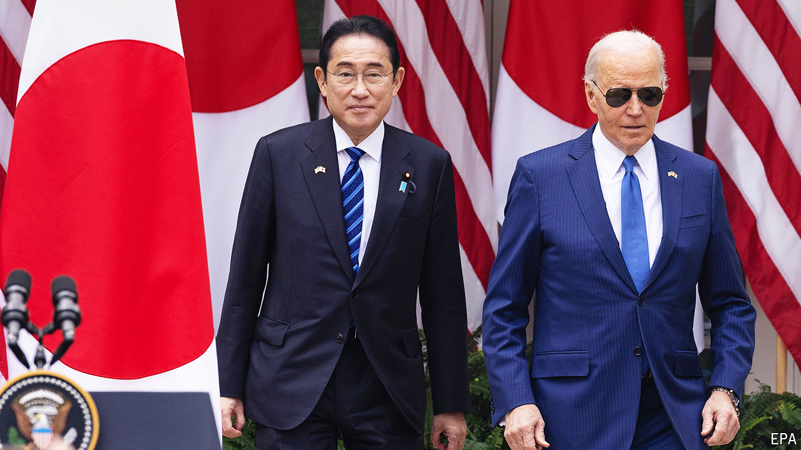
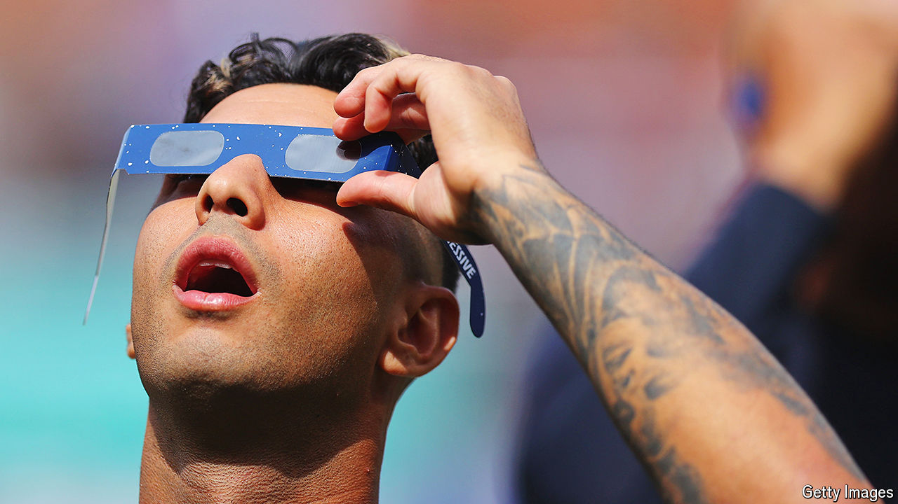

###### The world this week

# Politics 

#####  

 

> Apr 11th 2024 

 prime minister, , visited Washington for talks with Joe Biden and to address Congress. America and Japan are strengthening their military alliance, which includes closer co-operation between their command structures. Japan is also to join an American mission to the Moon, meaning a Japanese astronaut will be the first non-American to walk on the lunar surface. America, Japan and the Philippines then prepared for their first trilateral summit. The Philippines’ coastguard has recently clashed with Chinese vessels in the South China Sea. 

 leader, Xi Jinping, met Ma Ying-jeou in Beijing. Mr Ma served as president of  from 2008 to 2016, establishing friendlier ties with China. The relationship grew colder after he left office. China is trying to court friendly Taiwanese politicians, while freezing out independence-minded officials, such as the incoming president, Lai Ching-te.

 liberal opposition parties won the most seats in parliamentary elections, trouncing the conservative party of President Yoon Suk-yeol. The liberals fell short of a super-majority, however. 

In a tense phone call between Joe Biden and Binyamin Netanyahu the American president warned the Israeli prime minister that  must do more to protect civilians and negotiate a ceasefire with Hamas. America’s policy, Mr Biden said, would be determined by Israel’s “immediate action”. Israel said it would open the Erez crossing and allow in direct shipments from Ashdod, an Israeli port, opening major new conduits for aid into . The following days saw a big increase in the number of trucks entering Gaza with humanitarian aid. Mr Biden later offered “ironclad” support to Israel if Iran attacks it.

Israel withdrew its ground troops from , leaving just one brigade deployed in Gaza. The remaining troops will try to prevent Palestinians from leaving the south, now home to almost 90% of Gaza’s 2.2m people, and returning to the north.

Ismail Haniyeh, the leader of , who is based in Qatar, said three of his sons were killed in Israeli strikes. Israel said that the three men were members of Hamas’s military wing.

Jacob Zuma, a disgraced former president of , won a court case allowing him to run for office in a general election on May 29th. Mr Zuma had been barred by electoral officials because of a conviction for contempt of court and prison sentence of 15 months. His new party, known by its initials, MK, is polling above 10% of the national vote.

An overcrowded ferry capsized off , killing at least 96 people who had been trying to flee an outbreak of cholera. Separately, at least 38 migrants, including children, died in a shipwreck off the coast of .

 introduced a new gold-backed currency in a bid to contain inflation after a collapse in the value of the Zimbabwean dollar, which was only reintroduced in 2019 after being scrapped during an earlier bout of hyperinflation. It said the new currency would be backed by reserves of gold and precious metals. 

 activists won their first-ever case in the European Court of Human Rights. The court ruled that Switzerland had failed to protect its citizens’ rights in a case brought by a group of women in their 70s, who argued that old people were particularly vulnerable to intensifying heatwaves. The judges established a right to protection by the state “from the serious adverse effects of climate change on lives, health, well-being and quality of life”. Forty-six countries are covered by the ECHR’s jurisdiction. 

Dicing with danger

Russia and Ukraine blamed each other for drone strikes on the , which is in Ukraine but controlled by Russian forces. It was the first time the facility had been attacked directly since November 2022. The International Atomic Energy Agency said such attacks increased the risk of a nuclear accident and called an emergency meeting. 

Seven people were killed in a Russian drone strike on , Ukraine’s second-most-populous city. Russia has stepped up its attacks on the city in recent months, which Ukrainian officials think may be a prelude to a new Russian incursion. Kharkiv lies just 30km (19 miles) from Russia. 

The European Union’s top diplomat, Josep Borrell, warned that  to expand its reach outside Ukraine meant that “a high-intensity, conventional war in Europe is no longer fantasy”. He described the situation as “existential”, and said Europe may find it cannot count on America to defend it for the first time since the cold war. 

A court in Russia increased the prison sentence handed down to a former aide to , the opposition leader who died in an Arctic penal colony in February. Liliya Chanysheva ran Mr Navalny’s office in the Bashkortostan region and had been imprisoned for seven and a half years when his organisation was outlawed. Her sentence has now been increased to nine and a half years after a state prosecutor asked for it to be raised. 

Britain, Belgium, Denmark, Germany, the Netherlands and Norway signed a pact to co-operate on protecting underwater pipelines and other infrastructure in the . The sabotage of the Nord Stream pipeline in 2022 and damage to a pipeline in the Baltic Sea in 2023 are still unexplained. Some suspect Russian involvement; others have fingered Ukrainian agents. 

 is to have a new prime minister. Bjarni Benediktsson, who leads the conservative Independence Party, was chosen by the ruling coalition to lead the government after Katrin Jakobsdottir, of the Left-Green Movement, resigned to run for the mostly ceremonial post of president. 

A scathing report into  for children was published in Britain. The Cass Review recommended moving away from a model of medical intervention for trans-identifying children to one based on therapy. It also criticised the “toxicity” of the debate on gender for inhibiting open discussion.

 suspended diplomatic relations with , after Ecuadorean police stormed the Mexican embassy in Quito to arrest a former Ecuadorean vice-president. Jorge Glas took refuge in the embassy last December after he faced an arrest warrant for corruption (he has already served prison time on similar charges). He says he’s innocent. Mexico said it had granted him asylum. 

The first in America to be held criminally responsible for a mass shooting carried out by their child were sentenced to between ten and 15 years in prison. Their 15-year-old boy shot dead four fellow pupils at his school in suburban Detroit in 2021. The parents were found guilty in separate trials earlier this year of involuntary manslaughter. Their son was sentenced to life in prison.

Arizona’s Supreme Court banned  in the state, reviving a law from 1864 to justify its ruling. The order was put on hold for two weeks, but the decision has already had political reverberations. Arizona is one of the swing states on which the presidential election in November hinges. 

Moonlight shadows

 


Tens of millions of people in Canada, the United States and Mexico turned out to watch a . Some of the regions where a total eclipse was viewable included parts of southern Ontario and Quebec, upstate New York, Indiana and Texas and Sinaloa and Durango. The event drew hordes of eclipse-tourists, who booked 92% of Airbnb listings within the zone of totality. 

