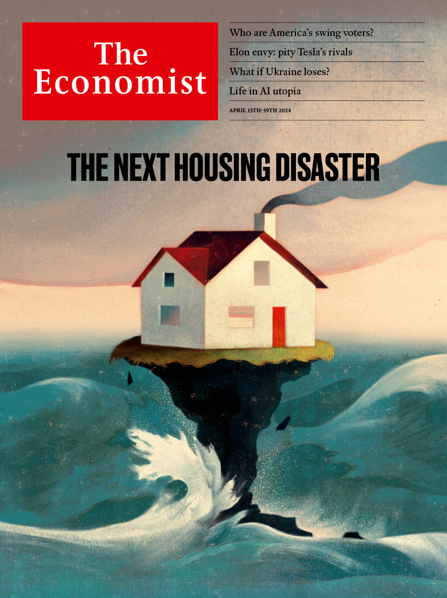
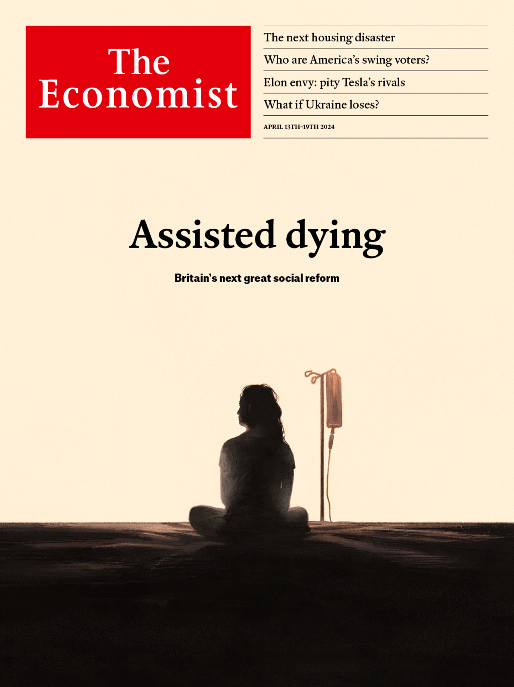

###### The Economist

# This week’s covers 

##### How we saw the world 

> Apr 11th 2024 

In most of the world this week we consider the effects of global warming on housing, the world’s biggest asset class. About one-tenth of the world’s residential property by value is under threat. Homeowners face a $25trn reckoning. Who will end up footing the bill?

 


: 

: 


In Britain, we look at assisted dying. Though still controversial, it is no longer a fringe issue. The public is already supportive and politicians are catching up. Britain may be on the verge of its next big social reform.

 


: 


