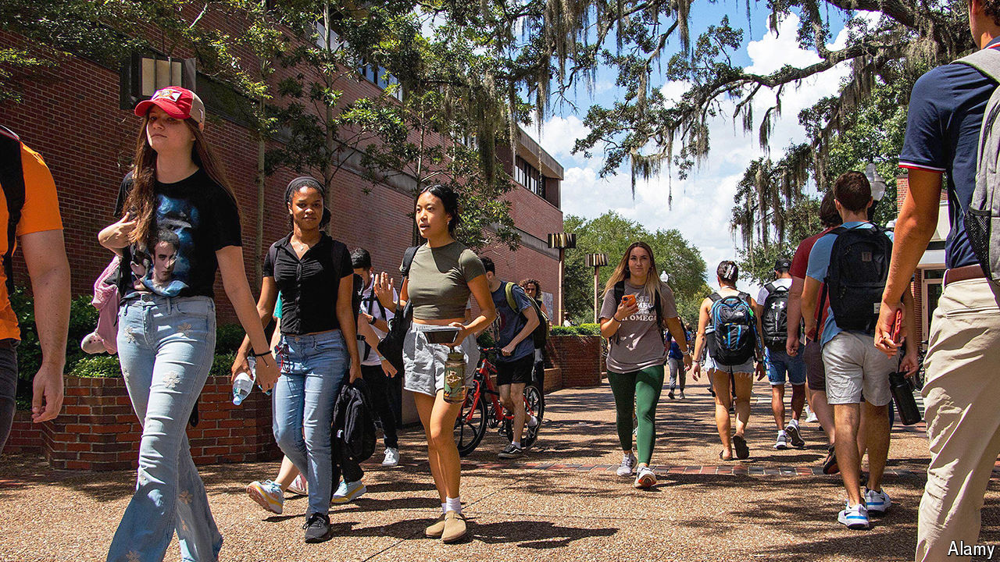

###### Conservatives on campus

# A challenge to leftist bias moves into America’s public universities 

##### Florida leads a push against prevailing progressivism 

 

> Apr 11th 2024 

In 1951 a 25-year-old Yale graduate published a 240-page polemic inveighing against his alma mater’s left-leaning bias. The book launched the career of William F. Buckley, the most influential conservative intellectual of the post-war era. Although Buckley managed to reshape the Republican Party, his war against academia proved less successful. Conservatives still haven’t given up on changing the academy. The most robust reform momentum now is building at public university systems. In Florida, in particular, a trio of Yale alumni have ambitious plans to change the future of higher education.

Ron DeSantis, the governor of Florida, who graduated from Yale in 2001, likes to say that his state is “where woke goes to die”. In universities he put in place a tenure-review process, which critics say weakened academic freedom, and he has used his appointment powers to influence institutions. At New College of Florida, a public liberal-arts college that had been a bastion of progressivism, he appointed new trustees who fired the president and replaced him with a former Republican lawmaker. Scores of faculty and students left.

New College, which had fewer than 700 students in the autumn of 2022, has drawn national attention. Yet much more consequential reforms are under way at the University of Florida (UF), the state’s flagship university and home to some 60,000 students. It ranks as one of the top public universities in America. It also offers an increasingly attractive bargain: undergraduate tuition and fees are only $6,380 this academic year for in-state students.

Ben Sasse, a former Republican senator who became UF’s president in February 2023, says that producing graduates who can thrive in a disruptive jobs market is at the heart of his mission. He still believes a fundamental part of this ought to be learning about the liberal arts. But, says Mr Sasse, who earned a doctorate in history at Yale, humanities faculties at most universities are not “sure what their purpose is right now”. A core curriculum is “incredibly important for an educated citizenry, but you have to be making a case that you’re speaking to things that are big and broad and meaningful and enduring.” He argues that this isn’t a right-wing project but a classically liberal one. And at the heart of it is UF’s new Hamilton Centre.

Authorised by the Florida legislature in 2022, the centre is a $30m wager on the appeal of Western civilisation. Mr Sasse has said that he intends Hamilton to become UF’s 17th college (joining existing ones such as those for business, engineering, law, medicine and pharmacy). Next year it will begin offering two majors: philosophy, politics, economics and law; and great books and ideas. 

Will Inboden, Hamilton’s director, wants UF to have America’s top programme in Western civilisation. The centre already employs a dozen faculty members in a cramped space on UF’s sprawling campus, dominated by the Florida Gators’ football stadium. It is hiring dozens more and eventually will move to its own building. Mr Imboden says part of the strategy is to seek out faculty in fields neglected by modern humanities departments, such as military and diplomatic history. He also favours public-facing academics.

Sunshine statement

Mr Inboden and Mr Sasse, who attended graduate school at Yale together, both served in the administration of George W. Bush. But Mr Inboden argues that the Hamilton Centre is a “pre-political” project. “Students are pretty leery of being indoctrinated,” he says. “The answer to progressive indoctrination on campuses is not conservative counter-indoctrination.”

Jill Ingram, Hamilton’s director of undergraduate students, echoes the desire to avoid a reputation of being a politicised entity. “We’re interested in giving students the tools and the practice to think for themselves, but also to bring back an appreciation for the texts and the ideas that were involved in the founding of America.”

The centre has received a mixed reception on campus. One student recalls telling an adviser that she planned to apply for a fellowship through the centre: “She was, like, ‘Don’t apply for that. It’s a bunch of right-wing storm troopers.’” Yet many who take classes from Hamilton faculty aren’t even aware the centre exists as its own entity. Students associated with it come from a variety of political backgrounds.

Florida is not alone. Other states with new schools focusing on civic thought include Arizona, North Carolina, Tennessee and Texas. A Republican state legislature funded Arizona State University’s School of Civic and Economic Thought and Leadership. When a Democrat, Katie Hobbs, became governor in 2023, it seemed its days might be numbered: Ms Hobbs labelled the school “libertarian” and proposed reallocating the funding. After some debate, however, Democrats backed down.

Places like the Hamilton Centre will face two related challenges. Finding faculty for a growing number of institutions could become harder in the years ahead. Harder still will be to avoid becoming conservative ghettos within their universities. 

Ray Rodrigues, the chancellor of the State University System of Florida, says the goal is to offer better general-education courses to all. He and his colleagues also aspire to create scholars who will influence new generations: “If, at the end of the day, what we’re doing is merely trading conservative scholars from one institution to another, then we have failed.”■


