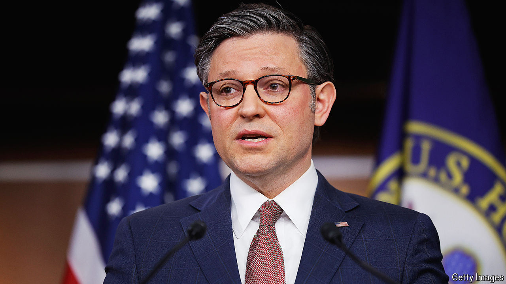

###### Mud slinging

# Mike Johnson may have to choose between Ukraine aid and his job 

##### The Republican House speaker is trapped by hardliners on his own side 

 

> Apr 11th 2024 

SPARE SOME pity for Mike Johnson, the stuck speaker of the House of Representatives. A relatively obscure congressman thrust into leadership six months ago when the ungovernable Republican majority threw out the former speaker, Kevin McCarthy, Mr Johnson may be defenestrated too if he does something that he seems to think that he must: provide additional military aid to Ukraine, over the objections of the isolationist wing of his party.

While the European Union and its member countries have contributed considerably to Ukraine’s budget and humanitarian needs, America has been Ukraine’s largest provider of military aid, amounting to $44bn since Russia’s invasion in February 2022. But further help has been stuck for months. In October 2023 President Joe Biden proposed that Congress appropriate $60bn for Ukraine as part of a security bill that would have spent a further $45bn on securing America’s southern border and on arming allies like Israel and Taiwan.

Six months of congressional  ensued, but nothing has come to the president’s desk. One Republican senator, James Lankford of Oklahoma, spent months negotiating a harder-line compromise on the southern border to accompany the aid package, only for his own party to torpedo it in a matter of three days after its unveiling in February because Donald Trump, the party’s presumptive presidential nominee, rejected it for giving Mr Biden an election-year win. The Senate then passed a $95bn aid bill without any border provisions, which Mr Johnson then rejected and refused to bring up for a vote.

When foreign policy is subordinated to domestic politics, as has happened with Ukraine and Israel, incoherence often follows. You can see this in the short history of Mr Johnson’s own pronouncements. Before he was appointed speaker, Mr Johnson was a Trump-following Ukraine-sceptic, voting against a small $300m military-aid bill in September 2023. In October, after getting the top job, he sounded more supportive, saying that Vladimir Putin must not win. In December he said that this necessary aid must be paired with sweeping reforms to Mr Biden’s border policy, which would be his “hill to die on”. In February, when Mr Biden announced plans to secure the border through executive action after the failure of the bipartisan Senate deal, Mr Johnson denounced them as “election-year gimmicks”—despite having previously called for him to do exactly that. In March he said that he would unveil a new plan for Ukraine aid after Easter.

The eggs have stopped rolling, but Mr Johnson is yet to release his plan, the details of which are not being shared widely. Many of the rumoured components are designed to mollify the isolationists in his party: aid to Ukraine would be labelled as a forgivable loan rather than direct aid (following a suggestion of Mr Trump’s); some of the funding would be recouped by seizing Russian assets that are currently frozen (though many more of these are in the EU than the US); and Mr Biden would have to endure a poke in the eye by overturning his recently announced moratorium on new export projects for liquefied natural gas.

Democrats might grumpily accept even the environmental rollback; the real hindrance to Mr Johnson will be his own party. Marjorie Taylor Greene, a Republican congresswoman from Georgia, has filed a “motion to vacate” Mr Johnson from his leadership, were he to secure Ukraine funding by relying on Democratic support. Ms Greene is probably the most Putin-friendly member of the party—bizarrely saying in a radio interview this week that Ukraine was attacking Christianity while Russia was “protecting it”—but the Republican majority is razor-thin, meaning that a few defectors could cast off Mr Johnson.

Some think that Mr Johnson might simply have to accept that he cannot both arm Ukraine and keep his job. “Then he’ll go down in history as being a profile in courage who does the right thing. We need Winston Churchills right now, not [Neville] Chamberlains,” says Don Bacon, a Republican congressman representing Nebraska. Mr Bacon has been a staunch supporter of Ukraine funding, crafting a so-called discharge petition which could circumvent the speaker and bring a bill directly to the floor for a vote if a majority of House members were to sign on. The discharge petition, which has been closely watched by anxious European diplomats in Washington, is an unconventional parliamentary tool. It is still a long shot, but its existence gives Mr Johnson at least some leverage with his own hardliners.

Critics like Ms Greene are unlikely to be placated. But the cost of congressional dithering is in this case quite real. Last week Sergei Shoigu, Russia’s defence minister, announced that his army had captured 400 square kilometres of territory from the Ukrainians, who have been forced to conserve ammunition (Ukraine is over 600,000 square kilometeres, but the trend is not good). Volodymyr Zelensky, Ukraine’s president, has said that “if the Congress doesn’t help Ukraine, Ukraine will lose the war.” ■


