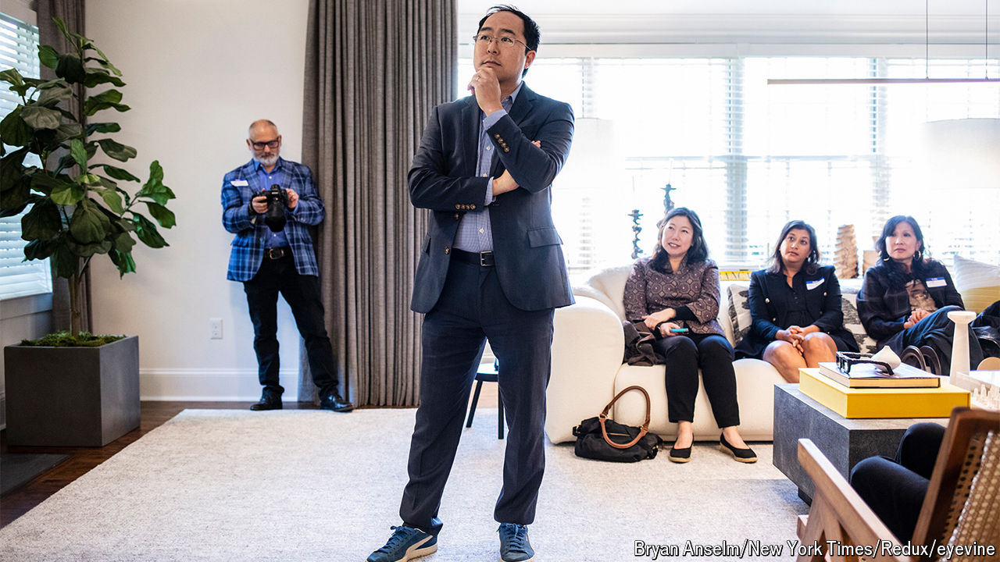

###### Jersey unsure

# New Jersey’s electoral process just got upended 

##### Andy Kim is fighting against some high-level political arcana 

 

> Apr 11th 2024 

THE DAY after Bob Menendez, New Jersey’s senior senator, was indicted for corruption, Andy Kim, a congressman, announced he would take on his powerful fellow Democrat in the upcoming Senate race. But the bigger obstacle to his bid was not Mr Menendez, whose support among Democrats quickly disappeared. It was an archaic primary process called the county line. New Jersey is the only state in America which brackets endorsements made by county party chairs and gives endorsees prime real estate on the ballot.

Party leaders give preferential placement to their candidates. Those not on the county line are tucked away in obscure rows and columns. Julia Sass Rubin of Rutgers University looked at 20 years of New Jersey races and found that the county line steered voters and helped preferred candidates by an average difference of 38%. Another study found county-line benefits ranged from four to 28 percentage points.


Mr Kim, who publicly opposed county lines before he got into the Senate race, had not intended to take on the antiquated system. But then Tammy Murphy, the wife of New Jersey’s governor, announced her candidacy. She immediately won endorsements from party leaders. Her connections all but guaranteed her county-line placement. Mr Kim filed a federal lawsuit asserting the system was unconstitutional.

Mr Kim says a number of politicos told him that they couldn’t speak out because they were worried their county chair would remove them from the line. He also blames apathy. The “well, that’s just Jersey” sentiment was entrenched. The same broken system protected Mr Menendez for years. “It was nerve-racking,” says Mr Kim, “in the middle of a statewide US Senate campaign to file a lawsuit that’s going to affect the party leaders of my own party.”

But then Mr Kim won some county endorsements and edged ahead of Mrs Murphy in polls. Last month she dropped out of the race. Mr Menendez said he would not run in the Democratic primary. And a federal judge ruled in Mr Kim’s favour. The demise of the county-lines system could affect the Senate race and next year’s governor’s race. “I don’t think it can be understated how big this is for New Jersey politics going forward,” says Ashley Koning of the Eagleton Institute of Politics. ■


