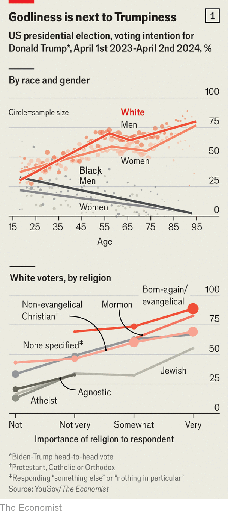
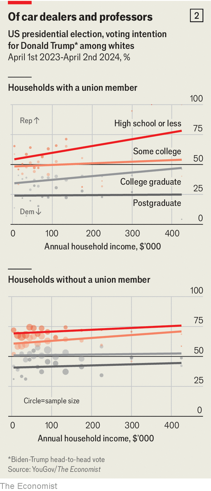
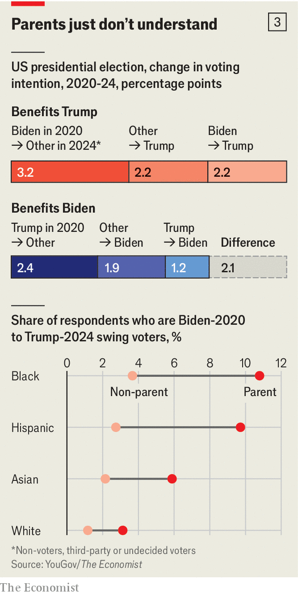

###### The parent trap

# Who are the swing voters in America? 

##### We interrogated a dataset of 49,000 people to find out 

 

> Apr 10th 2024 

DURING HIS two previous presidential campaigns, Donald Trump never led general-election polling averages for a single day. In 2016 he pulled within a percentage point of Hillary Clinton in July and September, but trailed in the opinion polls by four on election day. Four years later Joe Biden enjoyed a large, stable advantage over Mr Trump throughout the race, and ended it with an eight-point edge, according to pollsters. In both contests such surveys sharply underestimated the support Mr Trump received on election day, particularly in swing states.

Today, the first former president seeking to return to office since 1912 is in the strongest position in polls of his electoral career. Mr Trump first inched ahead of Mr Biden, the incumbent, in national surveys last September, and has held a narrow lead for most of 2024. Our national poll tracker has them tied now, but state-level polls give Mr Trump clear leads in four of the six states that could plausibly decide the election (Arizona, Georgia, Michigan, Nevada, Pennsylvania and Wisconsin).


Even more surprising than the scale of Mr Trump’s apparent electoral renaissance is its source. Delve inside these samples of voters and you will see that white voters’ preferences have changed little since 2020, whereas racial-minority groups—long the bedrock of Democratic support—have lurched away from Mr Biden. Mr Trump has also cut into his successor’s advantage among young voters, another core Democratic constituency, and in some surveys actually leads among people aged 18-29.

However, standard surveys do not obtain enough data to drill down within these groups and identify the exact types of voters who, on current trends, are poised to return Mr Trump to office. At least one source of information, thankfully, does not suffer from such limitations. Every week YouGov, an online pollster, conducts a survey of 1,500 people for , asking a wide range of questions about religion, race, voting intentions and political views, among other things. Since last April the firm has obtained a total of 49,000 responses from registered voters to its question on general-election voting intentions in 2024. Among them are 632 who say they backed Mr Biden in 2020 and now support Mr Trump, more than the standard size of an entire state-level poll.

Using this rich dataset, we have built a statistical model of voting intentions. Based on the relationships between poll respondents’ stated candidate preference and a wide range of demographic characteristics—ranging from age and sex to specific states and religious affiliations—it estimates the probability that an American with any particular combination of these attributes plans to vote for Mr Trump or Mr Biden this year, as well as how such a person recalls having voted in 2020. Some patterns are well known: white evangelical Christians tend to back Republicans, whereas black voters are still heavily Democratic overall. Others, however, are less familiar, and many have changed since 2020. You can plug in any demographic profile and explore the model’s findings at: economist.com/us-voter.

 


Most Americans are reliable partisans. They are far easier to identify with a few pieces of information than swing voters are. Although race is often cited as the central cleavage in America, the single best predictor of voting intention is religion. A model that knows nothing save for respondents’ religious affiliations (including atheist, agnostic, “something else” and “nothing in particular”) can correctly identify which of the two leading candidates they prefer 62% of the time, compared with 59% for race. Of Mormons and evangelical voters, 73% say they support Mr Trump. This compares with 53% of Catholics, Orthodox Christians and non-evangelical Protestants, 37% of Jews, 22% of agnostics and just 13% of avowed atheists (see chart 1). Regardless of affiliation, the more importance someone places on religion, the more likely they are to be a Trump voter. 

Race does play a large role in shaping political choices as well, but its impact varies by age and sex. According to YouGov’s data, among white voters Mr Trump surprisingly attracts more support from women aged 18-24 (41%) than from the youngest men (35%). His vote shares rise with age, at a faster rate for men than for women, up to people in their late 50s: he wins 59% of white women aged 55-59, and 70% of white men. Mr Trump actually fares relatively poorly among the baby-boomers, who came of age during the turbulent 1960s and 70s. He does best of all with the oldest white voters, winning 66% of female octogenarians and 75% of male ones.

For black people, by contrast, the age-partisanship pattern is the opposite. The youngest black voters are decidedly Trump-curious: 21% of such women and a remarkable 33% of men aged 18-24 say they plan to support him. But with each successive age cohort, backing for Mr Trump and the size of the gender gap both shrink. Among black voters aged 70 or older, who have personal memories of America before the Civil Rights Act, Mr Trump wins just 10% of men and 6% of women. 

 


Perhaps the most misleading variable is income. A simple plot of household income against support for Mr Trump shows that the former president does best among middle-class voters whose families earn around $50,000, and worse among both poorer and richer ones. However, income is also closely correlated with other demographic categories: poor voters are disproportionately non-white, whereas rich ones tend to be white with college degrees, and both of those groups lean Democratic.

Only when you look within race-education pairings—black people with graduate degrees, or Hispanics who did not attend college—do the historical affinities between Democrats and the working class, and between Republicans and the wealthy, reveal themselves. In general, the richest members of each of these groups are also the Trumpiest. In contrast, among people of the same education level and race, those whose households include a member of a labour union are around ten percentage points more likely to back Mr Biden—a slightly larger impact than moving up one tier of education (see chart 2). 

Movers and flippers

Taken together, the demographic characteristics in YouGov’s surveys do a good job of distinguishing Mr Biden’s voters from Mr Trump’s. Our full model, which also includes variables like home ownership, marital status, sexual orientation and residing in a city versus a rural area, can intuit the voting intentions of three-quarters of respondents based on other data about them. If you input your own profile, there is roughly a 75% chance that you support the candidate whom the model deems the likelier choice. But identifying the narrow sliver of voters who will account for changes from the results of 2020—those who are either switching between voting and not voting, or plan to flip from one candidate to the other—is far harder.

 


The two percentage points of vote share that Mr Trump has gained since 2020 come from three sources. The largest group is people who supported Mr Biden last time, but are now undecided, backing minor candidates or not planning to vote, who outnumber those making the same shift from Mr Trump’s camp. These voters account for 0.9 points of Mr Trump’s two-point improvement. Undecided former Biden voters are slightly younger, more likely to be black or female and less likely to have attended college than repeat Biden voters. 

Mr Trump also enjoys an edge among people entering or returning to the major-party electorate. The share who say they did not vote for either him or Mr Biden in 2020 but have now settled on Mr Trump is 3.7%, slightly above the 3.3% who are choosing Mr Biden. This group adds another 0.3 of a point to Mr Trump’s tally.

The final group, swing voters, is the smallest but also the most impactful. Because people who flip between the two major-party candidates both subtract a vote from one side and add one to the other, they matter twice as much as do those who switch between a candidate and not voting at all. Such voters are rare—just 3% of respondents fall into this category—but Mr Trump is winning two-thirds of them. With 2% of participants shifting from Mr Biden to Mr Trump versus just 1% doing the opposite, swing voters contribute a full percentage point to Mr Trump’s two-way vote share.

In today’s polarised political climate, with the same nominees running in both 2020 and 2024, who could possibly change their mind? One political cliché supported by YouGov’s data is that swing voters are far more focused on “kitchen-table” issues than on the culture-war subjects that animate reliable partisans. Among repeat Biden voters, the topics most often cited as most important are climate and the environment; civil rights, abortion and guns are also among the leaders. Democrats are placing a lot of hope on the importance of abortion to raise turnout, particularly after Arizona’s supreme court ruled that a ban on the practice for 1864 is enforceable, but our numbers suggest it is not a priority for swing voters. On the Republican side, immigration ranks second on the corresponding list for repeat Trump voters, as well as conventional Republican topics like taxes and national security. 

By contrast, Biden-Trump swing voters are most likely to list inflation as their top issue, followed by “jobs and the economy”. Health care ranks third for them and first for Trump-Biden voters, suggesting that Mr Biden might be well-advised to make defending the health-care reform passed when he was Barack Obama’s vice-president a core campaign issue.

Mr Biden has also lost ground among conservative-leaning African-Americans. By 2020 Mr Trump had already alienated virtually the entire left-of-centre electorate: among self-described liberals who recall supporting a major-party candidate that year, Mr Biden won at least 90% within each racial group. In contrast, although Mr Trump won 94% of the two-party vote among white conservatives and 79% of Hispanic ones, he actually lost black voters who identify as conservative, receiving just 35% of their support. This year, Mr Trump is on the brink of winning this group outright, with a 46% share among decided voters. A similar trend applies to the 23% of black respondents registered to vote who say that they disapprove of Mr Biden’s job performance. Of this group, 9% have already decided to flip to Mr Trump after backing Mr Biden last time, and a further 27% say that they voted for Mr Biden in 2020 but are now undecided, supporting a third-party candidate or do not plan to vote.

The most intriguing pattern in YouGov’s data, however, is probably an equally powerful factor that has nothing to do with ideology. Compared with committed partisans, swing voters are vastly more likely to have children aged under 18: 47% of those flipping from Mr Biden to Mr Trump and 40% of those switching the other way are currently raising children, compared with 22% of repeat Biden voters and 19% of consistent Trump ones. And once the effects of race and parenthood are combined, the disparities are striking.

Family matters

Among people who backed one of the two leading candidates in 2020 and plan to do so this year, 10% of non-white respondents with school-age children are flipping from Mr Biden to Mr Trump; another 3% are switching from Mr Trump to Mr Biden. The corresponding figures for the rest of the electorate are 2% and 1%. These switchers do not seem to have any demographic factor in common besides their race and children. In a statistical model accounting for 15 other variables—including sex, education, income, religion and location—being a non-white parent is the second-best predictor (after being young) of being a Biden 2020-Trump 2024 swing voter. 

Of the 183 non-white parents in YouGov’s surveys who say they are switching from Mr Biden to Mr Trump, just 3% list education as the election’s most important issue, compared with 48% citing inflation or the economy. This suggests that they are feeling squeezed more than voters who do not have children. It may also suggest that there is something about raising children.

There is no shortage of possible culprits, from concern about school curriculums to a parental reaction against progressive ideas on gender. But one thing that affected non-white parents of schoolchildren disproportionately was public policy during the covid-19 pandemic. Lockdowns were unusually difficult for parents raising children, who had to watch their kids while schools were closed. And although lockdowns began during Mr Trump’s presidency, they persisted well into Mr Biden’s term, after the advent of covid vaccines made them harder to justify. Teachers’ unions, allied with the Democratic Party, embraced school closures despite evidence from other countries or concerns about learning loss. Moreover, the expansion of federal transfer payments during the pandemic, which were particularly generous for parents, also began under Mr Trump and ended under Mr Biden.

Non-white students were much likelier than white ones to have had fully remote education during the pandemic. And non-white parents were unusually prone to have jobs that required showing up in person. Most white working-class parents who were upset about lockdowns were already solidly Republican by 2020, limiting the number of voters from this group available to defect from Mr Biden. In contrast, the president won large majorities of non-white voters that year, so angering them was far more electorally costly. Mr Biden faces a parent trap in November. ■


