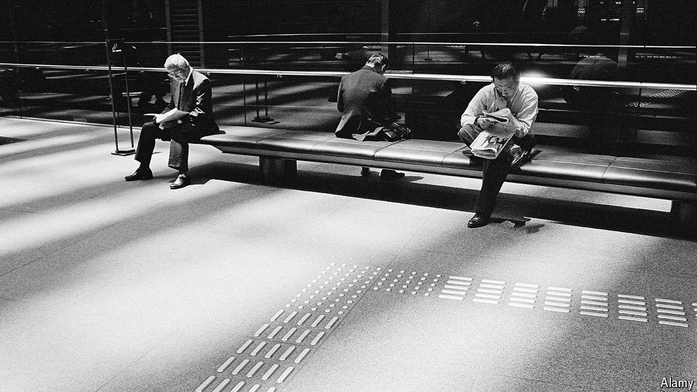

###### Waving the red flag

# An obscure communist newspaper is shaping Japan’s politics 

##### Stories by Shimbun Akahata consistently pack a punch 

 

> Apr 18th 2024 

Since Japan’s parliamentary session began three months ago, one issue has dominated the agenda: a financial scandal within the ruling Liberal Democratic Party (LDP). At the end of last year, prosecutors launched an investigation into factions of the LDP which had failed to report revenue from fundraising events, thereby evading taxes. Several people linked to the LDP, including accountants and parliamentarians, have been indicted. In December four cabinet ministers and five vice-ministers were sacked. On April 4th Kishida Fumio, the prime minister, asked two of his party’s heavyweights to quit and punished 37 other LDP members.

What is perhaps surprising is that this political turmoil can be traced back to  (“Red Flag Newspaper”), a relatively niche newspaper run by the Japan Communist Party (JCP). It is read by 850,000 subscribers, down from a peak of around 3.5m in 1980. It first reported on the funding discrepancies in 2022. “I didn’t expect things would blow up,” says Sasagawa Kamiyu, the 33-year-old journalist who first reported on the scoop after scrutinising government documents. He worked with Kamiwaki Hiroshi, a law professor at Kobe Gakuin University, who filed a criminal complaint with prosecutors.

This is not the first time that  has punched above its weight. In 2013 it led investigations on (“black companies”), which shed light on the prevalence of abusive workplaces and pushed the government to introduce tighter regulation. In 2019 it reported on politicians subsidising dinners for supporters during an annual cherry-blossom-viewing party. Abe Shinzo, then prime minister, was questioned by prosecutors; though he was never charged, the scandal hounded Abe until his resignation in August 2020. The paper reports on issues “that everyone else is too afraid to touch”, says Nick Kapur at Rutgers University in America. 

The paper’s tumultuous history contributes to its “strong will to stand up against power”, says Kogiso Yoji, its chief editor.  was founded in 1928, six years after the JCP was established. Japan’s militarist regime banned the communist party because it was viewed as subversive.  was produced and circulated underground; police arrested and tortured those reading it. After the second world war, American occupying forces made the JCP a legal party, as it claimed to promote democracy and free speech. 

But ’s accomplishments point to an awkward truth. Traditional media remain powerful in Japan. and , two of Japan’s national newspapers, have some of the largest circulations in the world, printing 6.8m and 4m copies a day respectively. Yet such mainstream outlets often fail to hold politicians to account. Self-censorship is widespread as journalists develop close-knit ties with authorities and try to avoid upsetting ultra-nationalist groups, which the police estimate have tens of thousands of members. These can be an intimidating force in public life. 

According to Reporters Without Borders, an NGO based in Paris, Japan’s freedom-of-press ranking slipped from 11th in 2010 to 68th in 2023. ’s scoops usually derive from information available to the public, including government reports and social media posts. Regarding the cherry-blossom scandal, journalists were invited to and attended Abe’s banquet every year. Yet they failed to realise that he might be violating political-funding rules. “Usually, the big media outlets already know what we know,” says Mr Kogiso. “We just have a different perspective.” ■

