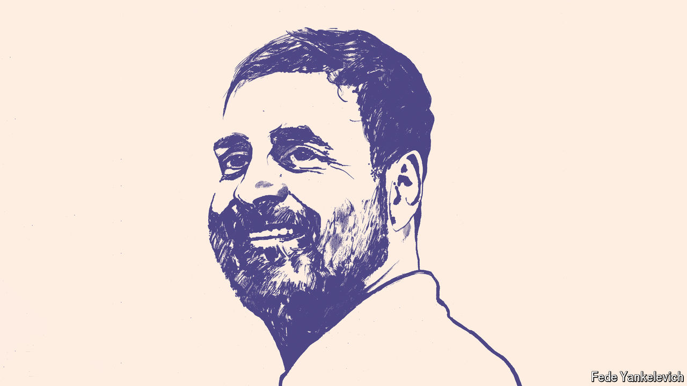
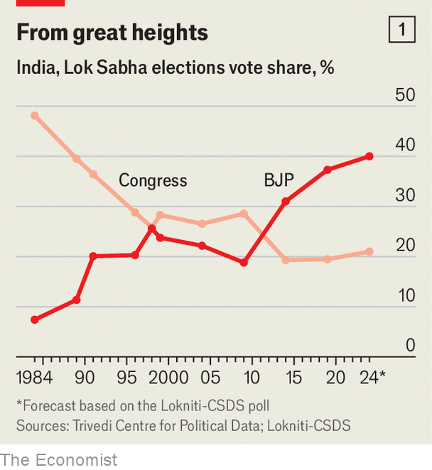
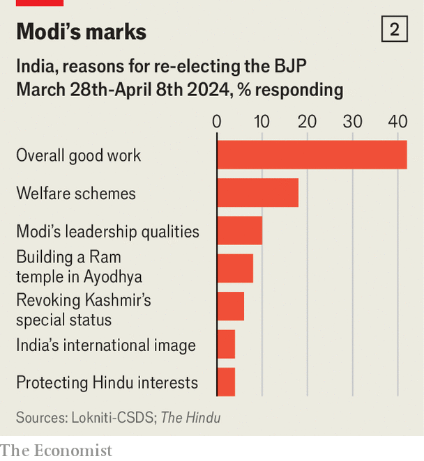

###### The last Gandhi?

# Gandhi v Modi: crunch time for Congress as India prepares to vote 

##### The Economist joins the most prominent opposition politician on the campaign trail 

 

> Apr 16th 2024 

Rahul Gandhi seems angrier now. For years, even close friends wondered if he had the drive to follow in the footsteps of his father, grandmother and great-grandfather, all of whom were Indian prime ministers. When he fronted the Congress party’s ill-fated campaign for a general election in 2014, his speeches, often in faltering Hindi, mostly fell flat. Five years later, he led his party to another bruising defeat, even losing his own parliamentary seat in the long-time family stronghold of Amethi, in . Soon afterwards he resigned as party chief.

And yet in the run-up to the general election, which starts on April 19th, Mr Gandhi has found the fire in his belly. That was one takeaway when  joined the final leg of a 6,300-mile (10,000km) journey across India that he finished last month. In rallies across the state of Maharashtra he denounced Narendra Modi, the prime minister, as a threat to democracy. He castigated the tycoons who dominate its . And he deplored its rampant inequality. “There’s no space for you in this country,” he told one crowd in (now fluent) Hindi. “I don’t understand why you’re not doing anything about it.”


Mr Gandhi’s newfound zeal has almost certainly come too late to swing this year’s result, due on June 4th. Mr Modi’s Bharatiya Janata Party (or BJP) is widely predicted to win again. But the hope among Congress loyalists is that it will help to revitalise the party in the years ahead and to position Mr Gandhi as a more serious challenger in 2029. By then, they say, public anger over unemployment and inequality may have dented Mr Modi’s popularity. And Mr Gandhi has time on his side. At 53, he is two decades younger than Mr Modi.

The question, then, is no longer if Mr Gandhi has the stomach for the fight. It is whether the Cambridge-educated, half-Italian scion of a political dynasty is the right person to overhaul a party that even some allies liken to a dysfunctional family business. Loyalists argue that the party needs a Gandhi to bind it together and that Rahul has proved his mettle on his two-stage trans-Indian tour, much of which he completed on foot. But after a series of prominent defections, even some supporters are starting to wonder if a third consecutive general-election loss should signal the end of the Gandhi family’s nearly eight-decade grip on the party.

 


To be fair to Mr Gandhi, the odds have been stacked against him lately. Mr Modi has curbed the independence of the media, the courts and civil society. His tax and investigative agencies have targeted dozens of the opposition’s politicians, arrested two of its party leaders and frozen Congress bank accounts. Mr Gandhi himself is being probed for alleged money-laundering (he denies wrongdoing) and was suspended from parliament for four months in 2023 after being convicted of defamation for mocking Mr Modi’s name. So uneven is the contest that Congress leaders have discussed boycotting the poll. 

Nonetheless Congress is still the only viable national alternative to the BJP. Although its national vote share has declined steadily from a peak of 49% in 1984 to 20% in 2019 (see chart 1) it retains a hard core of support among secular-minded Indians, Muslims and other minorities, especially in the south. And there is still a pathway back to national power—if Mr Gandhi can confront three urgent challenges that are within his purview.

 


The first is ideological. In the past decade, Congress has struggled to identify a coherent message to compete with the BJP’s combination of Hindutva (Hindu nationalism) and development. Branding Mr Modi a threat to democracy hardly dents his support base in the Hindu majority, much of which admires his muscular leadership (see chart 2). Congress leaders have dabbled in “soft Hindutva”, schmoozing with holy men and making high-profile temple visits. But that seems only to anger Congress stalwarts, while failing to steal many BJP votes. 

Recently Congress has made inequality its central campaign theme. A manifesto put out on April 5th (and denounced by Mr Modi as pro-Muslim) made commitments including a legal right to apprenticeship, a minimum support price for farmers, cash transfers of 100,000 rupees ($1,200) to poor families and a minimum wage of 400 rupees a day. It promised to carry out a nationwide census of all groups in the Hindu caste system, to strengthen an affirmative-action scheme and to reverse several BJP policies it considers anti-democratic.

It’s not just the economy

The manifesto has also pledged to create millions of jobs in manufacturing and mining. But the focus on government intervention and handouts (with few details of how to finance them) gives it a distinctly left-wing flavour. That partly reflects Mr Gandhi’s personal politics. Associates say he is less concerned about boosting economic growth than distributing its benefits more evenly. “Most Indian politicians would accept inequality as the price of rapid economic growth,” says Jairam Ramesh, a party spokesman. “He refuses.”

There is a logic to Mr Gandhi’s leftward tilt. To counter the BJP’s majoritarianism, he seeks to mobilise lower castes and minorities that represent around 80% of Indians. Still, it can be a hard sell coming from a product of wealth and privilege. Mr Modi, by contrast, is the son of a tea-seller, from a relatively low caste. He has won many votes among the poor by expanding digital welfare. And the BJP has pledged more handouts in its own manifesto, released on April 14th (and denounced by Congress as an “empty jugglery of words”). 

More troubling still for Congress is the apparent disconnect between voters’ everyday concerns and their political choices. While many care about unemployment and want a caste census, they still back Mr Modi. That suggests that many voters do not trust Congress to deliver, especially on jobs, says Rahul Verma of the Centre for Policy Research, a Delhi-based think-tank. Nor can the party cite a state that it recently transformed, as Mr Modi could with Gujarat pre-2014. “The challenge is harder for Congress because it was in power for so long,” says Mr Verma. “It comes with baggage.”

Mr Gandhi’s second big challenge is with organisation. The BJP’s recent electoral success is based in part on its ruthlessly efficient party management and messaging. Congress, by contrast, is plagued by slow, opaque and sometimes erratic decision-making. It has often been reluctant to jettison candidates loyal to the Gandhi family, even after they have lost elections. 

Its message discipline is also notoriously sloppy. Senior Congress figures often disagree openly or say things that upset alliance partners. Last year the party flip-flopped over its response to the Hamas attacks on Israel. In January, Congress leaders split publicly over whether to attend Mr Modi’s opening of a controversial Hindu temple. And in March, one senior Congress figure wrote an open letter challenging its support for the caste census. 

Two years ago the party tried to enlist Prashant Kishor, an electoral strategist who helped engineer the BJP’s 2014 victory (and is now starting a new political party). He presented the Gandhis with a detailed plan to overhaul the way Congress organised itself, picked candidates and ran campaigns. They rejected it. “They are yet not ready to accept that there is a problem and they need to change,” says Mr Kishor. “They still believe that this is just a temporary phase, that it will blow over, and sooner or later they will be back.”

The third challenge facing Mr Gandhi is personal. Although more energised now, he still prefers the intellectual side of politics. While relishing deep discussions on social issues, he dislikes the dealmaking needed to manage his party. His enthusiasm for initiatives often wanes when he meets resistance. And he lacks experience, having never run a state or a ministry. “Gandhis are only prime ministers,” one former party insider recalls being told, after proposing that Mr Gandhi join the cabinet when Congress was in power. 

A bigger concern is that Mr Gandhi lacks the steeliness to grasp control of his party. In the 2000s he led a drive to introduce new blood by holding open elections for its youth wing and promising the same for the party leadership. That brought an influx of young talent. But over the next decade they were repeatedly sidelined by Congress elders, leading many rising stars to defect. Since 2019 at least 25 prominent figures have deserted Congress. Failure to overrule party elders contributed to its defeat in three state elections last year. 

Some party insiders worry that Mr Gandhi is still in limbo, neither fully in control of Congress nor willing to let others take charge. After resigning as party leader in 2019, he was replaced by his Italian-born mother, Sonia. In 2022, a Congress veteran, Mallikarjun Kharge, replaced her. But Mr Kharge, now 81, is no match for Mr Modi and decision-making is still dominated by the Gandhis and a cluster of family loyalists. So far the party has not nominated a prime ministerial candidate, leaving Mr Modi with no direct rival.

Congress officials say Mr Kharge’s appointment proves the party’s commitment to meritocracy. Besides, they add, this is not a presidential race; prime ministers are normally chosen after an election. Even so, Mr Gandhi’s ambiguous role in the party leaves him vulnerable to suggestions that he is shirking a head-on fight with Mr Modi. If Congress is to reverse its decline in the years ahead, Mr Gandhi will have to make a choice: step up or step aside. ■


