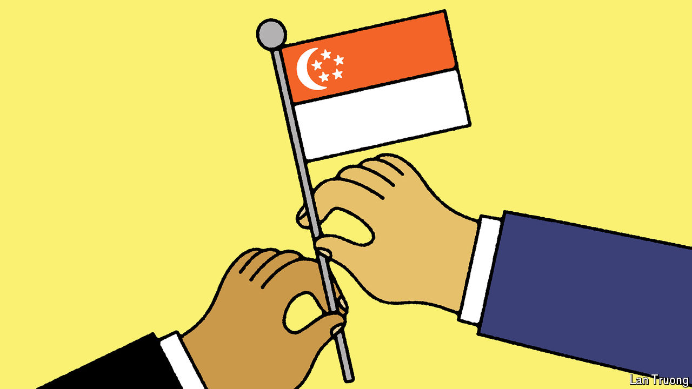

###### Banyan

# Lawrence Wong will be only the fourth PM in Singapore’s history 

##### The next leader promises continuity and change 

 

> Apr 18th 2024 

IN THE REPUBLIC’S 59-year history, Singapore has had only three leaders. On May 15th it gets its fourth, when the prime minister of 20 years, Lee Hsien Loong—who is 72 and whose father, Lee Kuan Yew, ruled with an iron will for 31 years—will resign. At a ceremony at the presidential palace, Lawrence Wong, the current finance minister, will be sworn in. He is Mr Lee’s junior by two decades. Singapore now faces the prospect of a future without a Lee at the helm.

The investiture also marks when the ruling party, the People’s Action Party (PAP), passes the baton from a “3G” (third generation) of senior party cadres to the “4G” cohort who chose Mr Wong as their man. Mr Wong will then call a general election, likely sometime this year. The PAP has made sure never to lose one, and Mr Wong will certainly not lose his. He is guaranteed a majority to make the leaders of many other countries weep. Yet never think that elections do not matter to the PAP. More is at stake than meets the eye. 

Singaporeans no longer judge the PAP merely on its traditional emphasis of delivering economic growth and of keeping Singapore, a tiny, multi-ethnic dot of prosperity in a sea of troubles, safe from threats to its extraordinary success and social cohesion. 

Indeed many younger Singaporeans, less respectful of hierarchy, want more fairness in terms of who shares in growth: they think that a country sitting on such gargantuan financial reserves should more generously support welfare. They also want politics to be more participatory rather than heavily directed from the top. At stake for Mr Wong, when he goes to the country, is not his (and the 4G’s) formal mandate but rather moral legitimacy.

The party likes to leave little to chance, and before change comes continuity. Mr Wong downplays expectations of major cabinet reshuffles before the election. After it, Mr Lee, as did his father before him, will stay on, as senior minister (more commonly called SM—the party loves initials). At least one key member of the old guard, K. Shanmugam, will stay in post. Since 2008 he has served as law minister and runs the home ministry, too. 

Mr Shanmugam takes a bleak view of threats to Singapore. They range from extremism spilling over from majority-Muslim Malaysia and Indonesia; to disinformation campaigns by foreign states; to great-power rivalry and other trade-wrenching forces to which Singapore’s open economy is especially vulnerable. Vigilance is the watchword. The PAP also likes to warn of the dangers of populist politics elsewhere; it presents itself as the guard against profligacy.

Yet Mr Wong has promised a break from the past. This week he described a “rapidly changing environment” which demanded fresh approaches and a readiness “to break new ground”. Some think his agenda will be thwarted by a shortage of political capital. He was not the 4G’s first choice. Heng Swee Keat, currently the economy minister, was Mr Lee’s anointed successor until he suddenly withdrew in 2021. Mr Wong, a highly competent former technocrat who entered politics in 2011, was the public face of the administration during the pandemic. Still, he remains relatively unknown among Singaporeans. 

In reality, being the compromise candidate may be no bad thing. No 4G member can hope to rule with the charismatic authority of earlier leaders. Mr Wong’s is likely to be a more collective leadership, one that reaches for consensus—perhaps, even, including outside the party. Promisingly, two years ago Mr Wong led a consultative initiative, known as Forward Singapore, that sought opinions among citizens about such issues as raising taxes on the rich and strengthening social welfare. The mild-mannered Mr Wong is more relatable to Singaporeans than most of the governing elites. The guitar-strumming, self-confessed nerd brought up on an East Coast housing estate did not go to any of the elite schools that the PAP high-flyers often judge themselves by. To many, that is a plus.

Mr Wong, then, kicks off with a degree of goodwill. Still, the election will be his key test. The PAP will win thanks to formidable organisation, unrelenting attacks on the opposition, a docile press, a record of good governance and a not always subliminal message that its survival and that of Singapore are synonymous. Yet if the opposition gets many more than the ten out of 87 elected seats it currently holds, the change candidate will start off on the back foot.■


