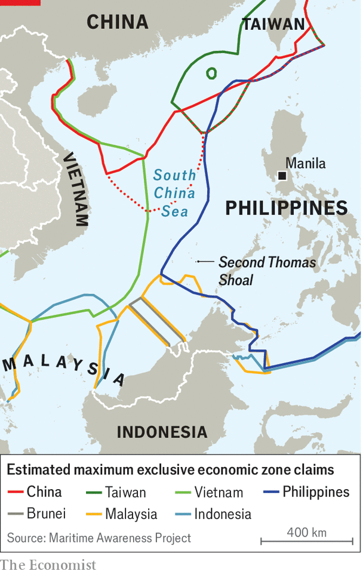

###### Maritime manoeuvres

# Tensions mount between China and the Philippines 

##### The latest incident was just inside the “nine-dash line” 

 

> Apr 18th 2024 

Could the Philippines be the next big flashpoint in the South China Sea? On April 13th a Chinese coastguard vessel blocked a maritime-research vessel and its escort, both belonging to the Philippines. The incident was just 35 nautical miles from the coast of the Philippines and barely inside China’s notorious “nine-dash line”, which it uses to claim territory over its waters. Reports have also emerged of Chinese coastguard vessels firing water cannons at supply boats trying to reach troops on the , a rusty warship grounded on purpose by the Philippines within its exclusive economic zone. Chinese boats are also swarming around islands occupied by the Philippines and conducting patrols within its waters. 

China has long had a contentious relationship with countries in the South China Sea. The recent spate of incidents has had more publicity partly because the government of the Philippines now highlights China’s actions as part of a “transparency initiative”. This policy shift has been driven by President Ferdinand “Bongbong” Marcos who, after being elected in 2022, returned the country to its usual pro-Western stance. By contrast, Rodrigo Duterte, the previous president, appeased China, generally staying silent about its growing aggression in the South China Sea. “He didn’t even want us to patrol our exclusive economic zone, that’s how far he went,” says Rommel Ong, a retired rear admiral. 

 


Mr Duterte’s reticence yielded no benefits. Instead, China encroached ever more forcefully on the Philippines’ waters. In February 2023 China pointed a military-grade laser at a coastguard ship on a resupply mission to the , which sits atop the Second Thomas Shoal, temporarily blinding the crew. “We finally decided that it doesn’t help to suppress these things,” says Jay Batongbacal of the University of the Philippines. Since early 2023 the Philippines’ government has been releasing videos of China’s growing aggression and taking journalists on its patrol ships to witness China’s “grey-zone” tactics (strategies to harass and intimidate that fall short of an all-out war).

This increased transparency has raised awareness among Filipinos over Chinese aggression. It also helps Mr Marcos win international support. Amid growing concerns over China’s coercion in the South China Sea, the president met Joe Biden, his American counterpart, and Kishida Fumio, the prime minister of Japan, in Washington earlier this month for the first high-level meeting between the three leaders. Mr Biden warned at the summit that “Any attack on Philippine aircraft, vessels or armed forces in the South China Sea would invoke our mutual defence treaty.” 

So far, publicising China’s aggression has not deterred it. The number of Chinese ships around Second Thomas Shoal increased in 2023, according to the Asian Maritime Transparency Initiative, a project run by CSIS, an American think-tank. It uses data from automatic identification systems to track Chinese ships in the South China Sea. Chinese researchers also claim to have developed an AI-controlled water cannon. Expect more escalation in the world’s most contested waters. ■

