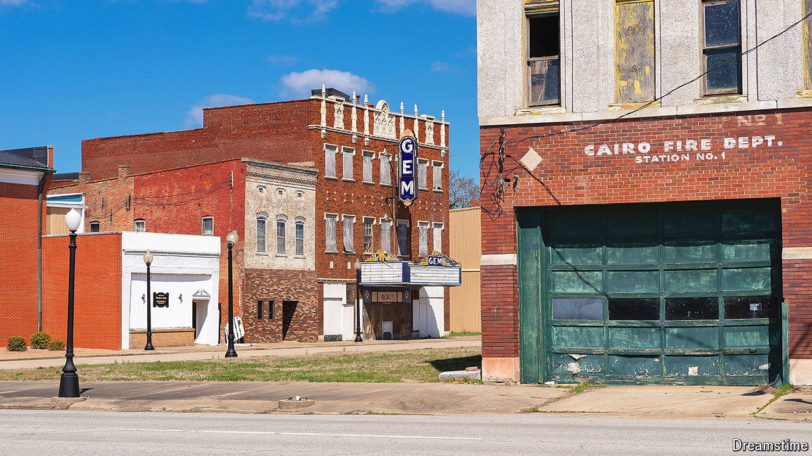
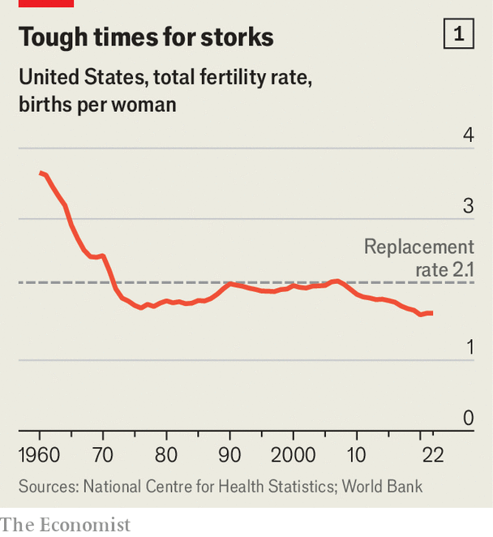
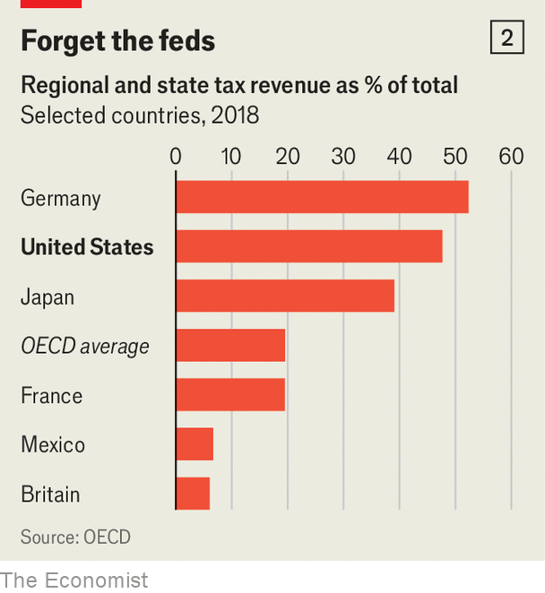

###### Emptying and fuming

# America is uniquely ill-suited to handle a falling population 

##### Which is a worry, because much of it is already shrinking 

 

> Apr 18th 2024 

Cairo, a town at the southern tip of Illinois founded in the early 19th century, was given that name because it was expected to grow into a huge metropolis. Located at the confluence of the Mississippi and Ohio rivers, it was the transport hub of a region that became known as “Little Egypt” because of its huge deltaic plains where farmers could grow anything.

Today, however, the name is redolent of lost civilisations. To walk around is a strange experience. Turreted Victorian houses gently crumble, being reclaimed by the weeds. What was once downtown (pictured) resembles an abandoned film set. Cairo has no petrol stations, no pharmacies and no hospitals. It has gone from six schools to two, both half-empty. “When I was growing up in the 1970s, we had two grocery stores, we had two gas stations. You know, a lot of businesses were still open,” says Toya Wilson, who runs the city’s still operating and beautiful Victorian library. One modest grocery store remains, but it is run at a loss by a charity and, when your correspondent visited, was deathly quiet, with many bare shelves. 

Cairo is on its way to becoming America’s newest ghost town. Its population, having peaked above 15,000 in the 1920s, had fallen to just 1,700 people by the 2020 census. Alexander County, Illinois, of which it is the capital, lost a third of its people in the decade to 2020, making it the fastest-shrinking place in America.

Huckleberry Finnished

Its collapse has many causes. A century ago the supplanting of river transport by railroads started the decline. In the wake of civil-rights legislation in the 1970s, white-owned businesses fled to avoid hiring black people. In the past decade the demolition of public housing displaced yet more residents. But its biggest problem now is a national demographic headwind. Between 2010 and 2020 over half of the country’s counties, home to a quarter of Americans, lost population (see map). Over the coming decades still more will, because America’s population is growing more slowly. The change will be wrenching, because of America’s demographic and administrative peculiarities.


Between 2010 and 2020 the number of people in the country grew by around 7.4%. That was the slowest decade of growth since the Great Depression (when the population grew by 7.3%). In the 1990s the growth rate was 13%. The main culprit is falling birth rates. The total fertility rate—a measure of how many children a typical woman will have in her lifetime—was steady or rising for 30 years from the mid-1970s. In 2008, however, it fell below 2.1, the level needed to keep the population stable, and has since declined to 1.67 (see chart 1). If it remains below 2.1, only immigration can keep the population growing in the long run. Yet net immigration, too, has been falling since the 1990s.

The pandemic almost stopped the population growing altogether. In 2020 over 500,000 more people died than in 2019, even as the birth rate also fell. With borders closed and American diplomatic outposts shuttered, net immigration dropped precipitously. In 2021 the Census Bureau estimated that the population expanded by just 0.2%, the lowest showing in the country’s history. As covid-19 has receded, deaths have fallen back. And in the past year or so, according to estimates published in January by the Congressional Budget Office, immigration has increased, largely owing to people crossing the southern border illegally. But demographers do not think this surge will alter the long-term trend. This decade, according to William Frey, of the Brookings Institution, a think-tank in Washington, DC, the population will probably grow by around 4%. Even if you assume immigration stays high, Mr Frey notes, America “would still show slower growth in coming decades than in any decade in the nation’s history”.

The phenomenon is hardly unique to America. The populations of many other rich countries are growing even more slowly or shrinking. So are those of many developing countries. That of China, America’s biggest geopolitical rival, shrank in 2023 for the second year in a row. Its fertility rate has tumbled to just 1.15 children per woman. Russia’s population is smaller than it was in 1991. America’s demographic problems are much smaller than those of its peers. Yet there are reasons to worry that America will adapt to slow growth even less readily than other countries.

Celebrated jumping frogs

America’s population is growing at about the same rate as those of Britain and France. But America is different from Britain or France in that its population is much more prone to move around the country. Some parts of America are extraordinarily successful at attracting new people. The population of the state of Nevada has grown ten times larger since the early 1960s, when it was so empty it could be used to test atom bombs. That of Texas has more than tripled over the same period. In general Americans have long flocked to “Sunbelt” states in the South and south-west. In the past that was not a problem, because the national population was growing fast enough that lots of people could leave the colder, cloudier states in the north-east and Midwest without causing their populations to shrink. But if the population as a whole is barely increasing, for one region to grow fast, another must contract, notes Beth Jarosz of the Population Reference Bureau, a non-profit research organisation that works with the Census Bureau. Growing becomes a zero-sum game.

 


Between 2010 and 2020 just two states lost population: Mississippi and West Virginia. The population of Illinois was essentially unchanged. All the rest grew. But in 2021, 17 out of 50 shrank. The pandemic doubtless exacerbated the trend, but internal migration shows no sign of stopping, so these contractions are in all likelihood a sign of things to come. 

Shrinking is bad for many reasons. As people leave a place, once beloved businesses become less viable and close. Schools without enough pupils struggle to maintain sports teams, or bands, or to teach a wide curriculum, even if their funding per pupil remains generous.

But the biggest problem is that, once a place starts shrinking, it can set in motion reinforcing cycles that accelerate the decline. For example, when there is far more housing available than people to fill it, the result tends to be a collapse in the value of homes. If it is severe enough, landlords and even homeowners stop maintaining their properties, because the cost of repairs is higher than the return they will generate. As the resulting blight spreads and neighbourhoods begin to feel hollowed out, the incentive to stay is reduced even further. This is what is called a death spiral.

Death spirals tend to be worse in America because of the remarkable level to which the government is decentralised. Just 8% of spending on primary and secondary education comes from the federal government, for example, and less than a quarter of the spending on law enforcement. Local and regional authorities levy 48% of all tax collected in America, compared with just 20% in France and 6% in Britain (see chart 2). And even America’s federal spending typically comes in the form of grants linked to population levels. So when local tax revenues shrink, services must be cut or taxes must rise.

 


Research by Christopher Berry of the University of Chicago finds that, as cities lose population, the cost of providing public services tends to stay about the same. “Virtually nowhere reduces the public sector in line with the population,” he says. Exactly why that happens is unclear: it could be that servicing a given geographical area entails fixed costs, regardless of population; it could be that laying off municipal workers is politically tricky. Whatever the reason, the result is that the remaining taxpayers must pay more simply to support the same services. 

When high taxes combine with deteriorating public services, people leave. Austin Berg of the Illinois Policy Institute, a right-leaning think-tank, notes that people in southern Illinois have an easy way to escape higher taxation: they can simply go to the next state. Whereas Alexander County in Illinois has shrunk drastically, neighbouring counties just to the south are still growing. The population of Paducah, Kentucky, 30 miles away on the other side of the Ohio river from Cairo, grew by 8.4% in the 2010s. Many who have stayed put still leave Illinois to buy petrol and groceries, to benefit from lower sales taxes elsewhere. As revenue gradually diminishes in this way in much of Illinois, the state is becoming ever more dependent on the taxpayers of its one metropolis, Chicago.

The biggest contributor to death spirals is often pensions for government workers. As America’s population ages, the overall burden of paying for such pensions is getting heavier everywhere. But many pensions are funded locally—and there are often shortfalls. Taxpayers in cities or states that shrink end up lumbered with a pension bill from when the population was much larger and so was the number of teachers, firemen and police officers. As a result, says Mr Berry, “Places that shrink are screwed.”

When Detroit went bankrupt in 2013, the state of Michigan bailed out its pensioners. But such bail-outs are dependent on the state having reasonably healthy finances. When the population of a state as a whole is stagnant or shrinking, that becomes much less likely. Across Illinois the total burden of unfunded state and local pension liabilities is estimated to be around $210bn, or roughly four times the state’s entire annual budget. Despite recent reforms, the state government does not expect state pensions to be fully funded for another 25 years. Chicago, meanwhile, is grappling with its own pension problems. That does not leave much cash to bail out or revive places like Cairo.

Does it matter if places die? Some would argue no. People are better off if they can move to opportunity, instead of becoming trapped in dying cities or jobless rural areas. Indeed, competition between cities helps explain America’s economic dynamism; many economists would like there to be even more movement. Although people are flocking to new jobs in places like Houston or Atlanta, high housing costs stop workers from moving to even better paid jobs in places like San Francisco or New York City. If those cities built more housing, they would attract more workers from other parts of America. Places like Cairo would shrink even faster, but America as a whole would be richer.

Yet in reality, shrinking is hugely politically unpopular because, inevitably, many people are left behind, and the lives of those unwilling or unable to move worsen as their neighbours depart. Federal, state and local officials know this. And so they will do almost anything to avoid shrinking. All manner of big government facilities, from air-force bases to prisons, can be located in rural areas, ensuring there are jobs that in turn sustain the rest of the economy. For decades cities and states across America have also competed to attract new businesses, handing out land, tax breaks or cash to firms that open factories or offices. 

Now cities and states are wooing workers directly, too. Take Muncie, Indiana, a city of 65,000 people about 50 miles north-east of Indianapolis. Since 2021 it has offered a $5,000 grant to remote workers who agree to move there. The cash is in essence a marketing device to get potential movers to consider a town they might not otherwise have heard of, says Dan Ridenour, the city’s Republican mayor. “It’s become very competitive—and not just for remote workers, for all workers,” he says. 

So far 152 people have moved to the city under the scheme, which is run by MakeMyMove, a firm based in Indiana which helps promote the incentive schemes of cities that are willing to pay people to move there. From its foundation in 2017 MakeMyMove has expanded enormously, says Christie Hurst, its spokeswoman, not least thanks to the pandemic, which freed many workers from having to go to an office. The result is a much larger pool of potentially mobile workers over whom cities can compete—hence the growth of the business. Yet a taxpayer gained by Muncie, Indiana, is one lost to somewhere else. And with growth overall slowing, not everywhere can win. In fact, remote-working may only hasten the decline of some struggling places, by making it possible for a worker in, say, Muncie, to relocate to a pretty mountain town in Colorado.

 


Ultimately, the risk is that all of this is at best “keeping places on life support”, says Mr Berry. If America’s population does not grow faster, far more places will begin to die. The politics of that will be ugly. Of the counties that lost population in the decade to 2020, 90% voted for Donald Trump in 2020. Presumably, his fulminations about American decline resonate. 

Yet much of the recent slowdown in America’s population growth dates to Mr Trump’s presidency when, even before the pandemic, net migration fell by a quarter as his administration deliberately gummed up the immigration services. If he is re-elected, Mr Trump promises “the largest domestic deportation operation in American history”, to remove illegal immigrants. (Admittedly Mr Trump says that he is in favour of legal immigration. He occasionally promises a “big beautiful door” as well as “a big beautiful wall”. But he wants to let in only people from “nice” countries.)

No life on the Mississippi

Driving your correspondent around Cairo, Phillip Matthews, the chairman of the Democratic Party in Alexander County, lists services that have been cut over the years: public housing closed, government offices moved, schools shut down. He points out the public hospital in which he was born—now a derelict concrete hulk. “A lot of this is done by design,” he declares, of his town’s decline. What he means is that politicians took many of the decisions that have contributed to the decay. Mr Matthews is pinning his hopes on a stalled plan to spend $40m on a new river port in Cairo, which has been backed by J.B. Pritzker, the state’s Democratic governor. If the port is ever built, perhaps Cairo will recover somewhat. But in the meantime, Mr Matthews, a black pastor, says he understands why more and more people in his region support Mr Trump. “The Democratic Party is failing its constituents,” he says. “People are scared to say it, but truth is truth.” The worse things get, the more votes Mr Trump will win. ■

