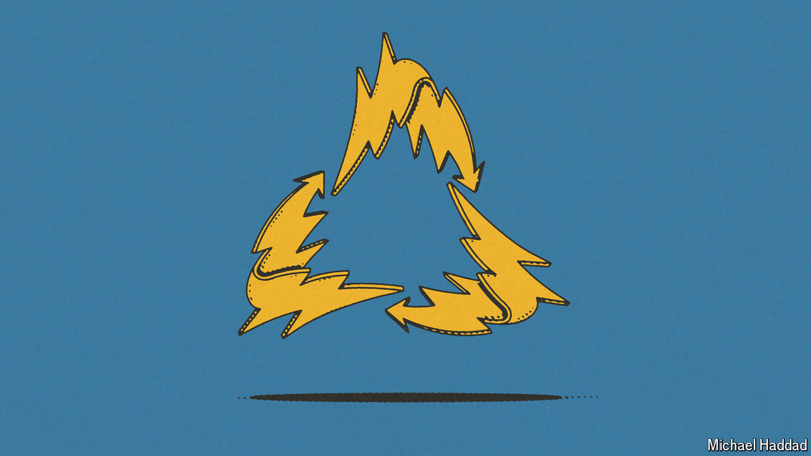

###### Critical minerals

# Britain’s black-mass problem 

##### The thorny business of recycling electric-vehicle batteries 

 

> Apr 18th 2024 

Recycling electric-vehicle batteries is tricky. But they are full of —lithium, cobalt and other commodities—that are vital to the green transition. At the moment most EV manufacturers in Britain crush old batteries into a material called “black mass”, which is then exported to other countries—mostly, experts say, to China. There the black mass is dissolved in acid before the most useful materials are separated and processed. 

EV batteries can last for 15-20 years; since the  is young, the amount of valuable stuff that is currently being exported is small. But as volumes grow, so will the pressure to recycle closer to home. According to Green Alliance, a think-tank, recycling could provide 43% of the minerals required for domestic manufacturers to meet demand for batteries by 2040. Western countries are keen to reduce their dependence on China: the EU has proposed banning exports of black mass to non-OECD countries. 

The main barrier to building processing plants in Britain is cost. It is cheaper to export the stuff to Asia and buy extracted materials back, according to Heather Plumpton, an analyst at Green Alliance. Research is under way to make black-mass processing more economic but it will take time for new tech to prove itself, says Paul Anderson at the Faraday Institution, another think-tank. 

The EU is using regulation to speed things up. From 2031 batteries in EVs sold there will need a share of recycled materials—16% for cobalt, 6% for lithium and so on. It has also fast-tracked the approval of battery-recycling projects. A consultation to update the regulation of EV batteries in Britain is yet to be published; the process of obtaining permits remains painful. “The government seems to be waiting until old EVs are available at scale to act,” says Ms Plumpton. Exporting black mass to Europe would be better than sending it to China. But if Britain wants its own supply of critical minerals, as it claims, it has work to do. ■


