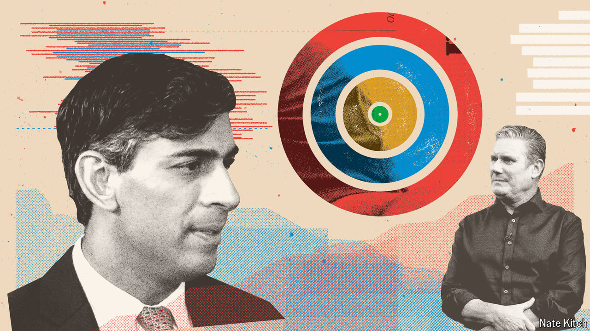
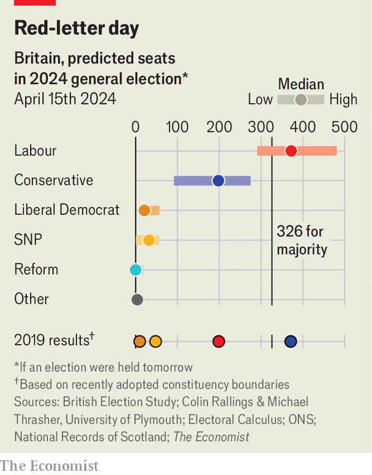

###### All change

# Explore our prediction model for Britain’s looming election 

##### The scale of the task facing Rishi Sunak is clear 

 

> Apr 15th 2024 

There have been 17 elections in Britain since the start of 1959 and the Conservative Party has been successful in ten of them. The next one is almost certain to take place in the second half of this year. It is safe to say that Rishi Sunak’s Tories are very unlikely to add to their victory tally: they currently trail Labour, led by Sir Keir Starmer, by 20 percentage points in the polls. But it is tricky to predict how many MPs each party will have, partly because national voting intentions do not convert simply into seats in Parliament. In 1997, for example, the Labour Party won 63% of the seats on 43% of the vote. 

To tackle this problem,  has built a  using 9,398 individual constituency-level election results along with available polling data from every election since 1959. Our model builds on the simple principle of uniform national swing—the idea that support for parties rises and falls across all constituencies in the country by the same magnitude—and augments it with specific regional polling from Scotland, Wales, London and so on. The output is not so much a forecast as a “nowcast”—a prediction of what would happen if the election were held tomorrow. If you happen to be Mr Sunak, you should look away now.


Our modelling concludes that Labour has a near-certain chance of being the largest party in Parliament, and an 87% chance of winning the 326 seats needed for an outright majority. Our central estimate is that it would win 372 seats if polling stations were to open tomorrow (though the range of possible outcomes is wide). The mid-point estimate for the Conservatives is 198 seats. Labour would retake many of the Conservatives’ 2019 “red wall” gains in the north and the Midlands; the Tories would be left with just 55 seats north of the Watford Gap, compared with 147 now. 

Labour is expected to gain at the expense of other parties, too. Scottish politics is in a febrile state at the moment, but our central estimate is that the Scottish National Party (SNP) would end up with 32 seats, 16 fewer seats than it would have won if the last election had been fought under newly redrawn constituency boundaries. We think Labour has a 40% chance of winning between 350 and 399 seats, and a 27% chance of winning more than 400, as Sir Tony Blair did in 1997. 

 


If all that sounds bad enough for Mr Sunak, the real picture may be even worse. The biggest determinant of the final composition of Parliament is the nationwide gap between Labour and the Conservatives; our model translates that into seat counts pretty reliably. But it does not take into account the full possibilities of  or the attention that parties’ campaign managers will give to particular seats. These effects may, if anything, push the Tory seat tally even lower. 

In our model’s central estimate, for example, the Liberal Democrats, who are hoping to become the third-largest party again in Westminster after being surpassed by the SNP in 2015, are expected to win 21 seats. But if enough Labour voters switch votes in constituencies where the Lib Dems are the only credible challengers to the Tories, they could do much better. A different prediction approach, enticingly called multi-level regression with post-stratification (MRP), attempts to capture these local effects; a recent MRP from YouGov, a polling firm, reckoned that the Lib Dems would win 49 seats. 

The waters are muddied further by uncertainty over the impact of Reform, an insurgent right-wing party that is critical of mass immigration and that is currently polling at 13%. In 2019 the Brexit Party, which was renamed Reform UK in 2021, did not have candidates in 317 constituencies held by the Conservatives. There will be no such respite for the Tories this time. Our model thinks it is unlikely that Reform will win any representation in Parliament, because Britain’s first past-the-post system punishes parties whose support is diffused across constituencies. (Reform’s best shot at a seat is in Barnsley North, in South Yorkshire, where it would currently attract around 30% of voters.) But its ability to hurt the Tories by taking votes away from them is both real and unpredictable.

So should Sir Keir begin measuring up for the curtains in Downing Street? Not quite yet. Predictions are not promises. Our swing model does reasonably well if asked to predict the outcome of the elections it was trained on. It correctly anticipated a hung parliament in the 2010 election, for instance. But it is not foolproof: like most pundits and pollsters it gave the Tories only a small chance of an outright majority at the following election in 2015.

The biggest source of hope for Mr Sunak is that voting intentions can still change. Our prediction is based on a scenario in which the election takes place tomorrow. We only account for the pattern of voters’ behaviour today and in the past, so shifts in the polls will affect our predictions (which will be regularly updated online). If the gap in the national polls between them and Labour narrowed to 15 percentage points, the Tories would increase their own chances of electoral success to one in ten—still measly, but better. 

It is ever plainer, however, that the Tories have a very steep mountain to climb. No governing party has entered the final nine months of a parliamentary term with a 20-percentage-point polling gap and won the subsequent election. The fact that the Tories’ poll deficit has been impervious to Mr Sunak’s various efforts suggest that their chances of victory are increasingly slim. However long there is to go until polling day, time may already have run out. ■ 


