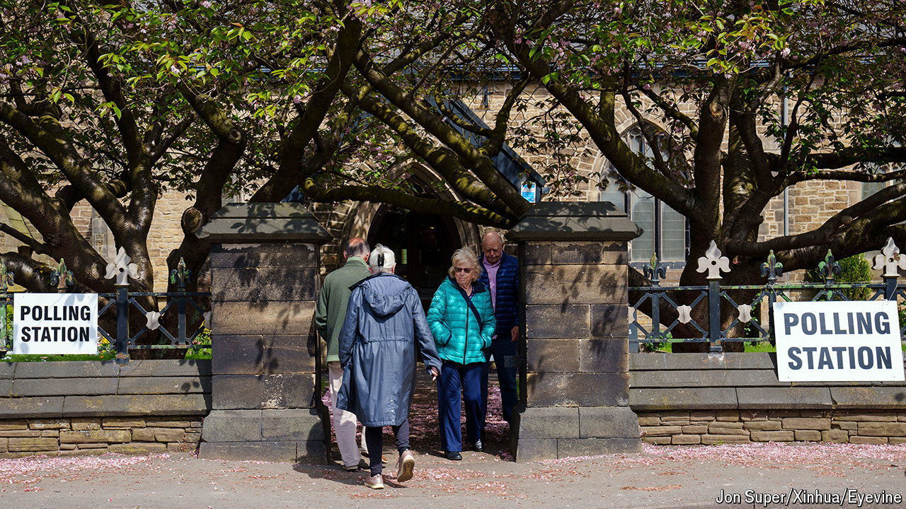
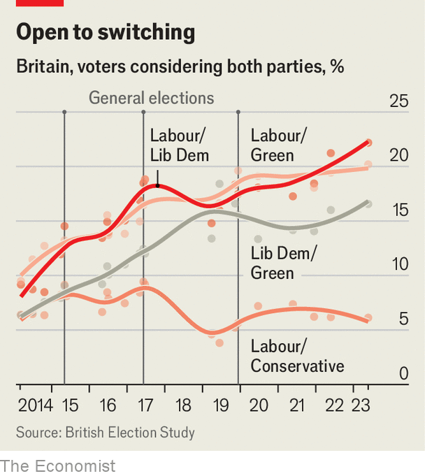

###### Crossover

# How tactical voting might affect the British election 

##### The evidence for co-ordinated anti-Tory behaviour 

 

> Apr 18th 2024 

If an election were held tomorrow, our  is sure that the Tories would lose. But it may still be being too kind, since it does not explicitly consider the potential for a jump in tactical voting. When the Conservatives have suffered landslide defeats in the past—as they did in 1906, 1945 and 1997—these have been at the hands of co-ordinated anti-Tory coalitions. Another such coalition may be forming now.

That is because of a big rise in the number of centre-left crossover voters who are prepared to cast their ballots for more than one party (see chart). This increases the chances that people will opt for a party other than their first choice in order to defeat the Tory candidate in their constituency. In 2019 around 17% of all voters were considering both Labour and the Liberal Democrats, compared with only around 13% in 2015. In May 2023 it was almost 22%.

 


This number may be even higher now. Labour is more palatable to crossover voters under Sir Keir Starmer than Jeremy Corbyn. And constituencies that have held by-elections since 2019 show evidence of tactical voting. In by-election seats targeted by the Lib Dems, the Labour vote fell by an average of 7.5 percentage points; in seats where the Lib Dems were not going for victory, Labour’s vote rose by ten percentage points. This may partly be because Labour chose not to campaign hard in seats where the Lib Dems were stronger. But it is also likely to reflect voter behaviour.

Less politically engaged voters, who are more likely to vote in a general election than in by-elections, may not be as attuned to these possibilities. But if they also vote tactically, the  than our model suggests.■


