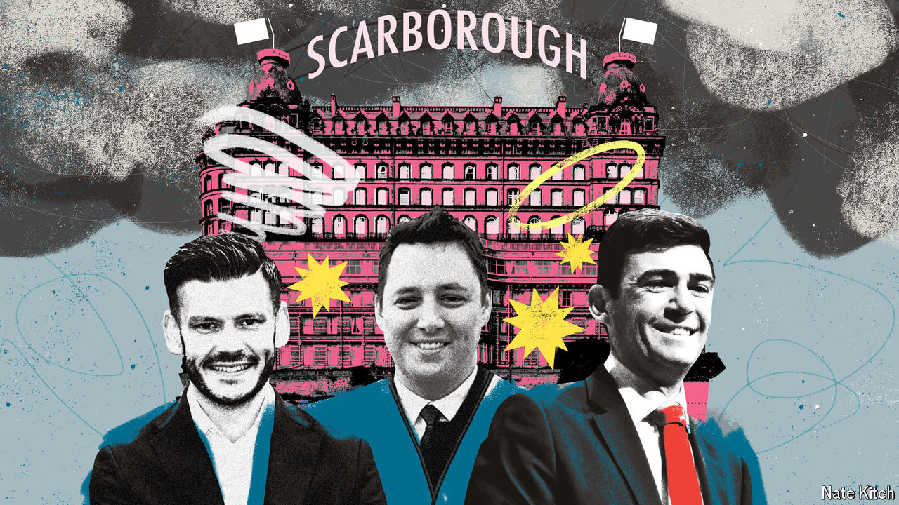

###### Bagehot

# Local British politics is a mix of the good, the bad and the mad 

##### Devolution is messier—and weirder—than people think 

 

> Apr 17th 2024 

“Buildings of England”, the Bible of architectural historians, is effusive about the Grand Hotel in Scarborough, a chilly, rather tired seaside resort on the coast of Yorkshire. It is “a High Victorian gesture of assertion and confidence: of denial of frivolity and insistence on substance, than which none more telling can be found in the land”.

Other reviews vary. “ABSOLUTELY HORRENDOUS,” reads one. “If I could give it 0 i would!!!” says another. A third vividly recalls: “The first room I got had pubic hair all over the sheets.” When Bagehot visited, he avoided that fate. But he found that the “glorious hall” highlighted in “Buildings of England” now hosts an air-hockey table and a luminous arcade machine, where punters can win prizes like an Xbox controller or a bottle of Prime, a sickly energy drink. In the bar four bored pensioners watched “The Chase”, a quiz show, at a disconcertingly loud volume. 

The Grand Hotel’s owner is Britannia, which is consistently ranked the country’s worst hotel chain. Soon it could have a new one: British taxpayers. Keane Duncan, the 29-year-old Conservative candidate for the newly formed York and North Yorkshire Combined Mayoral Authority, has pledged to buy the decaying hotel if he wins office in local elections on May 2nd. If Britannia refuses to sell, then Mr Duncan says he will use compulsory-purchase powers bestowed on the mayor to force it to do so. “Sounds bonkers, I know,” says Mr Duncan.

When it comes to , there is a broad consensus. The Conservatives are proud of introducing regional mayors in every major urban area and now in some rural ones. Under a future Labour government the powers of mayors will be juiced up further. Wonks generally agree that devolution is “a good thing”. What gets forgotten is that it is also a very messy thing. Some ideas will work. Others will fail. Some will be insane. Local politics is always a mixture of the good, the bad and the mad. 

For a taste of all three, drive 70 minutes north up the A171 to Teesside, a struggling industrial region. Ben Houchen, the Conservative mayor of this traditionally Labour region, is fighting for re-election. His offer to voters is one of unapologetic economic interventionism. Almost £560m ($700m) of public money has been pledged to overhaul a 1,800-hectare site by the Tees in an effort to turn the graveyard of a former steelworks into something productive. Lord Houchen even bought a loss-making airport on the basis that executives could fly in to invest while Teessiders could fly out to spend the proceeds on the Med. “Dirigisme” is the idea that the state can orchestrate an economy; “Houchisme” is a shrunken version, with a local economy bossed by a regional big man.

The scheme has been dogged by accusations of mismanagement and worse. Andy McDonald, a local MP, made allegations of “industrial-scale corruption” while speaking in Parliament, which is exempt from England’s libel laws. Lord Houchen in turn labelled Mr McDonald a “liar”, a “coward” and a “disgrace”. A report has found no evidence of corruption but a litany of governance failures, with 28 changes recommended for the complex set-up. 

The project has, at times, taken a unique approach to stakeholder management. During one disagreement about access rights to the site with a neighbouring business, the then vice-chair of the development corporation opted for film-dialogue threats: “I want your eyes out of your head; I want the fucking roof off your house; I want your kids out of private school; I want no shoes on your fucking feet.” Devolution succeeds in putting the spotlight on sometimes forgotten areas; the glare will not always flatter.

Sometimes devolved schemes are wacky but largely harmless. In the West of England Combined Authority, the mayor introduced a birthday bus pass, giving people free travel during the month of their birthday (at a cost of £8m). Other local decisions have bigger consequences. In Greater Manchester Andy Burnham, the Labour mayor, has attracted plaudits for bringing the region’s bus system into public ownership but chickened out of a “clean-air zone” that would have charged polluting vehicles for driving in the centre of the region. In London  expanded a similar scheme at some political cost. Pollution in the capital has plunged; pollution in Manchester is the country’s worst. If Manchester’s residents choke, at least it is due to their own choices.

This is part of the point of devolution. The British government and, in particular, its mighty Treasury are good at stopping sins of commission.  do exist but they are rare, since so many projects are aborted moments after conception. As a result, however, sins of omission are common. Devolution means more things will be tried because of decisions made by local politicians. But that will, inevitably, lead to mistakes.

Having a right mayor 

At the moment, a place like Scarborough is stuck in limbo. Central government has neither the guts to let it die nor the will to try to resuscitate it. A mayor will neither change the weather (it is still woolly-hat temperatures in spring) nor return the town to its Victorian pomp. But someone might end up cleaning the layer of grime and seagull droppings that covered the window in Bagehot’s filthy hotel room. Whether that is a good use of taxpayer money is for voters—or at least the fraction of them who bother to vote in local elections—to decide. 

Devolution is a long-term punt that local politicians will, on the whole, make better decisions about their area than national ones. Boosters insist a virtuous circle will kick in: more powers will attract higher-calibre candidates, which will lead to more scrutiny, which will mean better policy. Everyone in British politics has signed up to the gamble. The price in the short term? Whatever a 413-room Victorian hotel in Scarborough goes for these days. ■


