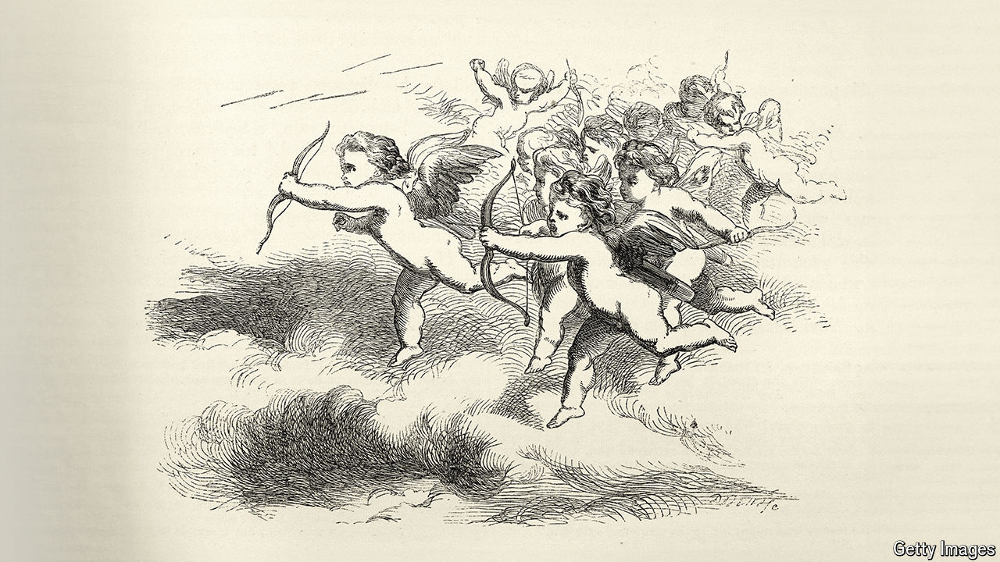

###### “Sexually, I’m more of a Switzerland”

# Online dating spells the end of Britain’s lonely-hearts ads 

##### A 300-year-old genre is losing its GSOH 

 

> Apr 18th 2024 

Mr Darcy, it turns out, was undemanding. In “Pride and Prejudice” Jane Austen implies that he is a picky paramour, since he likes a beloved to have “fine eyes”, “a thorough knowledge of music” and a mind improved “by extensive reading”. But read actual Georgian “lonely heart” advertisements and it is clear that Mr Darcy was pretty lax. Others were much fussier, demanding, among other things, that their beloveds be “not fat”, have “a good set of Teeth”, and a bosom that is “full, plump, firm and white”. 

Britain’s affair with lonely-hearts ads is more than 300 years old but it is now all but over. Another infatuation, for dating apps, has taken their place. This year, for the first time, Tinder is running ads in British cinemas, which tempt viewers to “just go out and find” someone. Modern Britons have adopted the apps’ turns of phrase (“swipe right” has entered the vernacular); some claim an addiction to them.

Meanwhile, sections of romantic ads that once spread over pages and pages of newspapers and periodicals have withered. Their historical value remains, however. Brief as a haiku but often far blunter, these ads illuminate Britons’ centuries-long search for the “one”—that elusive soul who is willing, loving and, as one romantic requested, of “no bodily deformity”.

Lonely hearts have always existed but the lonely-hearts genre itself dates back to the late-17th century. Perhaps the very first example was published in 1695, in a pleasingly titled pamphlet on “Collections for the Improvement of Husbandry and Trade”. Appropriately near promotions for a stallion and a bed appeared an advert for “A Gentleman about 30 Years of Age”. 

As Francesca Beauman points out in her book, “Shapely Ankle Preferr’d”, the Industrial Revolution spurred things on. For this manufactured not just products on an industrial scale, but loneliness, too. As the 18th and 19th centuries progressed, hundreds of thousands of migrants were arriving each year in London, where many experienced the kind of acute isolation that only crowds can elicit. London, which had 1m inhabitants by 1800, offered numerous potential lovers. But without the filters of family and friends it felt impossible, one novelist wrote, “to find the one eel out of the colossal bag of snakes”. 

Where connections could not help find suitable matches, advertising stepped in. It offered a way to filter London’s thousands by such criteria as their weight (which, as adverts made clear, should favour plumpness); skin (clear); ankles (shapely was indeed preferr’d) and even opinions (such as, perhaps, on the all-important question of snakes v eels).

Early ads can strike modern minds as unamorous. The romantic movement may have thrived in Britain at the turn of the 19th century, but it seems to have taken quite some time to make its way to Dorset. There, in 1832, a widower placed an advert explaining that he desired a new wife since his last one was dead and he wanted someone “to look after the pigs while I am out at work”. It’s not quite Keats. 

In some ways, the history of lonely-hearts ads is evidence of great change in Britain: few today would demand pig-husbandry of their paramour. In another way, very little is different. The bawdiness is familiar: as long ago as the 17th century one “plump, fresh, free and willing widow” was advertising for a nice young workman to (in arguably another amatory first) send her a “picture of his Tool”. 

That may have been satire. But people’s preferences are genuinely similar. Georgians wanted men who were tall, rich and educated and women who were young, shapely and intelligent (though not, one warned, “a wit”). Research on modern apps shows that women tend to look for wealth, status and height while men seek out women who are slim, young and educated (but not overly so: “wits” are still unwanted). It is, says Ms Beauman, depressing. 

The codes of Cupid

As the genre aged, it changed. Victorians specialised in starchy soppiness; racy Edwardian “bachelor girls” merely sought “chums”. It also developed its own language. In a pricing system based on characters, initials were cheaper. By the late 20th century abbreviations such as GSOH (good sense of humour) and WLTM (would like to meet) were commonplace. 

The tone changed, too: from blunt requests to self-referential irony. In the (LRB), a worthy literary magazine, advertisers started to brag about their beetroot wine rather than their bodies and say such obliquely brainy things as: “Sexually, I’m more of a Switzerland”. Others offered (possibly ironic) confessions: “Likes to be referred to as ‘Wing Commander’ in the bedroom,” explained M, 41. F, 29, listed her hobbies as “crying and hating men”.

Even in these archly worded adverts the age-old blend of self-love, self-loathing and hope that all dating engenders can be detected. “I hate you all,” began another, unusually honest, ad in the LRB. “I hate London. I hate books…I hate this column and I hate all the goons who appear in it.” Though, it added, hinting that some hope remained, if “you have large breasts [and] are younger than 30” he’d “put all that aside” and meet you. ■


