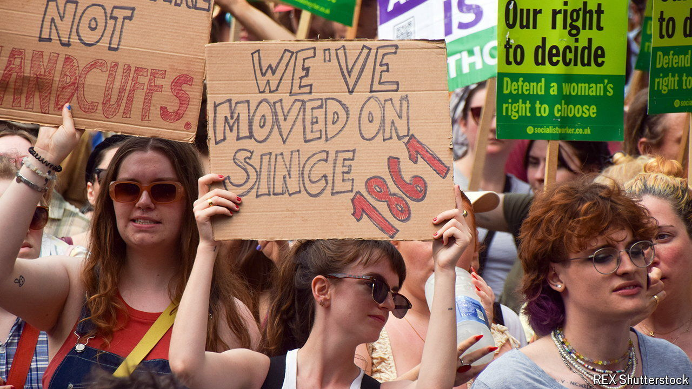

###### If you pull on a thread

# The push to decriminalise abortion in Britain heats up 

##### But campaigners should be careful what they wish for 

 

> Apr 18th 2024 

For more than half a century abortion has been a largely uncontroversial issue in Britain. In 1967 the Abortion Act was passed to allow women to end their pregnancies up until 28 weeks with the approval of two doctors; this limit was later lowered to 24 weeks. To satisfy those Britons—mostly conservative Christians—who believe abortion is murder, lawmakers chose not to repeal parts of a law from 1861 that criminalised it.

That legislative fudge has been successful, but it is now beginning to cause problems. Until recently prosecutions under the Victorian law were rare; they are now becoming more common. The reason is a change introduced during the pandemic and made permanent in August 2022, which allows women to receive abortion medication (two drugs taken a few hours apart) by post after a telemedicine consultation, provided they are less than ten weeks pregnant. This has made it easier to gain access to abortion. But it has an obvious flaw: it is impossible to check how far along a pregnancy is via a phone call. 

In 2023 a woman was sentenced to 28 months in prison after she aborted a baby of 32-34 weeks’ gestation. She had told the organisation that sent her abortion medication that she was around seven weeks pregnant. An appeals court later cut her sentence by half and suspended it, saying she deserved “compassion, not punishment”. msi Reproductive Choices, a charity, says that in the past year five women have appeared in court on similar charges, compared with a grand total of four in the previous 55 years.

Like other reproductive-rights groups, it believes the answer is to decriminalise abortion. The charity supports an amendment to the Criminal Justice Bill, which is now making its way through Parliament, by Diana Johnson, a Labour mp; this would remove women who have abortions from the Offences Against the Person Act 1861. Another amendment, supported by Stella Creasy, another Labour mp, would decriminalise any abortions up until 24 weeks. Although this would be largely symbolic, Ms Creasy has said it would protect abortion access against what she has described as a coming against it.

Decriminalising abortion makes some sense. In 1967 most Britons broadly opposed abortion; today, most believe it should be legal. When it was legalised in Northern Ireland, in 2019, the anti-abortion parts of the 1861 law were dropped. (Women there must, however, take the first tablets in a clinic.)

Yet opening a fresh debate also creates an opportunity for anti-abortion campaigners to push for reform. There are plenty of them in Parliament, where a comparatively high number of mps are religious. Some of them are itching to point out that Britain’s limit of 24 weeks is liberal compared with many European countries’ first-trimester (12- to 14-week) limit. That is evident in another proposed amendment to the Criminal Justice Bill, which would lower the limit to 22 weeks. 

Other pro-life politicians are trying another approach. In 1990 the law was changed to allow abortions after 24 weeks in the case of a “serious handicap”. Sir Liam Fox, a Conservative mp, wants to make it illegal to abort babies with Down’s syndrome, a genetic disorder that causes intellectual disability and delays in physical development, after that period. 

The law does not spell out what a serious handicap means, so the definition is subjective: many people with Down’s syndrome do not fit it. Yet most jurisdictions also allow abortions after legal limits for health reasons, meaning that decisions are between doctors and their patients. Although Down’s syndrome is often diagnosed earlier than 24 weeks, many comorbidities, like heart problems, are often not spotted until later. 

In any case using one group to push anti-abortion legislation is a mistake, says Ramandeep Kaur, whose 17-year-old son has Down’s syndrome. Sir Liam’s campaign rests on the idea that people with Down’s are discriminated against; that is no more true of them than any other people with learning disabilities, she says.

The idea of legislating against abortion because it is discriminatory may be inspired by campaigners across the Atlantic. Before  was overturned in 2022, some conservative states in America introduced bills  on the grounds of race, sex or fetal abnormality. Ms Kaur notes that many of the groups that backed the Down Syndrome Act, a law sponsored by Sir Liam in 2022 to “make provision about meeting the needs of persons” with the condition, were vehemently anti-abortion. “This is not about disability rights,” she says. “This is about reproductive rights.” Abortion is not a divisive topic in Britain. But it can become one. ■


